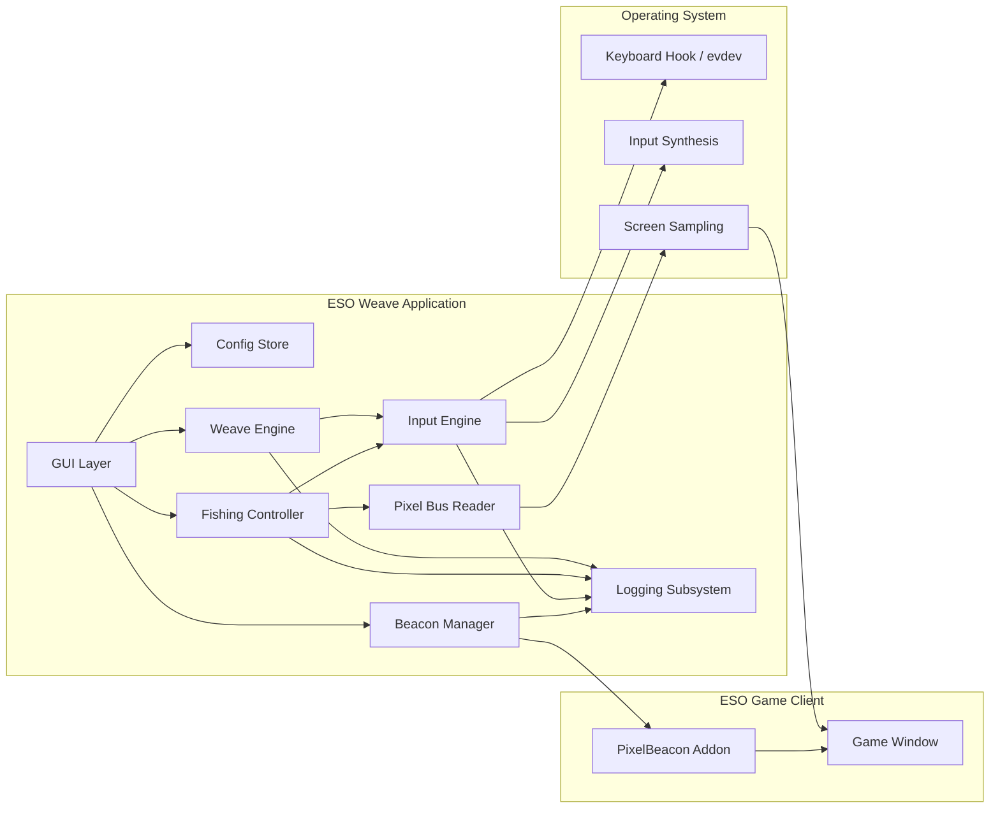
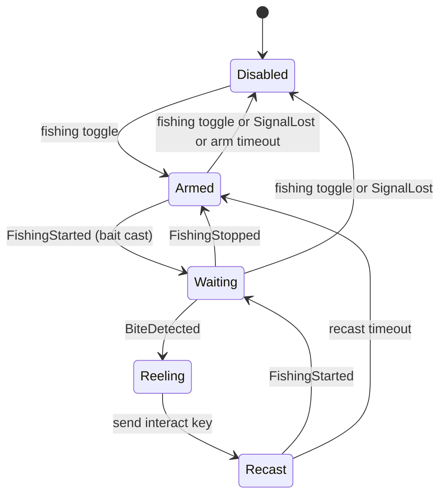

# ESO Weave Technical Specification

**Project:** ESO Weave \
**Repository:** `github.com/h8rt3rmin8r/eso-weave` \
**Document:** `docs/ESO-Weave-Specification-v0.1.0.md` \
**Version:** 0.1.0 (Draft) \
**Audience:** Human-facing (also consumed by AI coding agents via spec-kit) \
**Author:** h8rt3rmin8r \
**Date:** 2026-07-10 \
**License:** Apache-2.0

## Table of Contents

- [1. Overview](#1-overview)
- [2. Terminology](#2-terminology)
- [3. Scope](#3-scope)
- [4. Platform Support](#4-platform-support)
- [5. System Architecture](#5-system-architecture)
- [6. Input Engine](#6-input-engine)
- [7. Weave Engine](#7-weave-engine)
- [8. Fishing Automation](#8-fishing-automation)
- [9. PixelBeacon Companion Addon](#9-pixelbeacon-companion-addon)
- [10. Graphical User Interface](#10-graphical-user-interface)
- [11. Configuration](#11-configuration)
- [12. Logging](#12-logging)
- [13. Packaging and Distribution](#13-packaging-and-distribution)
- [14. Repository Conventions](#14-repository-conventions)
- [15. README Disclaimer Text](#15-readme-disclaimer-text)
- [16. Open Items](#16-open-items)

## 1. Overview

ESO Weave is a private desktop companion application for The Elder Scrolls Online
(ESO). It runs entirely outside the game and outside the game's addon ecosystem.
It provides two capabilities:

1. **Combat weave automation.** When the ESO game window is focused, configured
   skill keys are intercepted and replaced with synthesized input sequences that
   perform light attack, heavy attack, bash, or block-cast weaving around the
   skill activation.
2. **Fishing automation.** An optional module that detects fish-bite events and
   performs the reel-in and recast interactions automatically.

This document specifies version 1.0 of the rebuilt application. It supersedes the
prior AutoHotkey v2 implementation (ESO-Weave v0.4.0), whose behavioral semantics
it preserves where noted and deliberately improves elsewhere. The rebuild is
implemented in Rust and targets both Windows and Linux.

Fish-bite detection is provided by **PixelBeacon**, a minimal companion ESO addon
that is embedded inside the application binary and installed or uninstalled from
within the application UI. The addon exists only to translate in-game events into
a small on-screen pixel signal (the "pixel bus") that the external application can
read. The weave engine has no in-game dependency of any kind; only the fishing
module requires PixelBeacon.

## 2. Terminology

- **Weave:** The ESO combat technique of slotting a basic attack (light or heavy)
  or a block/bash action into the same global-cooldown window as a skill
  activation.
- **GCD:** ESO's global cooldown for skill activations, fixed at 1000 ms.
- **Skill slot:** One of seven automatable inputs: skills 1 through 5, Ultimate
  (default key `R`), and Synergy (default key `X`).
- **Weave type:** One of four fixed action sequences: Light Attack (`LA`), Heavy
  Attack (`HA`), Bash Attack (`BA`), Block Casting (`BL`).
- **PixelBeacon:** The companion ESO addon defined in [section 9](#9-pixelbeacon-companion-addon).
- **Pixel bus:** The on-screen block protocol rendered by PixelBeacon and sampled
  by the application.
- **Beacon block:** A single solid-color square rendered by PixelBeacon at a fixed
  physical-pixel position in the game window.
- **Interact key:** The in-game interaction keybind (default `E`), used to cast
  and reel during fishing.

## 3. Scope

### 3.1 In scope

- Rust desktop application, GUI-based, for Windows 10/11 x64 and Linux x64.
- Key interception and input synthesis scoped to the focused ESO game window.
- Four fixed weave types with per-skill enable, per-skill weave type, and
  per-skill timing overrides.
- Latency-adaptive delay adjustment using live server latency reported over the
  pixel bus.
- Fishing automation driven by a `BiteDetector` abstraction, with the pixel-bus
  detector as the v1 reference implementation.
- PixelBeacon addon: embedded resource, automatic AddOns-directory discovery,
  one-click install, one-click uninstall, and a live installed-status indicator.
- Fully configurable keybindings, including hotkeys for suspend and for toggling
  fishing without leaving the game.
- Runtime-configurable logging with an optional in-app live log viewer.
- MSI installer/uninstaller for Windows; `.deb` package and AppImage for Linux.

### 3.2 Out of scope

- Reading or writing game process memory.
- Network traffic interception or packet manipulation.
- Any in-game functionality beyond the PixelBeacon signal contract.
- Multi-account or multi-client orchestration.
- macOS support.
- Publication of PixelBeacon to addon indexes (the addon is distributed only
  inside the application binary).

## 4. Platform Support

| Platform | Status | Notes |
| --- | --- | --- |
| Windows 10 x64 | Supported | Native ESO client (Steam, standalone, Epic) |
| Windows 11 x64 | Supported | Native ESO client (Steam, standalone, Epic) |
| Linux x64, X11 session | Supported | ESO under Steam Proton |
| Linux x64, Wayland session | Best effort | Input works (evdev); screen sampling depends on XWayland surface availability. See [Open Items](#16-open-items). |

The application MUST detect the ESO game window by matching the game's window
identity per platform (window title/class on Windows; the corresponding X11
properties for the Proton/Wine surface on Linux) and MUST treat all input
interception as active only while that window holds keyboard focus.

## 5. System Architecture



Component responsibilities:

- **Input Engine:** Platform-abstracted key interception and input synthesis.
  One trait, two backends (Windows, Linux). See [section 6](#6-input-engine).
- **Weave Engine:** The skill/weave state machine. Owns cooldown gating, weave
  sequence execution, and timing math. Platform-agnostic and unit-testable with
  a mock input backend.
- **Fishing Controller:** The fishing state machine. Consumes bite events from a
  `BiteDetector` implementation and drives interact-key synthesis.
- **Pixel Bus Reader:** Samples the beacon blocks from the game window surface
  and decodes them into typed events (heartbeat, fishing state, latency).
- **Beacon Manager:** Discovers the ESO AddOns directory, installs, verifies,
  and uninstalls PixelBeacon, and reports installation status to the GUI.
- **Config Store:** Loads, validates, persists user settings. Settings only; no
  runtime or session state is ever written to the config file.
- **Logging Subsystem:** Structured logging with runtime-adjustable level, an
  optional file sink, and an always-available in-memory ring buffer feeding the
  live log viewer.
- **GUI Layer:** Cross-platform immediate-mode UI (egui/eframe or equivalent). Its
  visual identity (palette, typography, iconography) is governed by the brand
  standard `docs/brand/ESO-Weave-Brand-v1.md`.

## 6. Input Engine

### 6.1 Interception model

The engine intercepts configured physical keys only while the ESO window is
focused, suppresses the original keystroke, and enqueues a weave action. All
other keys pass through untouched. When the application is suspended, all
interception is disabled except the bindings marked suspend-exempt (suspend
toggle, fishing toggle).

Synthetic input generated by the engine MUST be marked or otherwise
distinguishable so the engine never intercepts its own output.

### 6.2 Threading contract

Interception callbacks MUST NOT sleep or perform blocking work. The
platform-hook thread's only job is to classify the key, suppress it if bound,
and hand an event to the engine worker. All timed sequences (clicks, delays, key
sends) execute on a dedicated worker thread. This is a hard requirement on
Windows, where a slow low-level hook callback causes the OS to silently remove
the hook.

### 6.3 Platform backends

- **Windows:** `WH_KEYBOARD_LL` hook for interception, `SendInput` for
  synthesis, with injected-input flagging used to break recursion. Timer
  resolution raised via `timeBeginPeriod` for the lifetime of the worker.
- **Linux:** evdev grab of the physical keyboard device for interception and a
  uinput virtual device for synthesis. This operates below the display server
  and therefore behaves identically under X11 and Wayland. Requires the user to
  be in the `input` group or an equivalent udev rule; packaging documentation
  MUST cover this.

### 6.4 Keybinding model

All bindings are user-configurable. The binding table maps an **action** to a
**physical key**. Default bindings:

| Action | Default key | Suspend-exempt |
| --- | --- | --- |
| Skill 1 through Skill 5 | `1` `2` `3` `4` `5` | No |
| Ultimate | `R` | No |
| Synergy | `X` | No |
| Toggle suspend | `F1` | Yes |
| Toggle fishing | `F2` | Yes |

Bindings are scoped to the focused ESO window in all cases; the application
never intercepts input globally. The GUI provides a capture-style rebinding
control ("press a key") for each action and rejects conflicting assignments.

## 7. Weave Engine

### 7.1 Skill model

Seven skill slots, each with the following user-visible configuration:

| Slot | Label | Default key | Default type | Default active |
| --- | --- | --- | --- | --- |
| 1 | Skill 1 | `1` | Light Attack | Yes |
| 2 | Skill 2 | `2` | Light Attack | Yes |
| 3 | Skill 3 | `3` | Light Attack | Yes |
| 4 | Skill 4 | `4` | Light Attack | Yes |
| 5 | Skill 5 | `5` | Light Attack | Yes |
| 6 | Ultimate (R) | `R` | Light Attack | No |
| 7 | Synergy (X) | `X` | Light Attack | No |

Slots 6 and 7 MUST be labeled "Ultimate" and "Synergy" in the UI (with their
bound key shown), correcting the prior version's generic "Skill 6/7" labels.
When a slot is inactive, its key passes through to the game unmodified.

### 7.2 Weave types and sequences

The weave type list is fixed at four entries. Sequences preserve the semantics
of the prior implementation. "Primary" is the left mouse button (basic attack),
"secondary" is the right mouse button (block/bash modifier).

| Type | Sequence |
| --- | --- |
| Light Attack (`LA`) | primary click, wait `d_weave`, send skill key |
| Heavy Attack (`HA`) | primary down, wait `d_heavy`, send skill key, primary up |
| Bash Attack (`BA`) | primary click, wait `d_weave`, send skill key, wait `d_bash`, secondary down, primary click, secondary up |
| Block Casting (`BL`) | secondary down, send skill key, wait `d_weave`, secondary up |

### 7.3 Timing model

Global timing defaults (all values in milliseconds, all user-configurable):

| Parameter | Provisional default | Description |
| --- | --- | --- |
| `global_cooldown` | 500 | Minimum interval between weave executions; weave requests inside the window are dropped (key still suppressed) |
| `d_weave` | 50 | Base gap between basic attack and skill key (`LA`, `BA`, `BL`) |
| `d_heavy` | 1000 | Heavy attack hold before skill key |
| `d_bash` | 125 | Gap before the bash action in `BA` |

In addition to the global defaults, **every skill slot supports per-slot delay
overrides** for the parameters relevant to its weave type. This accommodates
skills with 1 s to 3 s cast times, where the operator needs a longer gap for
that slot only. A blank override means "use the global default."

The provisional defaults above are carried over from operational experience with
the AutoHotkey implementation, minus its dispatch jitter (the old `d_weave` of
125 ms is reduced to 50 ms as a starting point). ESO's GCD is 1000 ms and light
attacks are effectively off-GCD, so the true lower bound on `d_weave` is
dominated by server latency rather than local timing. Final recommended defaults
are a research deliverable (see [Open Items](#16-open-items), item R1).

### 7.4 Latency-adaptive delays

When the pixel bus is available and reporting latency, the engine MAY adjust
delays in real time:

```text
effective_delay = base_delay + round(k * latency_ms)
```

- `k` defaults to 0.25 and is user-configurable.
- The adjustment applies to `d_weave` and `d_bash`; `d_heavy` and
  `global_cooldown` are not scaled.
- `effective_delay` is clamped to `[base_delay, base_delay + 300]`.
- The feature is off by default and requires PixelBeacon; without latency data
  the engine uses base delays unchanged.

## 8. Fishing Automation

### 8.1 Detector abstraction

Bite detection is defined by a `BiteDetector` trait that emits typed events:
`Heartbeat`, `FishingStarted`, `BiteDetected`, `FishingStopped`, `SignalLost`.
Version 1 ships exactly one implementation, `PixelBusDetector` (section 9). The
abstraction exists so future detectors (for example, an audio-cue detector) can
be added without modifying the fishing controller.

### 8.2 Fishing controller state machine



Behavioral requirements:

- The fishing toggle is a bound hotkey usable from inside the game (default
  `F2`) and a GUI button; both control the same state.
- In `Armed`, the controller sends the interact key once to cast, then expects
  `FishingStarted` within `arm_timeout_ms` (default 5000) or disarms.
- On `BiteDetected`, the controller sends the interact key after
  `reel_delay_ms` (default 100), waits `recast_delay_ms` (default 3000) for the
  catch to resolve, then sends the interact key again to recast.
- Loss of the beacon heartbeat at any point emits `SignalLost` and disables
  fishing rather than blind-firing inputs.
- All fishing timing parameters are user-configurable.

## 9. PixelBeacon Companion Addon

### 9.1 Nature and constraints

ESO exposes its Lua API only to addons loaded from the AddOns directory. There
is no external subscription mechanism, no IPC, and no real-time file channel
(SavedVariables flush only on logout or UI reload). PixelBeacon therefore exists
as the smallest possible in-game shim: it renders a few solid-color blocks that
encode state, and nothing else. It has no settings, no user interface, no
libraries, no saved variables, and is never published to addon indexes. It ships
embedded in the application binary and is managed exclusively by the Beacon
Manager.

### 9.2 Bite detection contract

PixelBeacon determines "fish on the hook" using the bait-consumption mechanism
established by prior art in the ESO addon community (FishBreak, Votan's
Fisherman lineage):

- Register `EVENT_INVENTORY_SINGLE_SLOT_UPDATE` and treat a stack-count change
  of -1 on the equipped bait item, while a fishing interaction is active, as a
  bite.
- Gate the "fishing interaction active" condition via the client interaction
  events (`EVENT_CLIENT_INTERACT_RESULT` and the camera-interaction state).
- Clear the bite state when a new item is gained (catch resolved), on
  `EVENT_CHATTER_END`, or after a safety timeout, covering the case where the
  player never reels in.
- Suppress detection while menus are open to avoid the known false-positive
  class (consumable use decrementing stacks outside of fishing).

### 9.3 Pixel bus protocol

PixelBeacon renders up to three beacon blocks anchored to the top-left corner of
the game window's client area. Blocks are 16 by 16 **physical pixels**; the
addon MUST compensate for the user's UI scale setting so block geometry is
constant in physical pixels. Blocks are hidden automatically during loading
screens by the game's UI lifecycle.

| Block | Position (px) | Sample point (px) | Meaning |
| --- | --- | --- | --- |
| B0 Status | (0, 0) | (8, 8) | Solid `#FF00FF` whenever the addon is loaded and rendering |
| B1 Fishing | (16, 0) | (24, 8) | `#0080FF` while a fishing cast is active and waiting; `#00FF00` when a bite is detected; absent otherwise |
| B2 Latency | (32, 0) | (40, 8) | Encodes `GetLatency()`: `R = clamp(latency, 0, 1020) / 4`, `G = 0xA5` (marker), `B = 255 - R` (checksum). Updated at 1 Hz. Rendered only while B0 is rendered. |

The Pixel Bus Reader samples the three points from the game window surface at a
configurable interval (default 100 ms while fishing is enabled, 1000 ms
otherwise). Sample matching allows a small per-channel tolerance (default plus
or minus 2) to absorb compositor rounding; the B2 checksum channel guards
against misreads. Loss of B0 for more than `heartbeat_timeout_ms` (default
2000) raises `SignalLost`.

Platform sampling backends: GDI window-surface capture on Windows; X11/XWayland
surface capture on Linux. Pure-Wayland capture without an XWayland surface is
out of scope for v1 (Open Item R3).

### 9.4 AddOns directory discovery

The Beacon Manager MUST locate the ESO AddOns directory without user input in
the common cases, while allowing a manual path override in settings:

- **Windows:** Resolve the user's Documents known folder via the shell API (the
  folder may be relocated; never assume the literal path), then
  `Elder Scrolls Online\live\AddOns`. This location is independent of the game's
  install path and launcher.
- **Linux (Proton):** Enumerate Steam libraries by parsing
  `libraryfolders.vdf`, locate app ID `306130`, and resolve
  `steamapps/compatdata/306130/pfx/drive_c/users/steamuser/Documents/Elder Scrolls Online/live/AddOns`.
- Both platforms: support `live` as the default game environment, with `pts`
  selectable in settings.

### 9.5 Lifecycle: install, verify, uninstall

- **Install:** Write the embedded addon files into `AddOns/PixelBeacon/`
  (manifest `PixelBeacon.txt` plus `PixelBeacon.lua`). Installation over an
  existing copy is an update and is always safe. The manifest MUST contain the
  marker line `## X-ESO-Weave-Managed: true` and a version field matching the
  application's embedded addon version.
- **Verify:** Installed status means the folder exists, the marker line is
  present, and the installed version equals the embedded version.
- **Uninstall:** Remove the `PixelBeacon` folder if and only if the marker line
  is present in its manifest. Never delete an unmanaged folder.
- If the game is running during install or uninstall, the UI MUST remind the
  user that a `/reloadui` or relog is required for the change to take effect.

### 9.6 Maintenance note

ESO addons declare an `APIVersion` in their manifest and the game flags them as
out of date after major updates. PixelBeacon uses no version-sensitive API
surface beyond stable inventory and interaction events, so maintenance is
expected to be a manifest version bump shipped in application patch releases
(Open Item R4).

## 10. Graphical User Interface

### 10.1 Main window

A single resizable window with the following regions:

- **Status region:**
  - Application state indicator and Suspend/Resume button.
  - Fishing state indicator and Go Fish/Stop Fishing button.
  - **PixelBeacon status light:** a small dot rendered green when the beacon is
    installed and current, red when it is missing or version-mismatched. A
    tooltip states the exact condition (installed and current; not installed;
    installed but outdated; AddOns directory not found).
  - **Install button:** one click installs (or updates) PixelBeacon.
  - **Uninstall button:** one click removes PixelBeacon (with a single
    confirmation prompt). Disabled when the beacon is not installed.
- **Skills region:** one row per skill slot: label (including "Ultimate (R)"
  and "Synergy (X)"), active checkbox, weave type dropdown (fixed four-entry
  list), and a per-slot delay override control.
- **Menu bar:**
  - `File`: settings, exit.
  - `View`: "Live Log" toggle. When checked, a log panel attaches to the bottom
    of the window; when unchecked, the panel is removed and its resources
    released.

### 10.2 Live log viewer

The live log panel displays the most recent log events from an in-memory ring
buffer (default capacity 1000 events), colorized by level (ERROR red, WARN
amber, INFO neutral, DEBUG dim, TRACE dimmer). The panel works regardless of
whether file logging is enabled. It provides pause-scroll behavior (autoscroll
while at the bottom) and a level filter local to the panel.

### 10.3 Settings

All of the following are editable in-app and persist to the config file:
keybindings (section 6.4), global and per-slot delays (section 7.3), latency
adaptation on/off and `k` (section 7.4), fishing timings (section 8.2), pixel
bus sampling interval and tolerance, AddOns path override and live/pts selection
(section 9.4), log level and file logging on/off (section 12), theme (dark
default, light optional), and always-on-top.

## 11. Configuration

- **Location:** `%APPDATA%\eso-weave\config.json` on Windows;
  `$XDG_CONFIG_HOME/eso-weave/config.json` (fallback `~/.config/eso-weave/`) on
  Linux.
- **Format:** JSON, UTF-8 without BOM, LF line endings, pretty-printed.
- **Content:** user settings only. No session identifiers, timestamps, host
  metadata, derived lookup tables, or runtime state (a corrective requirement
  learned from the prior implementation).
- **Versioning:** a top-level `schema_version` integer; the application migrates
  older schemas forward on load and never silently discards unknown settings
  without logging a warning.
- Invalid or corrupt config falls back to defaults, preserves the bad file with
  a `.invalid` suffix, and surfaces a UI notice.

## 12. Logging

- Structured logging (the `tracing` ecosystem or equivalent) with runtime level
  selection from the UI: OFF, ERROR, WARN, INFO, DEBUG, TRACE.
- **File sink:** optional, toggleable at runtime. Monthly log files named
  `YYYY-MM.log` under the platform data directory
  (`%APPDATA%\eso-weave\logs\`, `$XDG_STATE_HOME/eso-weave/logs/` with XDG
  fallback). Line format: timestamp (UTC ISO-8601), level, target, message.
- **Ring buffer sink:** always active, feeds the live log viewer independently
  of the file sink.
- Input contents are never logged above DEBUG, and no keystroke logging occurs
  while the application is suspended.

## 13. Packaging and Distribution

- **Windows:** MSI built with `cargo-wix`, providing standard install,
  uninstall, upgrade-in-place, Start Menu entry, and the application icon
  (`assets/icon.ico`). The MSI never writes to game or Documents directories;
  PixelBeacon management is an in-app runtime action.
- **Linux:** `.deb` package (via `cargo-deb`) and an AppImage. Package
  documentation and post-install notes MUST cover the evdev permission
  requirement (`input` group membership or a provided udev rule).
- Release binaries are produced by CI for both platforms from tagged versions.
  Version numbers follow SemVer and are single-sourced from `Cargo.toml`.

## 14. Repository Conventions

The repository is `github.com/h8rt3rmin8r/eso-weave`, licensed Apache-2.0. It
follows the GitHub spec-kit workflow for agentic development: this document is
the master specification, and individual features are derived from it into
numbered `specs/NNN-name/` directories (each holding its `spec.md`, `plan.md`,
and `tasks.md`) via the spec-kit commands, governed by
`.specify/memory/constitution.md`. Build plans under `docs/plans/` sequence that
derivation, decomposing this specification into the ordered slices that become
those `specs/NNN-name/` features.

```text
eso-weave/
├── .github/            # agent command prompts (spec-kit scaffolding)
├── .specify/           # constitution, scripts, templates (spec-kit scaffolding)
├── specs/              # generated per-feature spec-kit directories
├── docs/
│   ├── ESO-Weave-Specification-v0.1.0.md
│   ├── build-autopilot.md
│   ├── releasing.md
│   └── plans/          # build plans decomposing this spec into features
├── addon/
│   └── PixelBeacon/    # companion addon source, embedded at build time
├── src/                # Rust application (single crate; platform backends as modules)
├── assets/             # icon.ico, packaging art
├── packaging/          # WiX (MSI) config, deb/AppImage metadata
├── .gitattributes
├── .gitignore
├── Cargo.toml
├── LICENSE
└── README.md
```

Pre-existing scaffolding owned by the operator and set up manually before coding
begins: `LICENSE` (Apache-2.0), `.gitignore` (Rust), and `.gitattributes`
(normalize all text files to LF on commit and checkout on every platform, with
common binary types such as images, archives, fonts, and PDFs explicitly marked
binary so Git never attempts normalization). Implementation plans generated from
this specification treat those files as present and MUST NOT regenerate them.

Source conventions: a single Rust crate with platform backends as modules
(`input/windows.rs`, `input/linux.rs`, and the corresponding sampling backends);
promotion to a Cargo workspace requires a documented justification. All text
files are UTF-8 without BOM with LF line endings.

## 15. README Disclaimer Text

The repository `README.md` MUST include the following section verbatim:

```markdown
## Disclaimer

This project is published for educational purposes only. It exists as a study
in cross-platform input handling, screen-signal protocols, and game-adjacent
tooling architecture. It is not affiliated with, endorsed by, or supported by
ZeniMax Online Studios, ZeniMax Media Inc., Bethesda Softworks, or Microsoft.
The Elder Scrolls® and The Elder Scrolls Online are trademarks or registered
trademarks of ZeniMax Media Inc.

Automating gameplay input may violate the Terms of Service of The Elder
Scrolls Online. Using this software with a live game account is done entirely
at your own risk. You are solely responsible for reviewing and complying with
all agreements that govern your account, and you accept all consequences of
your use of this software, up to and including permanent account suspension.

The author assumes no liability for any account action, data loss, or other
damages arising from the use or misuse of this software. This software is
provided "AS IS", without warranty of any kind, express or implied, in
accordance with the Apache License, Version 2.0 under which it is distributed.
```

## 16. Open Items

| ID | Item | Notes |
| --- | --- | --- |
| R1 | Weave delay defaults research | Derive evidence-based defaults for `d_weave`, `d_heavy` per weapon class, and the latency coefficient `k`, informed by community combat data and Combat Metrics' weave-window methodology. Deliverable: an appendix revision to this specification. |
| R2 | Audio-cue bite detector | Prototype a loopback-capture detector as a second `BiteDetector` implementation, removing the addon dependency for fishing. Post-v1. |
| R3 | Pure-Wayland sampling path | Evaluate xdg-desktop-portal screen capture for sessions without an XWayland ESO surface. Post-v1 unless field reports demand it. |
| R4 | PixelBeacon APIVersion upkeep | Define the patch-release checklist for bumping the addon manifest after ESO major updates. |
| R5 | Interact key discovery | The interact key is configurable (default `E`); evaluate whether it should be read from the game's keybind exports rather than configured manually. Low priority. |
