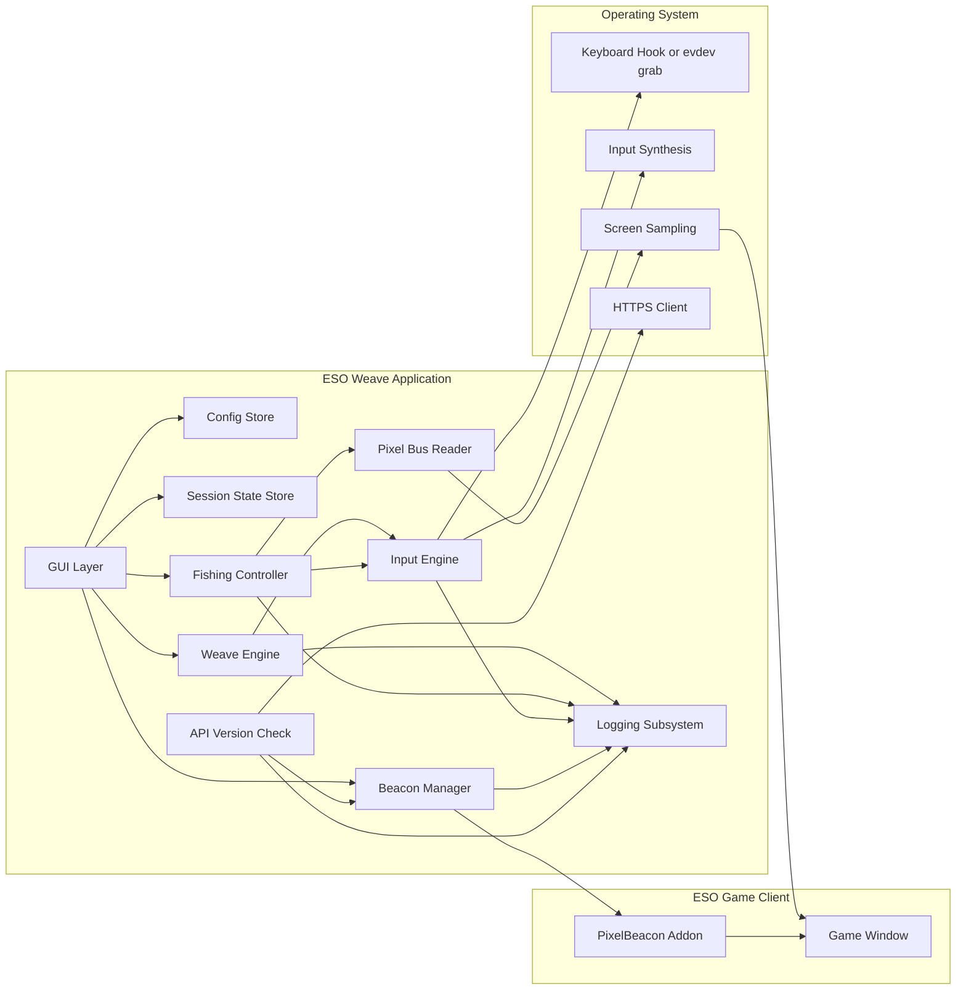
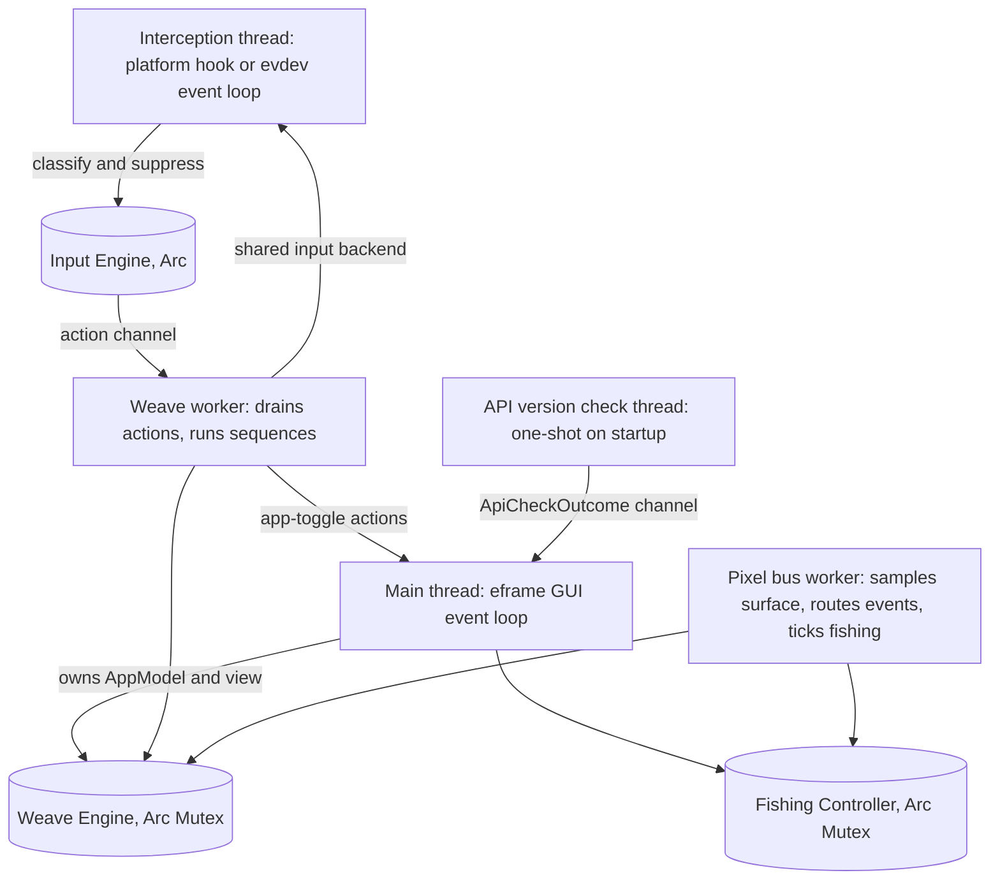
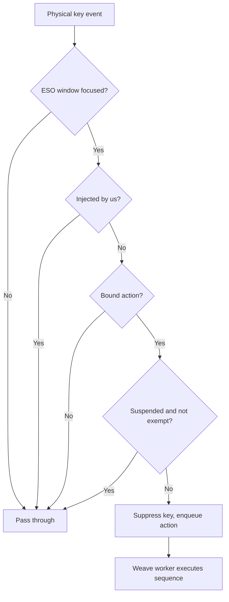
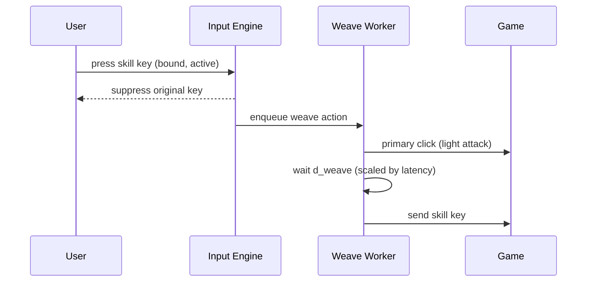
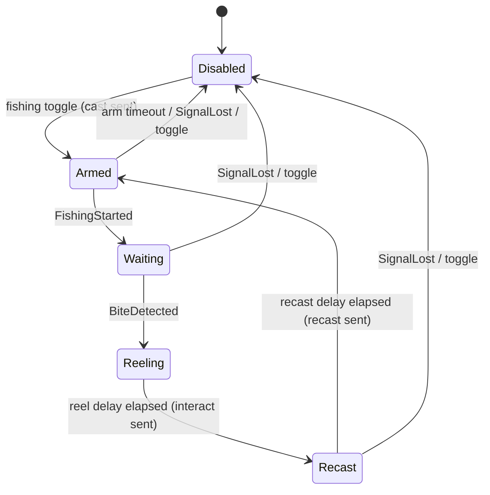
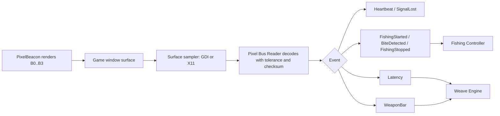
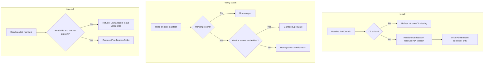
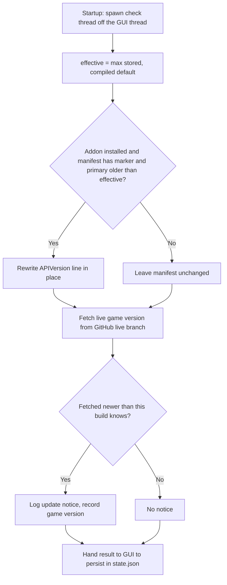
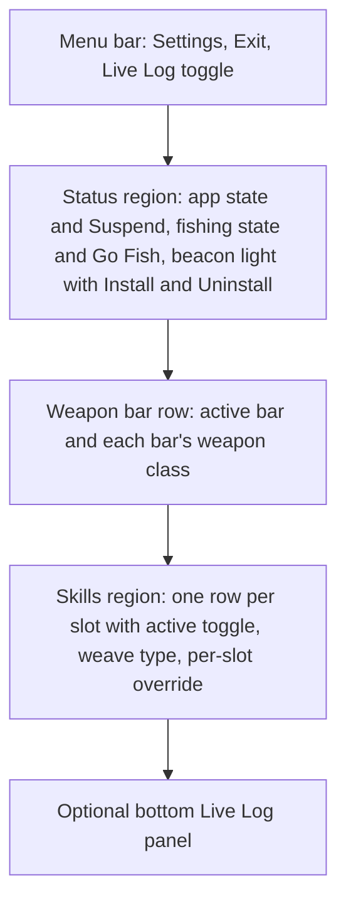
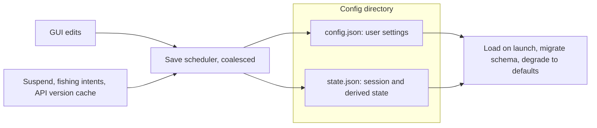

# ESO Weave Technical Specification

**Project:** ESO Weave \
**Repository:** `github.com/h8rt3rmin8r/eso-weave` \
**Document:** `docs/ESO-Weave-Specification-v0.2.0.md` \
**Version:** 0.2.0 \
**Audience:** Human-facing (also consumed by AI coding agents via spec-kit) \
**Author:** h8rt3rmin8r \
**Date:** 2026-07-12 \
**License:** Apache-2.0

## Table of Contents

- [1. Overview](#1-overview)
- [2. Terminology](#2-terminology)
- [3. Scope](#3-scope)
- [4. Platform Support](#4-platform-support)
- [5. System Architecture](#5-system-architecture)
- [6. Concurrency and Ownership](#6-concurrency-and-ownership)
- [7. Input Engine](#7-input-engine)
- [8. Weave Engine](#8-weave-engine)
- [9. Fishing Automation](#9-fishing-automation)
- [10. PixelBeacon Companion Addon](#10-pixelbeacon-companion-addon)
- [11. Graphical User Interface](#11-graphical-user-interface)
- [12. Configuration and Session State](#12-configuration-and-session-state)
- [13. Logging](#13-logging)
- [14. Packaging and Distribution](#14-packaging-and-distribution)
- [15. Repository Conventions](#15-repository-conventions)
- [16. README Disclaimer Text](#16-readme-disclaimer-text)
- [17. Open Items](#17-open-items)
- [Appendix A. Weave Delay Defaults](#appendix-a-weave-delay-defaults)

## 1. Overview

ESO Weave is a desktop companion application for The Elder Scrolls Online (ESO). It
runs entirely outside the game process and provides two capabilities:

1. **Combat weave automation.** While the ESO game window holds keyboard focus,
   configured skill keys are intercepted and replaced with synthesized input
   sequences that perform light attack, heavy attack, bash, or block-cast weaving
   around the skill activation.
2. **Fishing automation.** An optional module casts, detects the fish bite, reels
   in the catch, and recasts, driven by a bite-detection signal.

The application is a single Rust crate targeting Windows 10/11 x64 and Linux x64.
Its combat automation has no in-game dependency of any kind. Its fishing module
depends on **PixelBeacon**, a minimal companion ESO addon embedded in the
application binary and installed or removed from within the application UI.
PixelBeacon translates in-game events into a small on-screen pixel signal, the
"pixel bus," that the application samples from the game window surface. The
application reads that signal; it never reads or writes game memory and never
touches network traffic.

This document is the architecture of record. Every feature traces to it. It
describes the intended system declaratively: what the software is and does.

## 2. Terminology

- **Weave:** The ESO combat technique of slotting a basic attack (light or heavy)
  or a block or bash action into the same global-cooldown window as a skill
  activation.
- **GCD:** ESO's global cooldown for skill activations, 1000 ms.
- **Skill slot:** One of seven automatable inputs: skills 1 through 5, Ultimate
  (default key `R`), and Synergy (default key `X`).
- **Weave type:** One of four fixed action sequences: Light Attack (`LA`), Heavy
  Attack (`HA`), Bash Attack (`BA`), Block Casting (`BL`).
- **Weapon bar:** ESO's front or back weapon set. The active bar and each bar's
  weapon class drive weapon-aware heavy-attack timing.
- **PixelBeacon:** The companion ESO addon defined in [section 10](#10-pixelbeacon-companion-addon).
- **Pixel bus:** The on-screen block protocol rendered by PixelBeacon and sampled
  by the application.
- **Beacon block:** One solid-color square rendered by PixelBeacon at a fixed
  physical-pixel position in the game window.
- **Interact key:** The in-game interaction keybind (default `E`), used to cast,
  reel, and recast during fishing.
- **Managed marker:** The manifest line `## X-ESO-Weave-Managed: true` that
  identifies a PixelBeacon install as owned by ESO Weave and gates every write and
  delete the application performs on the addon files.

## 3. Scope

### 3.1 In scope

- A single-crate Rust desktop application with a graphical UI for Windows 10/11
  x64 and Linux x64.
- Key interception and input synthesis scoped to the focused ESO game window.
- Four fixed weave types with per-skill enable, per-skill weave type, and per-skill
  timing overrides.
- Weapon-bar-aware heavy-attack timing, driven by the active bar and each bar's
  weapon class reported over the pixel bus.
- Latency-adaptive delay adjustment using live server latency reported over the
  pixel bus.
- Fishing automation driven by a bite-detection abstraction, with the pixel-bus
  detector as the reference implementation.
- PixelBeacon addon: embedded resource, automatic AddOns-directory discovery,
  one-click install, one-click uninstall, a live installed-status indicator, and
  automated API-version upkeep of the manifest.
- Fully configurable keybindings, including hotkeys for suspend and for toggling
  fishing without leaving the game.
- Runtime-configurable logging with an optional in-app live log viewer.
- MSI installer for Windows; `.deb` package for Linux.

### 3.2 Out of scope

- Reading or writing game process memory.
- Network traffic interception or packet manipulation.
- Any in-game functionality beyond the PixelBeacon signal contract.
- Multi-account or multi-client orchestration.
- macOS support.
- Publication of PixelBeacon to addon indexes; the addon ships only inside the
  application binary.

## 4. Platform Support

| Platform | Status | Notes |
| --- | --- | --- |
| Windows 10 x64 | Supported | Native ESO client (Steam, standalone, Epic). |
| Windows 11 x64 | Supported | Native ESO client (Steam, standalone, Epic). |
| Linux x64, X11 session | Supported | ESO under Steam Proton. |
| Linux x64, Wayland session | Best effort | Input works via evdev and uinput; screen sampling depends on an XWayland surface. See [Open Items](#17-open-items). |

The application detects the ESO game window by its window identity per platform
(window title on Windows; the corresponding X11 surface on Linux) and treats input
interception as active only while that window holds keyboard focus.

## 5. System Architecture

The application is one process composed of cooperating subsystems. The GUI owns the
view and configuration; the engines own correctness-bearing logic behind trait
seams; the platform layer confines all OS-specific work to per-OS modules.



Component responsibilities:

- **Input Engine.** Platform-abstracted key interception and input synthesis behind
  one `InputBackend` trait with a Windows backend and a Linux backend. See
  [section 7](#7-input-engine).
- **Weave Engine.** The skill and weave state machine. Owns cooldown gating, weave
  sequence execution, weapon-bar-aware and latency-adaptive timing math.
  Platform-agnostic and unit-tested with a mock input sink.
- **Fishing Controller.** The fishing state machine. Consumes detector events and
  drives interact-key synthesis through a `FishingSink` seam.
- **Pixel Bus Reader.** Samples the beacon blocks from the game window surface and
  decodes them into typed events (heartbeat, fishing state, latency, weapon bar).
- **Beacon Manager.** Discovers the ESO AddOns directory, installs, verifies, and
  uninstalls PixelBeacon, and reports installed status to the GUI. Every write and
  delete is gated by the managed marker.
- **API Version Check.** Keeps the on-disk PixelBeacon manifest API version current
  (see [section 10.7](#107-api-version-automation)).
- **Config Store.** Loads, validates, and persists user settings only.
- **Session State Store.** Persists derived runtime state (suspend and fishing
  intents, the API-version cache) separately from settings.
- **Logging Subsystem.** Structured logging with a runtime-adjustable level, an
  optional file sink, and an always-available in-memory ring buffer feeding the
  live log viewer.
- **GUI Layer.** An immediate-mode egui/eframe interface. Its visual identity is
  governed by the brand standard under `docs/brand/`.

## 6. Concurrency and Ownership

The application uses `std::thread`, `Arc<Mutex<...>>`, and `std::sync::mpsc`. It
has no async runtime. The GUI owns the main thread; long-running or blocking work
runs on dedicated worker threads that share subsystems through `Arc`, and hand
results back to the GUI through channels drained once per frame.



Contract highlights:

- The interception callback never sleeps or performs blocking work; it classifies
  the key, suppresses it if bound, and hands an event to the engine. On Windows a
  slow low-level hook callback causes the OS to remove the hook, so this is a hard
  requirement.
- All timed sequences run on the weave worker, never on the hook thread.
- The weave worker forwards the two application-level toggles (suspend, fishing) to
  the GUI intent path rather than to the weave engine, so a hotkey and its GUI
  button reach one shared state.
- The pixel-bus worker and the GUI stamp and evaluate fishing deadlines against one
  shared monotonic clock origin.
- The startup API version check runs on its own one-shot thread and hands its result
  to the GUI through a channel; it never blocks the window from appearing.

## 7. Input Engine

### 7.1 Interception model

The engine intercepts configured physical keys only while the ESO window is
focused, suppresses the original keystroke, and enqueues a weave action. All other
keys pass through untouched. When the application is suspended, all interception is
disabled except the bindings marked suspend-exempt (the suspend toggle and the
fishing toggle). Synthetic input generated by the engine is flagged so the engine
never intercepts its own output.



### 7.2 Threading contract

Interception callbacks never sleep or perform blocking work. The hook thread's only
job is to classify the key, suppress it if bound, and hand an event to the engine
worker. All timed sequences (clicks, delays, key sends) execute on the weave worker
thread.

### 7.3 Platform backends

- **Windows.** A `WH_KEYBOARD_LL` hook for interception and `SendInput` for
  synthesis, with injected-input flagging to break recursion. Timer resolution is
  raised via `timeBeginPeriod` for the lifetime of the worker.
- **Linux.** An evdev grab of the physical keyboard device for interception and a
  uinput virtual device for synthesis. This operates below the display server and
  behaves identically under X11 and Wayland. It requires the user to be in the
  `input` group or an equivalent udev rule; the Linux package documents this.

### 7.4 Keybinding model

All bindings are user-configurable. The binding table maps an action to a physical
key. Default bindings:

| Action | Default key | Suspend-exempt |
| --- | --- | --- |
| Skill 1 through Skill 5 | `1` `2` `3` `4` `5` | No |
| Ultimate | `R` | No |
| Synergy | `X` | No |
| Toggle suspend | `F1` | Yes |
| Toggle fishing | `F2` | Yes |

Bindings are scoped to the focused ESO window in all cases; the application never
intercepts input globally. The GUI provides a capture-style rebinding control for
each action and rejects conflicting assignments.

## 8. Weave Engine

### 8.1 Skill model

Seven skill slots, each with the following user-visible configuration:

| Slot | Label | Default key | Default type | Default active |
| --- | --- | --- | --- | --- |
| 1 | Skill 1 | `1` | Light Attack | Yes |
| 2 | Skill 2 | `2` | Light Attack | Yes |
| 3 | Skill 3 | `3` | Light Attack | Yes |
| 4 | Skill 4 | `4` | Light Attack | Yes |
| 5 | Skill 5 | `5` | Light Attack | Yes |
| 6 | Ultimate (R) | `R` | Light Attack | No |
| 7 | Synergy (X) | `X` | Light Attack | No |

Slots 6 and 7 are labeled "Ultimate" and "Synergy" in the UI with their bound key
shown. When a slot is inactive, its key passes through to the game unmodified.

### 8.2 Weave types and sequences

The weave type list is fixed at four entries. "Primary" is the left mouse button
(basic attack); "secondary" is the right mouse button (block or bash modifier).

| Type | Sequence |
| --- | --- |
| Light Attack (`LA`) | primary click, wait `d_weave`, send skill key |
| Heavy Attack (`HA`) | primary down, wait `d_heavy`, send skill key, primary up |
| Bash Attack (`BA`) | primary click, wait `d_weave`, send skill key, wait `d_bash`, secondary down, primary click, secondary up |
| Block Casting (`BL`) | secondary down, send skill key, wait `d_weave`, secondary up |

A light-attack weave, the common case:



### 8.3 Timing model

Global timing defaults (milliseconds, all user-configurable):

| Parameter | Default | Description |
| --- | --- | --- |
| `global_cooldown` | 500 | Minimum interval between weave executions; a weave request inside the window is dropped while the key stays suppressed. |
| `d_weave` | 50 | Base gap between the basic attack and the skill key (`LA`, `BA`, `BL`). |
| `d_heavy` | 1000 | Heavy attack hold before the skill key (overridden per weapon class when weapon-aware timing is on). |
| `d_bash` | 125 | Gap before the bash action in `BA`. |

Every skill slot supports per-slot delay overrides for the parameters relevant to
its weave type, accommodating skills with long cast times. A blank override means
"use the global default."

### 8.4 Weapon-bar-aware timing

Heavy-attack channel duration depends on the equipped weapon class, and ESO players
carry two weapon bars. When weapon-aware timing is enabled, the engine selects the
`d_heavy` preset for the active bar's weapon class, reported over the pixel bus B3
weapon-bar block ([section 10.3](#103-pixel-bus-protocol)). The per-class presets
are in [Appendix A](#appendix-a-weave-delay-defaults). When the weapon bar is
unknown, the engine keeps the configured `d_heavy`.

### 8.5 Latency-adaptive delays

When the pixel bus reports latency, the engine adjusts delays in real time:

```text
effective_delay = base_delay + round(k * latency_ms)
```

- `k` defaults to 0.25 and is user-configurable.
- The adjustment applies to `d_weave` and `d_bash`; `d_heavy` and `global_cooldown`
  are not scaled.
- `effective_delay` is clamped to `[base_delay, base_delay + 300]`.
- The feature is off by default and requires PixelBeacon; without latency data the
  engine uses base delays unchanged.

## 9. Fishing Automation

### 9.1 Detector abstraction

Bite detection is defined by a detector that emits typed events: `Heartbeat`,
`FishingStarted`, `BiteDetected`, `FishingStopped`, `SignalLost`. The reference
implementation is `PixelBusDetector` ([section 10](#10-pixelbeacon-companion-addon)),
which adapts the pixel-bus reader. The abstraction lets future detectors be added
without modifying the fishing controller.

### 9.2 Fishing controller state machine

The controller is a pure, event-and-tick-driven state machine. It consumes detector
events and clock ticks and emits the interact key through the `FishingSink` seam. It
never blocks and never fires input blind: loss of the beacon heartbeat disables
fishing rather than sending the interact key into an unknown state.



Behavioral requirements:

- The fishing toggle is a bound hotkey usable inside the game (default `F2`) and a
  GUI button; both control one shared state.
- In `Armed`, the controller sends the interact key once to cast, then expects
  `FishingStarted` within `arm_timeout_ms` (default 8000) or disables fishing,
  recording the reason.
- On `BiteDetected`, the controller sends the interact key after `reel_delay_ms`
  (default 100), waits `recast_delay_ms` (default 3000) for the catch to resolve,
  then sends the interact key again to recast.
- Loss of the beacon heartbeat emits `SignalLost` and disables fishing.
- When fishing returns to idle, the controller records why (user stop, no cast
  detected, or signal lost) so the GUI explains an early stop rather than leaving
  it silent.
- All fishing timing parameters are user-configurable.

### 9.3 Bait requirement

Fishing requires bait selected in game. ESO will not cast the line without bait, so
with no bait selected the cast the controller sends never starts a fishing
interaction, the beacon never reports `FishingStarted`, and the controller disables
fishing on the arm timeout. Bait selection is a user precondition, documented in the
README, not something the application can supply.

## 10. PixelBeacon Companion Addon

### 10.1 Nature and constraints

ESO exposes its Lua API only to addons loaded from the AddOns directory, with no
external subscription mechanism and no real-time file channel. PixelBeacon is
therefore the smallest possible in-game shim: it renders a few solid-color blocks
that encode state and does nothing else. It has no settings, no user interface
beyond the blocks, no libraries, and no saved variables, and it is never published
to addon indexes. It ships embedded in the application binary and is managed
exclusively by the Beacon Manager.

### 10.2 Bite detection contract

PixelBeacon detects a bite via the bait-consumption mechanism established by prior
art in the ESO addon community:

- Register `EVENT_INVENTORY_SINGLE_SLOT_UPDATE` and treat a stack-count change of
  -1 on the equipped bait, while a fishing interaction is active and no menu is
  open, as a bite.
- Gate "fishing interaction active" on the client interaction result
  (`EVENT_CLIENT_INTERACT_RESULT` with interaction type `INTERACTION_FISH` while
  the game camera is interacting).
- Clear the bite state when a new item is gained (catch resolved), on
  `EVENT_CHATTER_END`, or after a safety timeout.
- Suppress detection while menus are open to avoid consumable-use false positives.

### 10.3 Pixel bus protocol

PixelBeacon renders up to four beacon blocks anchored to the top-left corner of the
game window's client area. Blocks are 16 by 16 physical pixels; the addon
compensates for the user's UI scale so block geometry is constant in physical
pixels. Blocks are hidden during loading screens by the game's UI lifecycle.

| Block | Position (px) | Sample (px) | Meaning |
| --- | --- | --- | --- |
| B0 Status | (0, 0) | (8, 8) | Solid `#FF00FF` whenever the addon is loaded and rendering (heartbeat). |
| B1 Fishing | (16, 0) | (24, 8) | `#0080FF` while a cast is active and waiting; `#00FF00` on a detected bite; hidden otherwise. |
| B2 Latency | (32, 0) | (40, 8) | Encodes `GetLatency()`: `R = clamp(latency, 0, 1020) / 4`, `G = 0xA5` marker, `B = 255 - R` checksum. Updated at 1 Hz. |
| B3 Weapon bar | (48, 0) | (56, 8) | `G = 0x5A` marker, `R` packs front and back weapon-class nibbles (`front * 16 + back`), `B` is the active-bar code (0 unknown, 1 front, 2 back). |

Weapon-class codes are shared byte-for-byte between the addon and the reader: 0
none, 1 dual wield, 2 two handed, 3 sword and shield, 4 bow, 5 destruction staff, 6
restoration staff.



The reader samples the block points at a configurable interval: fast (default 100
ms) while a fishing session is active, slow (default 1000 ms) otherwise. Sample
matching allows a small per-channel tolerance (default plus or minus 2) to absorb
compositor rounding, and the marker and checksum channels guard against misreads.
Loss of B0 for more than `heartbeat_timeout_ms` (default 2000) raises `SignalLost`.
On Windows the sampler captures a small strip of the composited desktop at the game
window's top-left client area (a GDI `BitBlt` from the screen device context) and
reads the block points from it, so pixels rendered through a hardware-accelerated
(DirectX) surface are read as displayed; a read of the window device context alone
returns the GDI front buffer, which does not contain the accelerated content. On
Linux the sampler uses X11 or XWayland capture.

### 10.4 AddOns directory discovery

The Beacon Manager locates the ESO AddOns directory without user input in the common
cases, and honors a manual path override:

- **Windows.** Resolve the user's Documents known folder via the shell API (never
  assume a literal path), then `Elder Scrolls Online\<env>\AddOns`.
- **Linux (Proton).** Enumerate Steam libraries from `libraryfolders.vdf`, locate
  app id `306130`, and resolve the addon path under
  `steamapps/compatdata/306130/pfx/.../Documents/Elder Scrolls Online/<env>/AddOns`.
- Both platforms default to the `live` environment, with `pts` selectable in
  settings.

### 10.5 Lifecycle: install, verify, uninstall



- **Install** writes the embedded addon files into `AddOns/PixelBeacon/` (manifest
  `PixelBeacon.txt` and `PixelBeacon.lua`), confined to that subfolder, rendering
  the manifest with the resolved API version. Install over an existing copy is an
  update.
- **Verify** classifies the install into NotInstalled, Unmanaged, ManagedUpToDate,
  or ManagedVersionMismatch.
- **Uninstall** removes the folder if and only if the managed marker is present in
  its on-disk manifest. An unmanaged or unreadable folder is never deleted. This is
  a safety-critical invariant.
- If the game is running during install or uninstall, the UI reminds the user that
  a `/reloadui` or relog is required for the change to take effect.

### 10.6 Manifest and versions

The manifest declares an addon `## Version` and `## AddOnVersion` (single-sourced as
the embedded addon version) and an `## APIVersion` line carrying one or more ESO
client API versions. The managed marker line identifies the install as owned by ESO
Weave.

### 10.7 API version automation

ESO raises its client API version each patch and flags an addon "Out of Date" when
the manifest `## APIVersion` falls behind, which can prevent the addon loading and
break fishing. ESO Weave keeps the manifest current automatically.



- A compiled default API version guarantees a valid manifest with no network access
  and no stored value.
- The numeric API version written to the manifest resolves as the maximum of the
  stored last known value and the compiled default; the application never downgrades
  the on-disk value and never guesses a number.
- The exact numeric API version is published only behind bot challenges a plain
  client cannot pass. The check fetches the live game client version string from the
  official esoui/esoui GitHub `live` branch as the bump-detection signal, and warns
  in the live log when the client has moved past this build so the player updates
  the application.
- Rewriting the `## APIVersion` line changes only that line, preserves every other
  line including the managed marker, sets the resolved value as the primary token,
  keeps any greater tokens, and drops lesser ones.
- Every manifest write is gated by the managed marker, extending the uninstall
  safety guarantee to edits.
- The check runs once per startup, off the GUI thread, and never blocks startup or
  panics on network or parse failure. The last known API version and last seen game
  version persist in the session state store.

## 11. Graphical User Interface

### 11.1 Main window

A single resizable window (default 600 by 720, minimum 480 by 420) with the
following regions:



- **Status region.** The application state indicator and Suspend or Resume control;
  the fishing state indicator and Go Fish or Stop Fishing control; the PixelBeacon
  status light (green when installed and current, red when missing or mismatched,
  with a tooltip stating the exact condition); a one-click Install control; and a
  one-click Uninstall control with a single confirmation, disabled when the beacon
  is not installed.
- **Weapon bar row.** The active bar and each bar's decoded weapon class, sourced
  from the pixel bus B3 block.
- **Skills region.** One row per slot: label (including "Ultimate (R)" and "Synergy
  (X)"), active toggle, weave type dropdown, and a per-slot delay override.
- **Menu bar.** Settings, Exit, and a Live Log toggle that attaches or removes a
  bottom log panel.

Hovering an interactive control changes its color, never its size, so the layout
never reflows on hover.

### 11.2 Live log viewer

The live log panel displays the most recent log events from an in-memory ring
buffer, colorized by level. It works whether or not file logging is enabled,
autoscrolls while at the bottom, and offers a level filter local to the panel.

### 11.3 Settings

The settings modal fills its width, with its scrollbar at the right edge. It edits,
and persists to the config file, all of: keybindings; global and per-slot delays;
weapon-aware timing and per-class presets; latency adaptation and `k`; fishing
timings and interact key; pixel-bus sampling interval and tolerance; AddOns path
override and live or pts selection; log level and file logging; theme (dark default,
light optional); and always-on-top. Changes apply live and persist through a
coalesced save, with no explicit save action.

## 12. Configuration and Session State

The application separates user settings from derived runtime state into two files in
the same directory. This separation is a hard constraint: the config file holds user
settings only.



- **Location.** `%APPDATA%\eso-weave\` on Windows; `$XDG_CONFIG_HOME/eso-weave/`
  (fallback `~/.config/eso-weave/`) on Linux.
- **Format.** JSON, UTF-8 without a byte order mark, LF line endings,
  pretty-printed, trailing newline.
- **config.json.** User settings only, organized into per-module opaque sections
  (timing, skills, beacon, fishing, latency, pixelbus, ui) each owned by its module
  and additive across versions. A top-level `schema_version` migrates older schemas
  forward on load. Invalid config falls back to defaults, preserves the bad file
  with a `.invalid` suffix, and surfaces a notice.
- **state.json.** Derived runtime state: the suspend and fishing intents and the
  API-version cache (last known numeric API version and last seen game version). A
  restored running or fishing intent performs no input until the game window is
  focused, upholding the focus-scoped input invariant. Loading never panics and
  degrades to safe defaults.
- Writes are coalesced through a save scheduler: a change marks the relevant store
  dirty, and a settled interval later a single write flushes it.

## 13. Logging

- Structured logging (the `tracing` ecosystem) with runtime level selection from the
  UI: OFF, ERROR, WARN, INFO, DEBUG, TRACE.
- **File sink.** Optional, toggleable at runtime. Monthly log files named
  `YYYY-MM.log` under the platform data directory. Line format: UTC timestamp,
  level, target, message.
- **Ring buffer sink.** Always active, feeding the live log viewer independently of
  the file sink.
- Input contents are never logged above DEBUG, and no keystroke logging occurs while
  the application is suspended.

## 14. Packaging and Distribution

- **Windows.** An MSI built with `cargo-wix`, providing install, uninstall,
  upgrade-in-place, a Start Menu entry, and the application icon. The MSI never
  writes to game or Documents directories; PixelBeacon management is an in-app
  runtime action.
- **Linux.** A `.deb` package built with `cargo-deb`. Package documentation covers
  the evdev permission requirement (`input` group membership or the provided udev
  rule) and ships a udev rule for `/dev/uinput`.
- Release binaries are produced by CI from tagged versions. Version numbers follow
  SemVer and are single-sourced from `Cargo.toml`.

## 15. Repository Conventions

The repository is `github.com/h8rt3rmin8r/eso-weave`, licensed Apache-2.0. It
follows the GitHub spec-kit workflow: this document is the master specification, and
individual features are derived from it into numbered `specs/NNN-name/` directories
(each holding its `spec.md`, `plan.md`, and `tasks.md`), governed by
`.specify/memory/constitution.md`. Build plans under `docs/plans/` sequence that
derivation into ordered slices.

```text
eso-weave/
├── .github/            # CI workflows and agent command prompts
├── .specify/           # constitution, scripts, templates (spec-kit scaffolding)
├── specs/              # generated per-feature spec-kit directories
├── docs/
│   ├── ESO-Weave-Specification-v0.2.0.md
│   ├── build-autopilot.md
│   ├── releasing.md
│   └── plans/          # build plans decomposing this spec into features
├── addon/
│   └── PixelBeacon/    # companion addon source, embedded at build time
├── src/                # Rust application (single crate; platform backends as modules)
├── assets/             # icon and packaging art
├── packaging/          # WiX (MSI) config and deb metadata
├── tests/              # integration tests
├── Cargo.toml
├── LICENSE
└── README.md
```

Source conventions: a single Rust crate with platform backends as modules
(`input/windows.rs`, `input/linux.rs`, and the corresponding sampling backends);
correctness-bearing logic sits behind trait seams and is unit-tested with mocks. All
text files are UTF-8 without a byte order mark, with LF line endings, and contain no
em-dashes or en-dashes.

## 16. README Disclaimer Text

The repository `README.md` includes the following section verbatim:

```markdown
## Disclaimer

This project is published for educational purposes only. It exists as a study
in cross-platform input handling, screen-signal protocols, and game-adjacent
tooling architecture. It is not affiliated with, endorsed by, or supported by
ZeniMax Online Studios, ZeniMax Media Inc., Bethesda Softworks, or Microsoft.
The Elder Scrolls® and The Elder Scrolls Online are trademarks or registered
trademarks of ZeniMax Media Inc.

Automating gameplay input may violate the Terms of Service of The Elder
Scrolls Online. Using this software with a live game account is done entirely
at your own risk. You are solely responsible for reviewing and complying with
all agreements that govern your account, and you accept all consequences of
your use of this software, up to and including permanent account suspension.

The author assumes no liability for any account action, data loss, or other
damages arising from the use or misuse of this software. This software is
provided "AS IS", without warranty of any kind, express or implied, in
accordance with the Apache License, Version 2.0 under which it is distributed.
```

## 17. Open Items

| ID | Item | Notes |
| --- | --- | --- |
| R1 | Weave delay defaults research | CLOSED (slice 014). Evidence-based defaults recorded in [Appendix A](#appendix-a-weave-delay-defaults). |
| R2 | Audio-cue bite detector | Prototype a loopback-capture detector as a second detector, removing the addon dependency for fishing. Post-1.0. |
| R3 | Pure-Wayland sampling path | Evaluate xdg-desktop-portal screen capture for sessions without an XWayland ESO surface. |
| R4 | PixelBeacon APIVersion upkeep | CLOSED (slice 018). Automated by the API version check ([section 10.7](#107-api-version-automation)); the compiled default is refreshed at release. |
| R5 | Interact key discovery | The interact key is configurable (default `E`); evaluate reading it from the game's keybind exports rather than configuring it manually. Low priority. |

## Appendix A. Weave Delay Defaults

Evidence-based defaults drawn from community combat data. The millisecond values
ship as adjustable configuration defaults, not fixed constants.

### A.1 Global cooldown and weave window

ESO's global cooldown is 1000 ms: at most one ability activates per second. Light
and heavy attacks run on a parallel track (effectively off-GCD), and weaving fires
one light attack plus one skill within the same window. The practical target is
about 965 ms per light-attack-plus-skill cycle; exceeding 1000 ms drops light
attacks. The true lower bound on `d_weave` is dominated by server latency rather
than local timing, so `d_weave` defaults small (50 ms) and the latency-adaptive path
shortens it; the weapon-specific knob is `d_heavy`.

### A.2 Per-weapon-class heavy-attack defaults

Approximate fully-charged heavy-attack channel durations by weapon class, used as
the per-bar `d_heavy` presets when weapon-aware timing is enabled:

| Weapon class | `d_heavy` default (ms) | Source note |
| --- | --- | --- |
| Dual wield | 640 | Fastest heavy attack (community measurements). |
| Two handed | 1050 | Next-fastest melee. |
| Destruction staff | 1180 | Fire and frost; lightning folded into this class for now. |
| Restoration staff | 1360 | |
| Bow | 1380 | |
| Sword and shield | 900 | Estimate; flagged for in-game measurement. |
| None or unknown | keep configured value | No preset applied. |

### A.3 Owed in-game validation

- Re-validate each preset against live timing per current patch.
- Measure the sword-and-shield heavy-attack duration (currently an estimate).
- Confirm the B3 weapon-bar signal decodes correctly across bar swaps, loading
  screens, and death.
