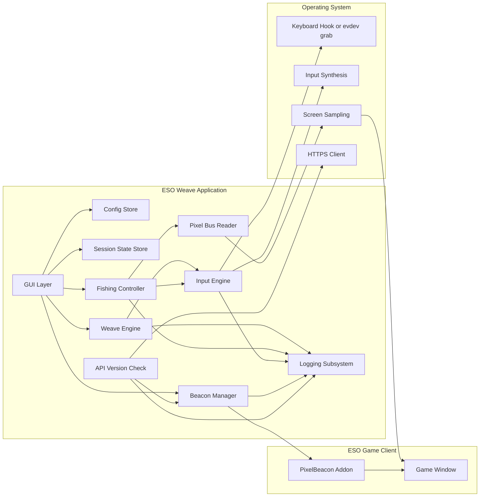
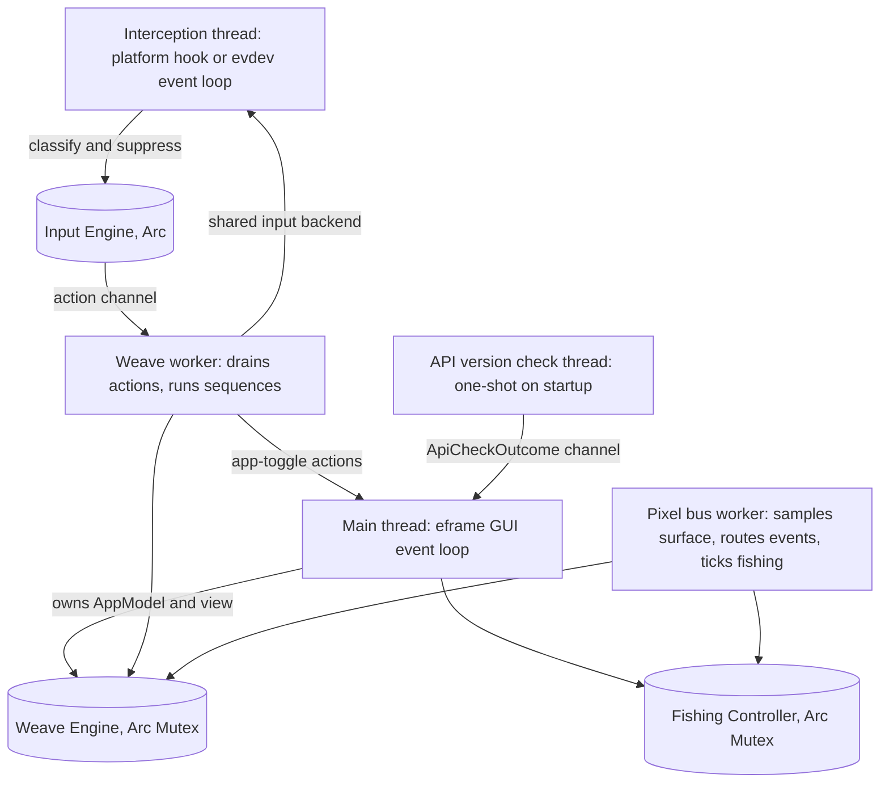
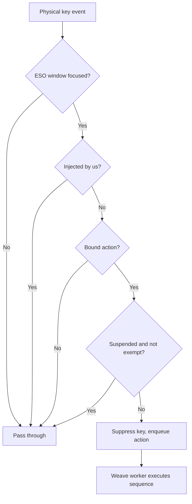
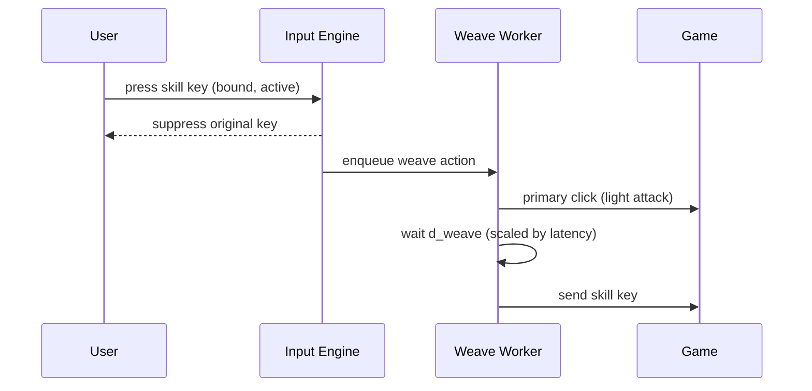
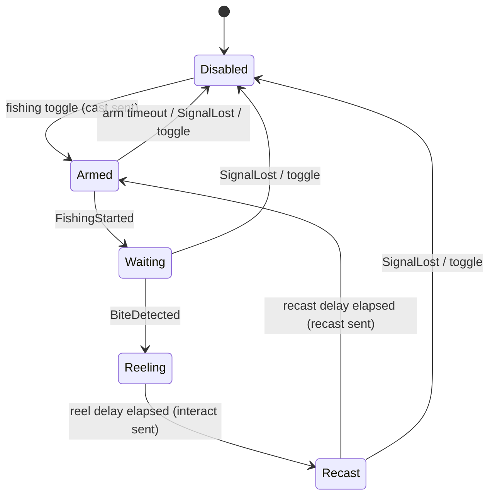
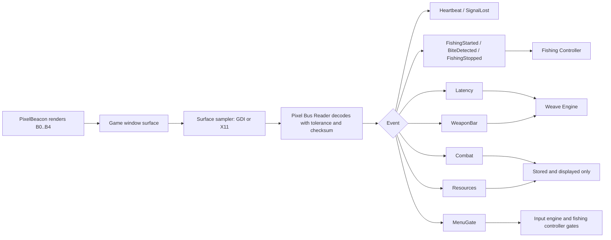
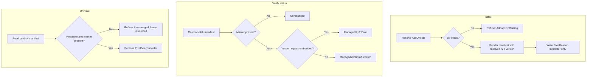
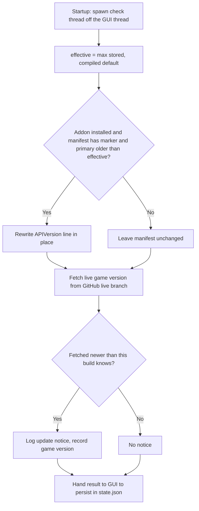
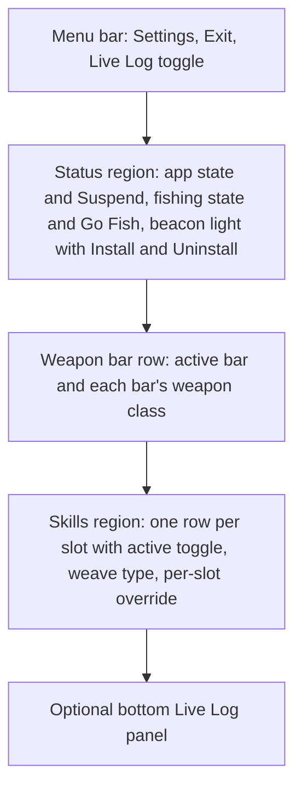
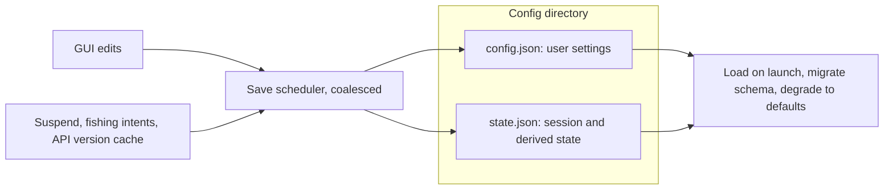

# ESO Weave Technical Specification

**Project:** ESO Weave \
**Repository:** `github.com/h8rt3rmin8r/eso-weave` \
**Document:** `docs/ESO-Weave-Specification-v0.2.0.md` \
**Version:** 0.2.0 \
**Audience:** Human-facing (also consumed by AI coding agents via spec-kit) \
**Author:** h8rt3rmin8r \
**Date:** 2026-07-12 \
**License:** Apache-2.0

## Table of Contents

- [1. Overview](#1-overview)
- [2. Terminology](#2-terminology)
- [3. Scope](#3-scope)
- [4. Platform Support](#4-platform-support)
- [5. System Architecture](#5-system-architecture)
- [6. Concurrency and Ownership](#6-concurrency-and-ownership)
- [7. Input Engine](#7-input-engine)
- [8. Weave Engine](#8-weave-engine)
- [9. Fishing Automation](#9-fishing-automation)
- [10. PixelBeacon Companion Addon](#10-pixelbeacon-companion-addon)
- [11. Graphical User Interface](#11-graphical-user-interface)
- [12. Configuration and Session State](#12-configuration-and-session-state)
- [13. Logging](#13-logging)
- [14. Packaging and Distribution](#14-packaging-and-distribution)
- [15. Repository Conventions](#15-repository-conventions)
- [16. README Disclaimer Text](#16-readme-disclaimer-text)
- [17. Open Items](#17-open-items)
- [Appendix A. Weave Delay Defaults](#appendix-a-weave-delay-defaults)

## 1. Overview

ESO Weave is a desktop companion application for The Elder Scrolls Online (ESO). It
runs entirely outside the game process and provides two capabilities:

1. **Combat weave automation.** While the ESO game window holds keyboard focus,
   configured skill keys are intercepted and replaced with synthesized input
   sequences that perform light attack, heavy attack, bash, or block-cast weaving
   around the skill activation.
2. **Fishing automation.** An optional module casts, detects the fish bite, reels
   in the catch, and recasts, driven by a bite-detection signal.

The application is a single Rust crate targeting Windows 10/11 x64 and Linux x64.
Its combat automation has no in-game dependency of any kind. Its fishing module
depends on **PixelBeacon**, a minimal companion ESO addon embedded in the
application binary and installed or removed from within the application UI.
PixelBeacon translates in-game events into a small on-screen pixel signal, the
"pixel bus," that the application samples from the game window surface. The
application reads that signal; it never reads or writes game memory and never
touches network traffic.

This document is the architecture of record. Every feature traces to it. It
describes the intended system declaratively: what the software is and does.

## 2. Terminology

- **Weave:** The ESO combat technique of slotting a basic attack (light or heavy)
  or a block or bash action into the same global-cooldown window as a skill
  activation.
- **GCD:** ESO's global cooldown for skill activations, 1000 ms.
- **Skill slot:** One of seven automatable inputs: skills 1 through 5, Ultimate
  (default key `R`), and Synergy (default key `X`).
- **Weave type:** One of four fixed action sequences: Light Attack (`LA`), Heavy
  Attack (`HA`), Bash Attack (`BA`), Block Casting (`BL`).
- **Weapon bar:** ESO's front or back weapon set. The active bar and each bar's
  weapon class drive weapon-aware heavy-attack timing.
- **PixelBeacon:** The companion ESO addon defined in [section 10](#10-pixelbeacon-companion-addon).
- **Pixel bus:** The on-screen block protocol rendered by PixelBeacon and sampled
  by the application.
- **Beacon block:** One solid-color square rendered by PixelBeacon at a fixed
  physical-pixel position in the game window.
- **Interact key:** The in-game interaction keybind (default `E`), used to cast,
  reel, and recast during fishing.
- **Managed marker:** The manifest line `## X-ESO-Weave-Managed: true` that
  identifies a PixelBeacon install as owned by ESO Weave and gates every write and
  delete the application performs on the addon files.

## 3. Scope

### 3.1 In scope

- A single-crate Rust desktop application with a graphical UI for Windows 10/11
  x64 and Linux x64.
- Key interception and input synthesis scoped to the focused ESO game window.
- Four fixed weave types with per-skill enable, per-skill weave type, and per-skill
  timing overrides.
- Weapon-bar-aware heavy-attack timing, driven by the active bar and each bar's
  weapon class reported over the pixel bus.
- Latency-adaptive delay adjustment using live server latency reported over the
  pixel bus.
- Fishing automation driven by a bite-detection abstraction, with the pixel-bus
  detector as the reference implementation.
- PixelBeacon addon: embedded resource, automatic AddOns-directory discovery,
  one-click install, one-click uninstall, a live installed-status indicator, and
  automated API-version upkeep of the manifest.
- Fully configurable keybindings, including hotkeys for suspend and for toggling
  fishing without leaving the game.
- Runtime-configurable logging with an optional in-app live log viewer.
- MSI installer for Windows; `.deb` package for Linux.

### 3.2 Out of scope

- Reading or writing game process memory.
- Network traffic interception or packet manipulation.
- Any in-game functionality beyond the PixelBeacon signal contract.
- Multi-account or multi-client orchestration.
- macOS support.
- Publication of PixelBeacon to addon indexes; the addon ships only inside the
  application binary.

## 4. Platform Support

| Platform | Status | Notes |
| --- | --- | --- |
| Windows 10 x64 | Supported | Native ESO client (Steam, standalone, Epic). |
| Windows 11 x64 | Supported | Native ESO client (Steam, standalone, Epic). |
| Linux x64, X11 session | Supported | ESO under Steam Proton. |
| Linux x64, Wayland session | Best effort | Input works via evdev and uinput; screen sampling depends on an XWayland surface. See [Open Items](#17-open-items). |

The application detects the ESO game window by its window identity per platform
(window title on Windows; the corresponding X11 surface on Linux) and treats input
interception as active only while that window holds keyboard focus.

## 5. System Architecture

The application is one process composed of cooperating subsystems. The GUI owns the
view and configuration; the engines own correctness-bearing logic behind trait
seams; the platform layer confines all OS-specific work to per-OS modules.


```mermaid
flowchart LR
    subgraph app [ESO Weave Application]
        GUI[GUI Layer]
        CFG[Config Store]
        ST[Session State Store]
        LOG[Logging Subsystem]
        WE[Weave Engine]
        FC[Fishing Controller]
        IE[Input Engine]
        PB[Pixel Bus Reader]
        BM[Beacon Manager]
        AV[API Version Check]
    end
    subgraph os [Operating System]
        HK[Keyboard Hook or evdev grab]
        SY[Input Synthesis]
        SC[Screen Sampling]
        NET[HTTPS Client]
    end
    subgraph game [ESO Game Client]
        WIN[Game Window]
        ADDON[PixelBeacon Addon]
    end
    GUI --> CFG
    GUI --> ST
    GUI --> BM
    GUI --> WE
    GUI --> FC
    WE --> IE
    FC --> IE
    FC --> PB
    IE --> HK
    IE --> SY
    PB --> SC
    SC --> WIN
    ADDON --> WIN
    BM --> ADDON
    AV --> NET
    AV --> BM
    WE --> LOG
    FC --> LOG
    IE --> LOG
    BM --> LOG
    AV --> LOG
```

Component responsibilities:

- **Input Engine.** Platform-abstracted key interception and input synthesis behind
  one `InputBackend` trait with a Windows backend and a Linux backend. See
  [section 7](#7-input-engine).
- **Weave Engine.** The skill and weave state machine. Owns cooldown gating, weave
  sequence execution, weapon-bar-aware and latency-adaptive timing math.
  Platform-agnostic and unit-tested with a mock input sink.
- **Fishing Controller.** The fishing state machine. Consumes detector events and
  drives interact-key synthesis through a `FishingSink` seam.
- **Pixel Bus Reader.** Samples the beacon blocks from the game window surface and
  decodes them into typed events (heartbeat, fishing state, latency, weapon bar).
- **Beacon Manager.** Discovers the ESO AddOns directory, installs, verifies, and
  uninstalls PixelBeacon, and reports installed status to the GUI. Every write and
  delete is gated by the managed marker.
- **API Version Check.** Keeps the on-disk PixelBeacon manifest API version current
  (see [section 10.7](#107-api-version-automation)).
- **Config Store.** Loads, validates, and persists user settings only.
- **Session State Store.** Persists derived runtime state (suspend and fishing
  intents, the API-version cache) separately from settings.
- **Logging Subsystem.** Structured logging with a runtime-adjustable level, an
  optional file sink, and an always-available in-memory ring buffer feeding the
  live log viewer.
- **GUI Layer.** An immediate-mode egui/eframe interface. Its visual identity is
  governed by the brand standard under `docs/brand/`.

## 6. Concurrency and Ownership

The application uses `std::thread`, `Arc<Mutex<...>>`, and `std::sync::mpsc`. It
has no async runtime. The GUI owns the main thread; long-running or blocking work
runs on dedicated worker threads that share subsystems through `Arc`, and hand
results back to the GUI through channels drained once per frame.


```mermaid
flowchart TB
    MAIN[Main thread: eframe GUI event loop]
    INT[Interception thread: platform hook or evdev event loop]
    WW[Weave worker: drains actions, runs sequences]
    PBW[Pixel bus worker: samples surface, routes events, ticks fishing]
    AVC[API version check thread: one-shot on startup]

    IE[(Input Engine, Arc)]
    WE[(Weave Engine, Arc Mutex)]
    FC[(Fishing Controller, Arc Mutex)]

    MAIN -->|owns AppModel and view| WE
    MAIN --> FC
    INT -->|classify and suppress| IE
    IE -->|action channel| WW
    WW -->|app-toggle actions| MAIN
    WW --> WE
    PBW --> WE
    PBW --> FC
    AVC -->|ApiCheckOutcome channel| MAIN
    WW -->|shared input backend| INT
```

Contract highlights:

- The interception callback never sleeps or performs blocking work; it classifies
  the key, suppresses it if bound, and hands an event to the engine. On Windows a
  slow low-level hook callback causes the OS to remove the hook, so this is a hard
  requirement.
- All timed sequences run on the weave worker, never on the hook thread.
- The weave worker forwards the two application-level toggles (suspend, fishing) to
  the GUI intent path rather than to the weave engine, so a hotkey and its GUI
  button reach one shared state.
- The pixel-bus worker and the GUI stamp and evaluate fishing deadlines against one
  shared monotonic clock origin.
- The startup API version check runs on its own one-shot thread and hands its result
  to the GUI through a channel; it never blocks the window from appearing.

## 7. Input Engine

### 7.1 Interception model

The engine intercepts configured physical keys only while the ESO window is
focused, suppresses the original keystroke, and enqueues a weave action. All other
keys pass through untouched. When the application is suspended, all interception is
disabled except the bindings marked suspend-exempt (the suspend toggle and the
fishing toggle). Synthetic input generated by the engine is flagged so the engine
never intercepts its own output.


```mermaid
flowchart TD
    K[Physical key event] --> F{ESO window focused?}
    F -->|No| P[Pass through]
    F -->|Yes| S{Injected by us?}
    S -->|Yes| P
    S -->|No| B{Bound action?}
    B -->|No| P
    B -->|Yes| SU{Suspended and not exempt?}
    SU -->|Yes| P
    SU -->|No| X[Suppress key, enqueue action] --> W[Weave worker executes sequence]
```

### 7.2 Threading contract

Interception callbacks never sleep or perform blocking work. The hook thread's only
job is to classify the key, suppress it if bound, and hand an event to the engine
worker. All timed sequences (clicks, delays, key sends) execute on the weave worker
thread.

### 7.3 Platform backends

- **Windows.** A `WH_KEYBOARD_LL` hook for interception and `SendInput` for
  synthesis, with injected-input flagging to break recursion. Timer resolution is
  raised via `timeBeginPeriod` for the lifetime of the worker.
- **Linux.** An evdev grab of the physical keyboard device for interception and a
  uinput virtual device for synthesis. This operates below the display server and
  behaves identically under X11 and Wayland. It requires the user to be in the
  `input` group or an equivalent udev rule; the Linux package documents this.

### 7.4 Keybinding model

All bindings are user-configurable. The binding table maps an action to a physical
key. Default bindings:

| Action | Default key | Suspend-exempt |
| --- | --- | --- |
| Skill 1 through Skill 5 | `1` `2` `3` `4` `5` | No |
| Ultimate | `R` | No |
| Synergy | `X` | No |
| Toggle suspend | `F1` | Yes |
| Toggle fishing | `F2` | Yes |

Bindings are scoped to the focused ESO window in all cases; the application never
intercepts input globally. The GUI provides a capture-style rebinding control for
each action and rejects conflicting assignments.

## 8. Weave Engine

### 8.1 Skill model

Seven skill slots, each with the following user-visible configuration:

| Slot | Label | Default key | Default type | Default active |
| --- | --- | --- | --- | --- |
| 1 | Skill 1 | `1` | Light Attack | Yes |
| 2 | Skill 2 | `2` | Light Attack | Yes |
| 3 | Skill 3 | `3` | Light Attack | Yes |
| 4 | Skill 4 | `4` | Light Attack | Yes |
| 5 | Skill 5 | `5` | Light Attack | Yes |
| 6 | Ultimate (R) | `R` | Light Attack | No |
| 7 | Synergy (X) | `X` | Light Attack | No |

Slots 6 and 7 are labeled "Ultimate" and "Synergy" in the UI with their bound key
shown. When a slot is inactive, its key passes through to the game unmodified.

### 8.2 Weave types and sequences

The weave type list is fixed at four entries. "Primary" is the left mouse button
(basic attack); "secondary" is the right mouse button (block or bash modifier).

| Type | Sequence |
| --- | --- |
| Light Attack (`LA`) | primary click, wait `d_weave`, send skill key |
| Heavy Attack (`HA`) | primary down, wait `d_heavy`, send skill key, primary up |
| Bash Attack (`BA`) | primary click, wait `d_weave`, send skill key, wait `d_bash`, secondary down, primary click, secondary up |
| Block Casting (`BL`) | secondary down, send skill key, wait `d_weave`, secondary up |

A light-attack weave, the common case:


```mermaid
sequenceDiagram
    participant U as User
    participant IE as Input Engine
    participant WW as Weave Worker
    participant G as Game
    U->>IE: press skill key (bound, active)
    IE-->>U: suppress original key
    IE->>WW: enqueue weave action
    WW->>G: primary click (light attack)
    WW->>WW: wait d_weave (scaled by latency)
    WW->>G: send skill key
```

### 8.3 Timing model

Global timing defaults (milliseconds, all user-configurable):

| Parameter | Default | Description |
| --- | --- | --- |
| `global_cooldown` | 500 | Minimum interval between weave executions; a weave request inside the window is dropped while the key stays suppressed. |
| `d_weave` | 50 | Base gap between the basic attack and the skill key (`LA`, `BA`, `BL`). |
| `d_heavy` | 1000 | Heavy attack hold before the skill key (overridden per weapon class when weapon-aware timing is on). |
| `d_bash` | 125 | Gap before the bash action in `BA`. |

Every skill slot supports per-slot delay overrides for the parameters relevant to
its weave type, accommodating skills with long cast times. A blank override means
"use the global default."

### 8.4 Weapon-bar-aware timing

Heavy-attack channel duration depends on the equipped weapon class, and ESO players
carry two weapon bars. When weapon-aware timing is enabled, the engine selects the
`d_heavy` preset for the active bar's weapon class, reported over the pixel bus B3
weapon-bar block ([section 10.3](#103-pixel-bus-protocol)). The per-class presets
are in [Appendix A](#appendix-a-weave-delay-defaults). When the weapon bar is
unknown, the engine keeps the configured `d_heavy`.

### 8.5 Latency-adaptive delays

When the pixel bus reports latency, the engine adjusts delays in real time:

```text
effective_delay = base_delay + round(k * latency_ms)
```

- `k` defaults to 0.25 and is user-configurable.
- The adjustment applies to `d_weave` and `d_bash`; `d_heavy` and `global_cooldown`
  are not scaled.
- `effective_delay` is clamped to `[base_delay, base_delay + 300]`.
- The feature is off by default and requires PixelBeacon; without latency data the
  engine uses base delays unchanged.

## 9. Fishing Automation

### 9.1 Detector abstraction

Bite detection is defined by a detector that emits typed events: `Heartbeat`,
`FishingStarted`, `BiteDetected`, `FishingStopped`, `SignalLost`. The reference
implementation is `PixelBusDetector` ([section 10](#10-pixelbeacon-companion-addon)),
which adapts the pixel-bus reader. The abstraction lets future detectors be added
without modifying the fishing controller.

### 9.2 Fishing controller state machine

The controller is a pure, event-and-tick-driven state machine. It consumes detector
events and clock ticks and emits the interact key through the `FishingSink` seam. It
never blocks and never fires input blind: loss of the beacon heartbeat disables
fishing rather than sending the interact key into an unknown state.


```mermaid
stateDiagram-v2
    [*] --> Disabled
    Disabled --> Armed: fishing toggle (cast sent)
    Armed --> Waiting: FishingStarted
    Armed --> Disabled: arm timeout / SignalLost / toggle
    Waiting --> Reeling: BiteDetected
    Waiting --> Disabled: SignalLost / toggle
    Reeling --> Recast: reel delay elapsed (interact sent)
    Recast --> Armed: recast delay elapsed (recast sent)
    Recast --> Disabled: SignalLost / toggle
```

Behavioral requirements:

- The fishing toggle is a bound hotkey usable inside the game (default `F2`) and a
  GUI button; both control one shared state.
- In `Armed`, the controller sends the interact key once to cast, then expects
  `FishingStarted` within `arm_timeout_ms` (default 8000) or disables fishing,
  recording the reason.
- On `BiteDetected`, the controller sends the interact key after `reel_delay_ms`
  (default 100), waits `recast_delay_ms` (default 3000) for the catch to resolve,
  then sends the interact key again to recast.
- Loss of the beacon heartbeat emits `SignalLost` and disables fishing.
- When fishing returns to idle, the controller records why (user stop, no cast
  detected, or signal lost) so the GUI explains an early stop rather than leaving
  it silent.
- All fishing timing parameters are user-configurable.

### 9.3 Bait requirement

Fishing requires bait selected in game. ESO will not cast the line without bait, so
with no bait selected the cast the controller sends never starts a fishing
interaction, the beacon never reports `FishingStarted`, and the controller disables
fishing on the arm timeout. Bait selection is a user precondition, documented in the
README, not something the application can supply.

## 10. PixelBeacon Companion Addon

### 10.1 Nature and constraints

ESO exposes its Lua API only to addons loaded from the AddOns directory, with no
external subscription mechanism and no real-time file channel. PixelBeacon is
therefore the smallest possible in-game shim: it renders a few solid-color blocks
that encode state and does nothing else. It has no settings, no user interface
beyond the blocks, no libraries, and no saved variables, and it is never published
to addon indexes. It ships embedded in the application binary and is managed
exclusively by the Beacon Manager.

### 10.2 Fishing detection contract

PixelBeacon detects the cast and the bite by polling the game's authoritative
interaction state, mirroring the game's own reticle (which samples the same
state every frame):

- A periodic update tick (100 ms) samples `GetInteractionType()`. While it
  returns `INTERACTION_FISH` a cast is active: the tick drives idle to waiting
  and, when the interaction ends, waiting or bite back to idle within one tick.
- The sole bite signal: `EVENT_INVENTORY_SINGLE_SLOT_UPDATE` with a stack-count
  change of -1 carrying `ITEM_SOUND_CATEGORY_LURE` (the equipped bait), while a
  cast is active and no menu is open. The game consumes the bait when the fish
  takes it, making this the one reliable hooked-fish observable available to
  addons.
- The reel-in interact prompt (`SI_GAMECAMERAACTIONTYPE17`) is the standing
  prompt for the entire time the line is in the water (it is how a player reels
  in early manually); it is never consulted as a bite indicator (a dated
  decision corrected the brief pre-026 contract that treated it as one).
- Waiting persists indefinitely until a bite, the interaction ending, or the
  player stopping; the addon never synthesizes a bite from a timer or prompt.
- The tick never demotes a rendered bite to waiting. The bite clears when a new
  item is gained (catch resolved), after a safety timeout, or when the
  interaction ends; `EVENT_CHATTER_END` remains as redundant cleanup.
- Suppress the inventory signal while menus are open to avoid consumable-use
  false positives.
- `EVENT_CLIENT_INTERACT_RESULT` is not consulted: the game's interface registers
  it as an error-alert channel carrying interaction failure codes, so it never
  fires on a clean successful cast (root cause of the pre-025 failures, retired
  by a dated decision).

### 10.3 Pixel bus protocol

PixelBeacon renders twenty beacon blocks anchored to the top-left corner of the
game window's client area. Blocks are 16 by 16 physical pixels by default; the
addon compensates for the user's UI scale so block geometry is constant in physical
pixels. Blocks are hidden during loading screens by the game's UI lifecycle.

Blocks are laid out in a **grid**, not a strip. Block `index` occupies column
`index mod COLUMNS` and row `index div COLUMNS`, so the beacon wraps to a new row
when a row is full and grows downward rather than sideways. Its width is
therefore bounded forever at `BLOCK_PX * COLUMNS`, which is what lets the number
of published signals scale into the hundreds without the beacon running off the
side of the client area.

Two numbers are stated once on each side of the contract (`local NUM_BLOCKS` and
`local COLUMNS` in `PixelBeacon.lua`, `pixelbus::NUM_BLOCKS` and
`pixelbus::COLUMNS` in the companion): the block count and the column count. Both
the drawn extent and the captured region derive from them. The companion's test
suite parses the addon source it embeds and fails if either disagrees, so a
divergence cannot ship as a silently dead signal.

The column count is 16 and is **fixed**. It is deliberately not derived from the
display resolution or the client area on either side, even though both sides
could measure one. A derived count would require two independently obtained
measurements to yield the identical integer, and a disagreement of one does not
degrade: it shifts every block from row 1 onward, so the companion reads real
blocks that pass their marker and checksum checks while reporting each signal as
another signal's value, with the error sitting underneath the validation built to
catch exactly that. The value 16 is at least the block count, so no block moved
when the grid replaced the strip, and one row at the maximum block size is 512
pixels, half the narrowest client width the game supports.

The occupied extent is `BLOCK_PX * min(NUM_BLOCKS, COLUMNS)` wide by
`BLOCK_PX * ceil(NUM_BLOCKS / COLUMNS)` tall. The width uses the lesser of the two
counts so a grid occupying part of one row does not claim a full row's width. When
the block count is not a multiple of the column count the final row is partial;
the cells beside the last block are neither drawn nor read.

**The grid occupies two rows.** At twenty blocks against a column count of
sixteen, row 0 is full (B0 to B15) and row 1 holds the four quickslot blocks (B16
to B19). The occupied extent is therefore `BLOCK_PX * 16` wide by `BLOCK_PX * 2`
tall, which is 256 by 32 physical pixels at the default block size.

This crossing landed with the quickslot blocks and is the first shipping block
count to wrap. It moved no existing block: every index below the column count
resolves to row 0 at the same coordinates it had when the layout was a single
strip, which is why the value 16 was chosen for the column count in the first
place. The positions in the table below are grid coordinates; those in row 0
coincide with the old strip offsets.

The overlay is not movable. Its anchor is part of the geometry contract both
sides share, so relocating it would need the addon's anchor and the companion's
capture origin to agree on a new origin, with the same failure mode as a
column-count disagreement. The block size setting is the supported way to reduce
the overlay's footprint, and the application reports the current footprint beside
that setting and in its log.

| Block | Position (px) | Sample (px) | Meaning |
| --- | --- | --- | --- |
| B0 Status | (0, 0) | (8, 8) | Solid `#FF00FF` whenever the addon is loaded and rendering (heartbeat). |
| B1 Fishing | (16, 0) | (24, 8) | `#0080FF` while a cast is active and waiting; `#00FF00` on a detected bite; hidden otherwise. |
| B2 Latency | (32, 0) | (40, 8) | Encodes `GetLatency()`: `R = clamp(latency, 0, 1020) / 4`, `G = 0xA5` marker, `B = 255 - R` checksum. Updated at 1 Hz. |
| B3 Weapon bar | (48, 0) | (56, 8) | `G = 0x5A` marker, `R` packs front and back weapon-class nibbles (`front * 16 + back`), `B` is the active-bar code (0 unknown, 1 front, 2 back). |
| B4 Combat | (64, 0) | (72, 8) | `G = 0x2D` marker, `R` is the state code (`0xE0` in combat, `0x20` out of combat), `B = 255 - R` checksum. Driven by `EVENT_PLAYER_COMBAT_STATE` and re-baselined from `IsUnitInCombat("player")` on `EVENT_PLAYER_ACTIVATED`. Never hidden to express a state. |
| B5 Menu | (80, 0) | (88, 8) | `G = 0xD2` marker, `R` is the surface code times 24 (0 gameplay, 1 system menu, 2 map, 3 inventory, 4 mail, 5 character, 6 guild store, 7 crown store, 8 journal, 9 chat entry, 10 other), `B = 255 - R` checksum. Published on the addon's fast tick. Never hidden to express a state. |

| B6 Health | (96, 0) | (104, 8) | `G = 0x16` marker, `R` is the percentage of the current maximum (0 to 100, or `0xFF` for unavailable), `B = 255 - R` checksum. |
| B7 Stamina | (112, 0) | (120, 8) | As B6 with `G = 0x6D`. |
| B8 Magicka | (128, 0) | (136, 8) | As B6 with `G = 0xBB`. |
| B9 Movement | (144, 0) | (152, 8) | `G = 0x43` marker, `R` is a two-bit state code (bit 0 mounted, bit 1 sprint) scaled to `0x20` on foot, `0x60` mounted, `B = 255 - R` checksum. Driven by `EVENT_MOUNTED_STATE_CHANGED` and re-baselined from `IsMounted()` on `EVENT_PLAYER_ACTIVATED`, with a 1 Hz re-sync backstop. Never hidden to express a state. The two sprint codes (`0xA0` and `0xE0`) are reserved and never emitted: the game exposes no sprint state to an addon, so the reader decodes them as unavailable. |
| B10 to B15 Cooldowns | (160, 0) to (240, 0) | (168, 8) to (248, 8) | One block per action slot the game exposes a cooldown for, in order: skills 1 to 5 then the ultimate. `G` is a per-slot marker (`0x0B`, `0x21`, `0x4E`, `0x92`, `0xC6`, `0xE8`), `R` is the remaining time in 50 ms steps (`0` ready, `1` to `254` a duration saturating at 12700 ms, `0xFF` unavailable), `B = 255 - R` checksum. Polled on the 1 Hz tick with change detection and re-baselined on `EVENT_PLAYER_ACTIVATED`; the game fires no per-slot cooldown event. Never hidden to express a state. Synergy has no block: it is a contextual prompt rather than an action slot, so the game exposes no cooldown for it. Six distinct markers rather than one shared marker so a geometry error off by one block fails validation instead of reporting a neighbouring slot's value. |
| B16 Quickslot | (0, 16) | (8, 24) | **The first block on row 1.** `G = 0x38` marker, `R` is the active quickslot's remaining cooldown in the same 50 ms steps as B10 to B15 (`0` ready, `1` to `254` a duration saturating at 12700 ms, `0xFF` unavailable), `B = 255 - R` checksum. Read with `GetSlotCooldownInfo(GetCurrentQuickslot(), HOTBAR_CATEGORY_QUICKSLOT_WHEEL)`, the same call the skill cooldowns use, because the slot rather than the item link is authoritative on whether the thing can be used now (potions share a cooldown). `0xFF` covers an empty quickslot, a non-potion item, a potion with no on-use ability, and a slot the game reports no cooldown for; these are one outcome and are deliberately not told apart. Driven by `EVENT_ACTIVE_QUICKSLOT_CHANGED` and `EVENT_ACTION_SLOT_UPDATED`, re-baselined on `EVENT_PLAYER_ACTIVATED`, with the 1 Hz tick as the backstop that makes the countdown correct. Never hidden to express a state. |
| B17 to B19 Quickslot item | (16, 16) to (48, 16) | (24, 24) to (56, 24) | The slotted item's 24-bit `GetItemLinkItemId`, one byte per block, most significant byte first. `G` is a per-byte marker (`0xB0`, `0xDD`, `0xF3`), `R` is the byte, `B = 255 - R` checksum. Every byte value is legal, so these blocks carry no reserved payload and their validity rests entirely on the marker and the checksum, which is why each byte has its own marker rather than sharing one. The id is reduced modulo 2^24 by the addon so no block can carry an unencodable value. When B16 is unavailable these carry zero and are still drawn. The companion reports no identity unless all three decode **and** B16 reports a potion: a partial identity is a different item, not an approximate one. The identity is published rather than the potion's restore types, which exist only inside a localized human-readable ability description the game itself consumes as tooltip text. |

Weapon-class codes are shared byte-for-byte between the addon and the reader: 0
none, 1 dual wield, 2 two handed, 3 sword and shield, 4 bow, 5 destruction staff, 6
restoration staff.

Marker channels are chosen so no two blocks can be confused when the strip geometry
is misaligned by a block: every green appearing at a block center is separated from
every other by more than the match tolerance, and the companion asserts this.

Combat state decodes to three values: in combat, out of combat, and unavailable.
Unavailable is not a game state; it means the companion could not read the signal
(an addon older than version 6 draws no B4, the sample failed validation, or the
beacon signal is lost). Unlike B3, which holds its last decoded value while the
beacon is alive, B4 clears to unavailable on any sample that does not decode, so a
stale "in combat" cannot survive an addon downgrade or a mid-session reload. The
decoded value is stored and displayed but nothing acts on it; no timing, input, or
fishing behavior depends on combat state.

The menu block (B5) is the one signal that does act. While it decodes to any
surface other than gameplay, the application suspends keystroke interception and
declines to start new synthesis. Three properties are load-bearing:

- **The active/inactive answer comes from the game's UI-mode state**, ORed with the
  chat text-entry state, and never from which gameplay scene is showing. Opening
  chat does not hide the gameplay scenes, so a scene test reads "no menu" while the
  player is typing, which is the case the gate exists to cover. The game's own
  `ZO_IngameSceneManager:ConsiderExitingUIMode` declines to leave UI mode while
  chat text entry is open, which is why UI mode is the correct flag. The addon
  decides the boolean before it maps the scene to a surface code, so an unlisted or
  renamed scene falls back to the generic code and still gates.
- **The gate can only relax interception.** It is an additional early pass in the
  interception decision, so for every combination of that decision's inputs the
  gated outcome is either identical to the ungated one or more permissive. Focus
  scoping remains unconditional; the gate ANDs with focus and never replaces it,
  so suppression outside the focused game window remains impossible.
- **Two synthesis paths are covered, not one.** The weave path is gated at the
  interception decision. The fishing controller synthesizes on its own timers in
  response to beacon events and never passes through that decision, so its
  autonomous reel and recast interacts are deferred separately while gated, and
  retried rather than dropped so its state never advances past an interact the game
  did not receive. The operator-initiated first cast is not deferred, because the
  fishing hotkey is exempt from the gate and the cast is the direct, immediate
  result of pressing it.

Both gates default to inactive, and inactive reproduces the application's behavior
without this feature, so an addon too old to draw B5, a sample that fails
validation, and a lost beacon signal all degrade to the prior behavior rather than
to a gate stuck on.

The resource blocks (B6 to B8) are the first numeric signal on the strip, and they
are encoded differently from every block before them for that reason. The payload
channel carries the percentage itself rather than an index into a colour table.
The distinction matters because the two encodings fail differently: under a lookup
table a capture that shifts the payload by one step lands on whichever entry is
nearest in colour space, which bears no relation to nearness in percentage and can
be wrong by any amount; under a numeric channel the same shift reads as one percent
off. For a discrete state either is acceptable, because every wrong answer is
equally wrong; for an ordered quantity only bounded error is.

The guarantee, stated precisely: for any sample perturbed within the reader's
tolerance, decoding yields either a percentage within that tolerance or
unavailable, and never a different percentage. Rejection is a safe outcome. A
payload slightly above 100 clamps to 100 rather than being rejected, because a full
pool is the ordinary out-of-combat state and rejecting it on any upward drift would
make the most common value the least stable reading on the strip.

Resource changes are logged at TRACE, not DEBUG. Unlike every other block, these
change many times a second in combat, and at DEBUG they would push every other line
out of the live log. As with combat state, the values are stored and displayed and
nothing acts on them.


```mermaid
flowchart LR
    ADDON[PixelBeacon renders B0..B4] --> SURF[Game window surface]
    SURF --> SMP[Surface sampler: GDI or X11]
    SMP --> RDR[Pixel Bus Reader decodes with tolerance and checksum]
    RDR --> EVT{Event}
    EVT --> HB[Heartbeat / SignalLost]
    EVT --> FISH[FishingStarted / BiteDetected / FishingStopped]
    EVT --> LAT[Latency]
    EVT --> WB[WeaponBar]
    EVT --> CMB[Combat]
    EVT --> MENU[MenuGate]
    EVT --> RES[Resources]
    FISH --> FC[Fishing Controller]
    LAT --> WE[Weave Engine]
    WB --> WE
    CMB --> STORE[Stored and displayed only]
    MENU --> GATE[Input engine and fishing controller gates]
    RES --> STORE
```

The reader samples the block points at a configurable interval: fast (default 100
ms) while a fishing session is active or while the application is in a position to
intercept input, slow (default 1000 ms) otherwise. The second condition exists for
the menu gate, which is worthless if it engages a second after the operator starts
typing; a suspended application intercepts and synthesizes nothing, so it has no
gate to keep current and samples slowly. Sample
matching allows a small per-channel tolerance (default plus or minus 2) to absorb
compositor rounding, and the marker and checksum channels guard against misreads.
Loss of B0 for more than `heartbeat_timeout_ms` (default 2000) raises `SignalLost`.
On Windows the sampler captures a small strip of the composited desktop at the game
window's top-left client area (a GDI `BitBlt` from the screen device context) and
reads the block points from it, so pixels rendered through a hardware-accelerated
(DirectX) surface are read as displayed; a read of the window device context alone
returns the GDI front buffer, which does not contain the accelerated content. On
Linux the sampler uses X11 or XWayland capture.

**Out-of-band display detection.** Alongside the grid, and reading none of it,
the companion resolves a display descriptor: the render surface size in physical
pixels, its origin in screen coordinates, the position, size, and scale of the
physical display it sits on, and whether the reading was measured or configured.
Measurement comes from operating system queries about the game window on the
sampling cycle above, change-detected so a stationary window costs nothing; a
parse of the game's stored video settings (the file beside the AddOns directory)
serves as a cross-check and as a pre-launch fallback, and is never permitted to
override a live measurement. Every value is in physical pixels, the same unit as
the block geometry, and the scale is reported rather than applied.

This existed originally because the strip did not scale and a grid does. The grid
landed with a fixed column count rather than a measured one (see above), so the
descriptor's role is narrower than first anticipated and worth stating exactly:
it confirms the grid's extent fits inside the measured client area, and the
application warns when it does not. That check is not decoration. A block drawn
past the client edge is captured as black, fails its marker check, and decodes as
absent, which is indistinguishable from an addon that was never installed, so
without the warning an operator would debug an addon that is installed, loaded,
and drawing correctly. The check is advisory: nothing branches on it, because the
blocks that do fit still decode and refusing to sample would turn a partial loss
into a total one.

Two limits are deliberate. The stored window-mode value is reported exactly as
read and is never mapped to a named mode, because no verified mapping exists; a
configured descriptor is therefore produced only when both stored resolution
pairs are identical, which is the sole case where the mapping does not matter.
And on X11 the reported display is the X screen, which on a multi-head session is
the union of every head, with no scale factor at all, because the core X protocol
exposes neither.

### 10.4 AddOns directory discovery

The Beacon Manager locates the ESO AddOns directory without user input in the common
cases, and honors a manual path override:

- **Windows.** Resolve the user's Documents known folder via the shell API (never
  assume a literal path), then `Elder Scrolls Online\<env>\AddOns`.
- **Linux (Proton).** Enumerate Steam libraries from `libraryfolders.vdf`, locate
  app id `306130`, and resolve the addon path under
  `steamapps/compatdata/306130/pfx/.../Documents/Elder Scrolls Online/<env>/AddOns`.
- Both platforms default to the `live` environment, with `pts` selectable in
  settings.

### 10.5 Lifecycle: install, verify, uninstall


```mermaid
flowchart TD
    subgraph install [Install]
        I0[Resolve AddOns dir] --> I1{Dir exists?}
        I1 -->|No| IE[Refuse: AddonsDirMissing]
        I1 -->|Yes| I2[Render manifest with resolved API version] --> I3[Write PixelBeacon subfolder only]
    end
    subgraph verify [Verify status]
        V0[Read on-disk manifest] --> V1{Marker present?}
        V1 -->|No| VU[Unmanaged]
        V1 -->|Yes| V2{Version equals embedded?}
        V2 -->|Yes| VOK[ManagedUpToDate]
        V2 -->|No| VM[ManagedVersionMismatch]
    end
    subgraph uninstall [Uninstall]
        U0[Read on-disk manifest] --> U1{Readable and marker present?}
        U1 -->|No| UU[Refuse: Unmanaged, leave untouched]
        U1 -->|Yes| U2[Remove PixelBeacon folder]
    end
```

- **Install** writes the embedded addon files into `AddOns/PixelBeacon/` (manifest
  `PixelBeacon.txt` and `PixelBeacon.lua`), confined to that subfolder, rendering
  the manifest with the resolved API version. Install over an existing copy is an
  update.
- **Verify** classifies the install into NotInstalled, Unmanaged, ManagedUpToDate,
  or ManagedVersionMismatch.
- **Uninstall** removes the folder if and only if the managed marker is present in
  its on-disk manifest. An unmanaged or unreadable folder is never deleted. This is
  a safety-critical invariant.
- If the game is running during install or uninstall, the UI reminds the user that
  a `/reloadui` or relog is required for the change to take effect.

### 10.6 Manifest and versions

The manifest declares an addon `## Version` and `## AddOnVersion` (single-sourced as
the embedded addon version) and an `## APIVersion` line carrying one or more ESO
client API versions. The managed marker line identifies the install as owned by ESO
Weave.

### 10.7 API version automation

ESO raises its client API version each patch and flags an addon "Out of Date" when
the manifest `## APIVersion` falls behind, which can prevent the addon loading and
break fishing. ESO Weave keeps the manifest current automatically.


```mermaid
flowchart TD
    S[Startup: spawn check thread off the GUI thread] --> R[effective = max stored, compiled default]
    R --> M{Addon installed and manifest has marker and primary older than effective?}
    M -->|Yes| W[Rewrite APIVersion line in place]
    M -->|No| K[Leave manifest unchanged]
    W --> FET
    K --> FET[Fetch live game version from GitHub live branch]
    FET --> D{Fetched newer than this build knows?}
    D -->|Yes| N[Log update notice, record game version]
    D -->|No| C[No notice]
    N --> P[Hand result to GUI to persist in state.json]
    C --> P
```

- A compiled default API version guarantees a valid manifest with no network access
  and no stored value.
- The numeric API version written to the manifest resolves as the maximum of the
  stored last known value and the compiled default; the application never downgrades
  the on-disk value and never guesses a number.
- The exact numeric API version is published only behind bot challenges a plain
  client cannot pass. The check fetches the live game client version string from the
  official esoui/esoui GitHub `live` branch as the bump-detection signal, and warns
  in the live log when the client has moved past this build so the player updates
  the application.
- Rewriting the `## APIVersion` line changes only that line, preserves every other
  line including the managed marker, sets the resolved value as the primary token,
  keeps any greater tokens, and drops lesser ones.
- Every manifest write is gated by the managed marker, extending the uninstall
  safety guarantee to edits.
- The check runs once per startup, off the GUI thread, and never blocks startup or
  panics on network or parse failure. The last known API version and last seen game
  version persist in the session state store.

## 10.6 Auto-potion

Auto-potion synthesizes the quickslot key when a watched resource runs low. It is
**the first and, at this version, the only consumer that acts on a beacon-derived
value**; every other decoded signal is stored, displayed, and acted on by nothing.

It therefore sits on the NON-NEGOTIABLE input surface, and the following are
requirements rather than implementation details.

**The trigger rule.** The key is pressed when, and only when, all of these hold:

1. Auto-potion is enabled.
2. The application is not suspended.
3. No native game UI surface or text field is gating input.
4. The minimum retry interval since the last attempt has elapsed.
5. The active quickslot holds a usable potion (B16 not reporting unavailable).
6. The quickslot cooldown is zero (B16 reporting ready).
7. At least one enabled resource is readable and at or below its own threshold.

Condition 7 is a disjunction across the three resources and is not configurable.
Requiring all three to be low would fire only in situations where the potion no
longer helps. Each resource has an independent enable and threshold, because the
right number differs between health and magicka.

**An unreadable value is never a permissive one.** A resource reported as
unavailable never satisfies its threshold, at any threshold including 100; an
unreadable quickslot is not a potion; an unreadable cooldown is not zero. The
failure directions are asymmetric: treating unknown as permissive fires a potion
on every beacon outage, addon reload, and loading screen, while treating it as
blocking means the feature does nothing until readings return.

**The retry interval is not the quickslot cooldown.** The cooldown is a screen
signal and does not update until at least one sampling interval after the key is
pressed. In that window the rule still evaluates as eligible on every sample. The
retry interval is the floor that covers that lag; the cooldown is the authority
once it updates.

**Safety requirements, all test-covered.** Synthesis goes through the existing
input engine, so it is scoped to the focused game window and flagged against
recursion; no new input path is introduced. The menu gate is applied to the
controller directly rather than only to the interception path, because the
controller acts on its own timers and never passes through interception. The
suspended state is a checked condition rather than an emergent property of the
worker loop. Signal loss switches the feature off rather than leaving it
evaluating stale readings. The controller ticks on the existing pixel-bus worker
loop, adding no thread and no timer, and nothing reaches the input hook thread.

**Defaults.** The feature is off, every per-resource watch is off, and the enable
is not restored across sessions. The last is a deliberate inconsistency with
suspend and fishing, both of which are restored: a restored fishing session does
nothing until the operator stands at a fishing hole, while a restored auto-potion
would wait silently to press a key in a later session.

The toggle is `Action::ToggleAutoPotion`, default `F3`, suspend-exempt like the
suspend and fishing toggles. Being reachable while suspended is separate from
acting while suspended, which it does not.

## 11. Graphical User Interface

### 11.1 Main window

A single resizable window (default 600 by 720) with the following regions.

The window minimum is not a fixed size. 480 by 420 is the boot floor, applied only
until the content has been laid out and measured over two consecutive stable
frames. From then on the enforced minimum is the intrinsic content extent: the
widest content-sized block and the height the laid-out content occupies, plus the
panel padding. It is a function of the controls, the theme, and the display scale
only, and never of the current window size, so a single continuous drag can shrink
the window to the content minimum on either axis. It follows the content down when
a control row disappears, grows the window to fit when the content no longer fits
(never shrinking the window the user chose), and is capped at the display work
area. While the live log is open the minimum adds a width bonus and the open log
reserve.


```mermaid
flowchart TB
    MB[Menu bar: Settings, Exit, Live Log toggle]
    ST[Status region: app state and Suspend, fishing state and Go Fish, beacon light with Install and Uninstall]
    WB[Weapon bar row: active bar and each bar's weapon class]
    SK[Skills region: one row per slot with active toggle, weave type, per-slot override]
    LOG[Optional bottom Live Log panel]
    MB --> ST --> WB --> SK --> LOG
```

- **Status region.** The application state indicator and Suspend or Resume control;
  the fishing state indicator and Go Fish or Stop Fishing control; the PixelBeacon
  status light (green when installed and current, red when missing or mismatched,
  with a tooltip stating the exact condition); a one-click Install control; and a
  one-click Uninstall control with a single confirmation, disabled when the beacon
  is not installed.
- **Weapon bar row.** The active bar and each bar's decoded weapon class, sourced
  from the pixel bus B3 block.
- **Skills region.** One row per slot: label (including "Ultimate (R)" and "Synergy
  (X)"), active toggle, weave type dropdown, and a per-slot delay override.
- **Menu bar.** Settings, Exit, and a Live Log toggle that attaches or removes a
  bottom log panel.

Hovering an interactive control changes its color, never its size, so the layout
never reflows on hover.

### 11.2 Live log viewer

The live log panel displays the most recent log events from an in-memory ring
buffer, colorized by level. It works whether or not file logging is enabled,
autoscrolls while at the bottom, and offers a level filter local to the panel.

The panel is resizable between a six-line readable minimum and the space above it,
and it may never cover an interactive control. That boundary is unconditional: on
every rendered frame the pane's top edge sits at or below the central content's
bottom edge, during a splitter drag, during a window resize, and during both at
once. A height produced by a drag is brought inside the boundary before it is
displayed or persisted, and a restored height is brought inside it before the first
frame. In a window too short for both the content and six log lines, the controls
win and the pane gives up its readable floor rather than covering them.

### 11.3 Settings

The settings modal grows with the window on both axes, sub-linearly, so it takes a
progressively smaller fraction of a larger window while its absolute size keeps
increasing, bounded to a maximum of 1040 by 880 points and never exceeding 0.92 of
the window. Its rendered rectangle equals that computed extent: the height is set
as explicitly as the width, and the room reserved above the body is measured from
the laid-out heading, separator, and close row rather than assumed. At the maximum
size at least half the settings body is visible without scrolling.

The modal fills its width, with its scrollbar at the right edge. It edits,
and persists to the config file, all of: keybindings; global and per-slot delays;
weapon-aware timing and per-class presets; latency adaptation and `k`; fishing
timings and interact key; pixel-bus sampling interval and tolerance; AddOns path
override and live or pts selection; log level and file logging; theme (dark default,
light optional); and always-on-top. Changes apply live and persist through a
coalesced save, with no explicit save action.

## 12. Configuration and Session State

The application separates user settings from derived runtime state into two files in
the same directory. This separation is a hard constraint: the config file holds user
settings only.


```mermaid
flowchart LR
    subgraph dir [Config directory]
        C[config.json: user settings]
        S[state.json: session and derived state]
    end
    UI[GUI edits] --> SCH[Save scheduler, coalesced]
    SCH --> C
    RUN[Suspend, fishing intents, API version cache] --> SCH
    SCH --> S
    C --> LOAD[Load on launch, migrate schema, degrade to defaults]
    S --> LOAD
```

- **Location.** `%APPDATA%\eso-weave\` on Windows; `$XDG_CONFIG_HOME/eso-weave/`
  (fallback `~/.config/eso-weave/`) on Linux.
- **Format.** JSON, UTF-8 without a byte order mark, LF line endings,
  pretty-printed, trailing newline.
- **config.json.** User settings only, organized into per-module opaque sections
  (timing, skills, beacon, fishing, latency, pixelbus, ui) each owned by its module
  and additive across versions. A top-level `schema_version` migrates older schemas
  forward on load. Invalid config falls back to defaults, preserves the bad file
  with a `.invalid` suffix, and surfaces a notice.
- **state.json.** Derived runtime state: the suspend and fishing intents and the
  API-version cache (last known numeric API version and last seen game version). A
  restored running or fishing intent performs no input until the game window is
  focused, upholding the focus-scoped input invariant. Loading never panics and
  degrades to safe defaults.
- Writes are coalesced through a save scheduler: a change marks the relevant store
  dirty, and a settled interval later a single write flushes it.

## 13. Logging

- Structured logging (the `tracing` ecosystem) with runtime level selection from the
  UI: OFF, ERROR, WARN, INFO, DEBUG, TRACE.
- **File sink.** Optional, toggleable at runtime. Monthly log files named
  `YYYY-MM.log` under the platform data directory. Line format: UTC timestamp,
  level, target, message.
- **Ring buffer sink.** Always active, feeding the live log viewer independently of
  the file sink.
- Input contents are never logged above DEBUG, and no keystroke logging occurs while
  the application is suspended.

## 14. Packaging and Distribution

- **Windows.** An MSI built with `cargo-wix`, providing install, uninstall,
  upgrade-in-place, a Start Menu entry, and the application icon. The MSI never
  writes to game or Documents directories; PixelBeacon management is an in-app
  runtime action.
- **Linux.** A `.deb` package built with `cargo-deb`. Package documentation covers
  the evdev permission requirement (`input` group membership or the provided udev
  rule) and ships a udev rule for `/dev/uinput`.
- Release binaries are produced by CI from tagged versions. Version numbers follow
  SemVer and are single-sourced from `Cargo.toml`.

## 15. Repository Conventions

The repository is `github.com/h8rt3rmin8r/eso-weave`, licensed Apache-2.0. It
follows the GitHub spec-kit workflow: this document is the master specification, and
individual features are derived from it into numbered `specs/NNN-name/` directories
(each holding its `spec.md`, `plan.md`, and `tasks.md`), governed by
`.specify/memory/constitution.md`. Build plans under `docs/plans/` sequence that
derivation into ordered slices.

```text
eso-weave/
├── .github/            # CI workflows and agent command prompts
├── .specify/           # constitution, scripts, templates (spec-kit scaffolding)
├── specs/              # generated per-feature spec-kit directories
├── docs/
│   ├── ESO-Weave-Specification-v0.2.0.md
│   ├── build-autopilot.md
│   ├── releasing.md
│   └── plans/          # build plans decomposing this spec into features
├── addon/
│   └── PixelBeacon/    # companion addon source, embedded at build time
├── src/                # Rust application (single crate; platform backends as modules)
├── assets/             # icon and packaging art
├── packaging/          # WiX (MSI) config and deb metadata
├── tests/              # integration tests
├── Cargo.toml
├── LICENSE
└── README.md
```

Source conventions: a single Rust crate with platform backends as modules
(`input/windows.rs`, `input/linux.rs`, and the corresponding sampling backends);
correctness-bearing logic sits behind trait seams and is unit-tested with mocks. All
text files are UTF-8 without a byte order mark, with LF line endings, and contain no
em-dashes or en-dashes.

## 16. README Disclaimer Text

The repository `README.md` includes the following section verbatim:

```markdown
## Disclaimer

This project is published for educational purposes only. It exists as a study
in cross-platform input handling, screen-signal protocols, and game-adjacent
tooling architecture. It is not affiliated with, endorsed by, or supported by
ZeniMax Online Studios, ZeniMax Media Inc., Bethesda Softworks, or Microsoft.
The Elder Scrolls® and The Elder Scrolls Online are trademarks or registered
trademarks of ZeniMax Media Inc.

Automating gameplay input may violate the Terms of Service of The Elder
Scrolls Online. Using this software with a live game account is done entirely
at your own risk. You are solely responsible for reviewing and complying with
all agreements that govern your account, and you accept all consequences of
your use of this software, up to and including permanent account suspension.

The author assumes no liability for any account action, data loss, or other
damages arising from the use or misuse of this software. This software is
provided "AS IS", without warranty of any kind, express or implied, in
accordance with the Apache License, Version 2.0 under which it is distributed.
```

## 17. Open Items

| ID | Item | Notes |
| --- | --- | --- |
| R1 | Weave delay defaults research | CLOSED (slice 014). Evidence-based defaults recorded in [Appendix A](#appendix-a-weave-delay-defaults). |
| R2 | Audio-cue bite detector | Prototype a loopback-capture detector as a second detector, removing the addon dependency for fishing. Post-1.0. |
| R3 | Pure-Wayland sampling path | Evaluate xdg-desktop-portal screen capture for sessions without an XWayland ESO surface. |
| R4 | PixelBeacon APIVersion upkeep | CLOSED (slice 018). Automated by the API version check ([section 10.7](#107-api-version-automation)); the compiled default is refreshed at release. |
| R5 | Interact key discovery | The interact key is configurable (default `E`); evaluate reading it from the game's keybind exports rather than configuring it manually. Low priority. |

## Appendix A. Weave Delay Defaults

Evidence-based defaults drawn from community combat data. The millisecond values
ship as adjustable configuration defaults, not fixed constants.

### A.1 Global cooldown and weave window

ESO's global cooldown is 1000 ms: at most one ability activates per second. Light
and heavy attacks run on a parallel track (effectively off-GCD), and weaving fires
one light attack plus one skill within the same window. The practical target is
about 965 ms per light-attack-plus-skill cycle; exceeding 1000 ms drops light
attacks. The true lower bound on `d_weave` is dominated by server latency rather
than local timing, so `d_weave` defaults small (50 ms) and the latency-adaptive path
shortens it; the weapon-specific knob is `d_heavy`.

### A.2 Per-weapon-class heavy-attack defaults

Approximate fully-charged heavy-attack channel durations by weapon class, used as
the per-bar `d_heavy` presets when weapon-aware timing is enabled:

| Weapon class | `d_heavy` default (ms) | Source note |
| --- | --- | --- |
| Dual wield | 640 | Fastest heavy attack (community measurements). |
| Two handed | 1050 | Next-fastest melee. |
| Destruction staff | 1180 | Fire and frost; lightning folded into this class for now. |
| Restoration staff | 1360 | |
| Bow | 1380 | |
| Sword and shield | 900 | Estimate; flagged for in-game measurement. |
| None or unknown | keep configured value | No preset applied. |

### A.3 Owed in-game validation

- Re-validate each preset against live timing per current patch.
- Measure the sword-and-shield heavy-attack duration (currently an estimate).
- Confirm the B3 weapon-bar signal decodes correctly across bar swaps, loading
  screens, and death.
