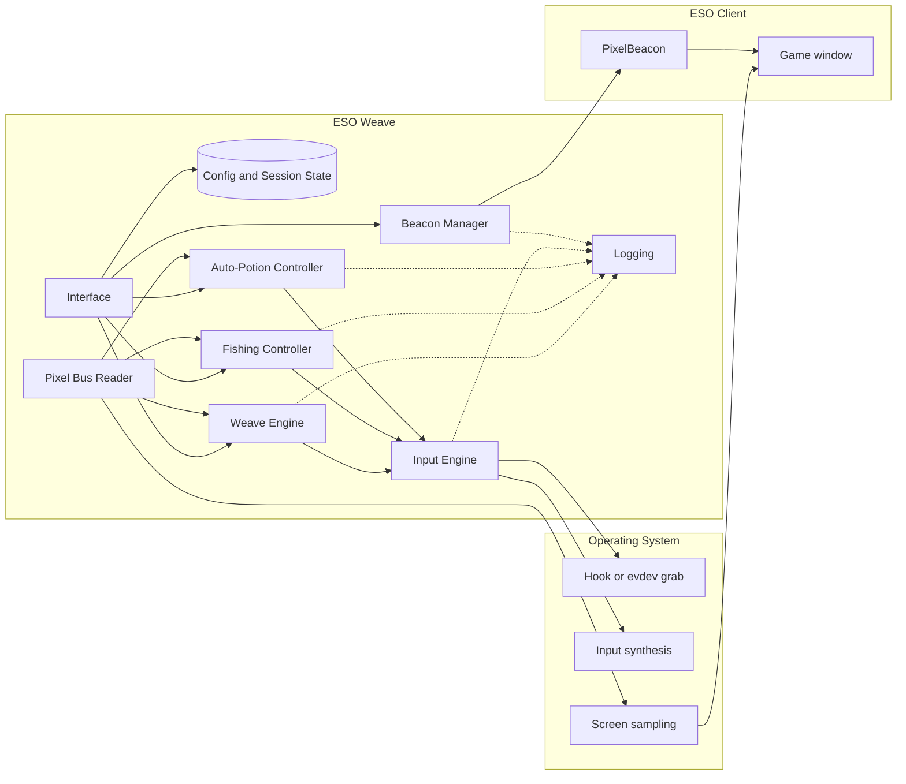
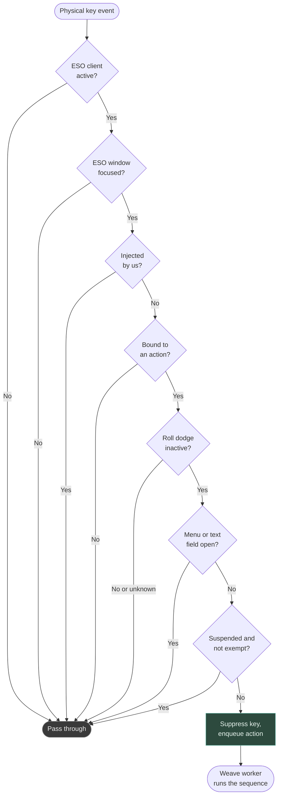
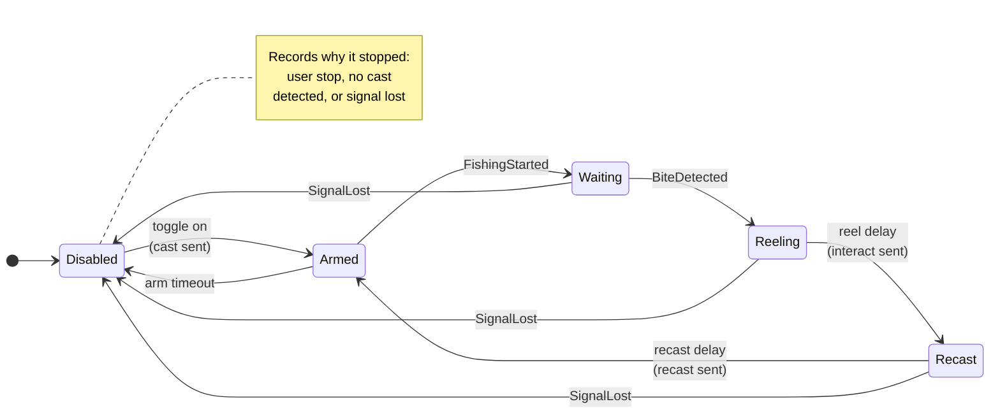
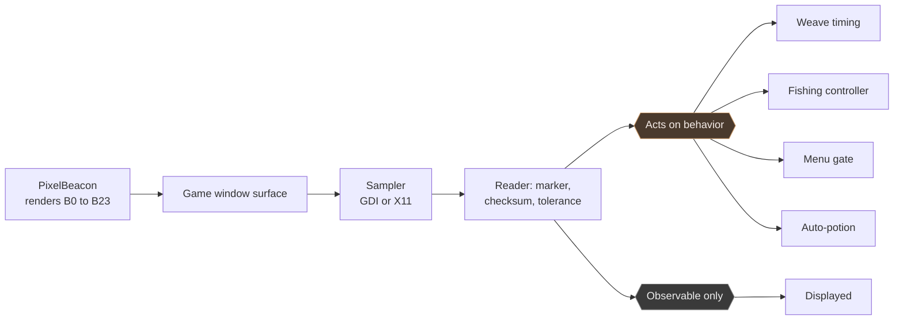

# ESO Weave Technical Specification

**Project:** ESO Weave \
**Repository:** `github.com/h8rt3rmin8r/eso-weave` \
**Document:** `docs/ESO-Weave-Specification.md` \
**Version:** 1.2.0 \
**Date:** 2026-09-04 \
**Audience:** Human-facing, and consumed by AI coding agents through spec-kit \
**Author:** h8rt3rmin8r \
**License:** Apache-2.0

> The document version is independent of the application version. This document
> describes the system; `Cargo.toml` versions the build.

## Table of Contents

- [1. Overview](#1-overview)
- [2. Terminology](#2-terminology)
- [3. Scope](#3-scope)
- [4. Platform Support](#4-platform-support)
- [5. System Architecture](#5-system-architecture)
- [6. Concurrency and Ownership](#6-concurrency-and-ownership)
- [7. Input Engine](#7-input-engine)
- [8. Weave Engine](#8-weave-engine)
- [9. Fishing Automation](#9-fishing-automation)
- [10. PixelBeacon Companion Addon](#10-pixelbeacon-companion-addon)
- [11. Auto-Potion](#11-auto-potion)
- [12. Graphical User Interface](#12-graphical-user-interface)
- [13. Configuration and Session State](#13-configuration-and-session-state)
- [14. Logging](#14-logging)
- [15. Packaging and Distribution](#15-packaging-and-distribution)
- [16. Repository Conventions](#16-repository-conventions)
- [17. README Disclaimer Text](#17-readme-disclaimer-text)
- [Appendix A. Weave Delay Defaults](#appendix-a-weave-delay-defaults)

## 1. Overview

ESO Weave is a desktop companion application for The Elder Scrolls Online. It runs
entirely outside the game process and provides three capabilities:

1. **Combat weave automation.** While the ESO window holds keyboard focus,
   configured skill keys are intercepted and replaced with synthesized sequences
   that weave a light attack, heavy attack, bash, or block-cast around the skill
   activation.
2. **Fishing automation.** An optional module casts, detects the bite, reels in
   the catch, and recasts.
3. **Auto-potion.** An optional module drinks the quickslotted potion when a
   watched resource runs low.

The application is a single Rust crate targeting Windows 10/11 x64 and Linux x64.
Combat weaving has no in-game dependency of any kind. Fishing and auto-potion
depend on **PixelBeacon**, a minimal companion ESO addon embedded in the
application binary and installed or removed from within the application interface.
PixelBeacon translates in-game state into a small on-screen grid of colored
squares, the **pixel bus**, which the application samples from the game window
surface.

The application reads that signal. It never reads or writes game memory and never
touches network traffic.

This document is the architecture of record. Every feature traces to it.

## 2. Terminology

- **Weave:** The ESO combat technique of fitting a basic attack, block, or bash
  into the same global-cooldown window as a skill activation.
- **GCD:** ESO's global cooldown for skill activations, 1000 ms.
- **Skill slot:** One of seven automatable inputs: skills 1 through 5, Ultimate,
  and Synergy.
- **Weave type:** One of four fixed action sequences: Light Attack (`LA`), Heavy
  Attack (`HA`), Bash Attack (`BA`), Block Casting (`BL`).
- **Weapon bar:** ESO's front or back weapon set. The active bar and each bar's
  weapon class drive weapon-aware heavy-attack timing.
- **PixelBeacon:** The companion addon defined in [section 10](#10-pixelbeacon-companion-addon).
- **Pixel bus:** The on-screen block protocol PixelBeacon renders and the
  application samples.
- **Beacon block:** One solid-color square rendered at a fixed physical-pixel
  position in the game window.
- **Marker:** The green channel of a block, identifying which signal the block
  carries. Markers are held far enough apart that a geometry error cannot decode
  one block as another.
- **Menu gate:** The suppression of interception and synthesis while a native game
  menu or text field is open.
- **Quickslot:** ESO's consumable slot. Its cooldown and the identity of the item
  in it are published on the bus and consumed by auto-potion.
- **Resource watch:** One resource's participation in the auto-potion trigger: an
  independent enable and threshold for health, magicka, or stamina.
- **Interact key:** The in-game interaction keybind, default `E`, used to cast,
  reel, and recast.
- **Managed marker:** The manifest line `## X-ESO-Weave-Managed: true`, which
  identifies a PixelBeacon install as owned by ESO Weave and gates every write and
  delete the application performs on the addon files.

## 3. Scope

### 3.1 In scope

- A single-crate Rust desktop application with a graphical interface for
  Windows 10/11 x64 and Linux x64.
- Key interception and input synthesis scoped to the focused ESO window.
- Four fixed weave types with per-skill enable, weave type, and timing overrides.
- Weapon-bar-aware heavy-attack timing driven by the active bar and its weapon
  class.
- Latency-adaptive delay adjustment using live server latency.
- Fishing automation behind a bite-detector abstraction, with the pixel-bus
  detector as the reference implementation.
- Auto-potion driven by resource, quickslot, and cooldown readings.
- Suppression of interception and synthesis while a native game menu or text field
  is open.
- PixelBeacon: embedded resource, automatic AddOns discovery, one-click install
  and uninstall, a live status indicator, and automated API-version upkeep.
- Out-of-band display detection, used to confirm the beacon grid fits the client
  area.
- Fully configurable keybindings, including in-game hotkeys for suspend, fishing,
  and auto-potion.
- Runtime-configurable logging with an in-app live log viewer.
- An MSI installer for Windows; `.deb`, AppImage, and tarball for Linux.

### 3.2 Out of scope

- Reading or writing game process memory.
- Network traffic interception or packet manipulation.
- Any in-game functionality beyond the PixelBeacon signal contract.
- Multi-account or multi-client orchestration.
- macOS.
- Publication of PixelBeacon to addon indexes. The addon ships only inside the
  application binary.

## 4. Platform Support

| Platform | Input | Screen sampling |
| --- | --- | --- |
| Windows 10 and 11 x64 | `WH_KEYBOARD_LL` hook and `SendInput` | GDI capture of the composited desktop |
| Linux x64, X11 | evdev grab and uinput | X11 capture |
| Linux x64, Wayland | evdev grab and uinput, below the display server | Requires an XWayland game surface |

The application identifies the ESO window per platform, by window title on Windows
and the corresponding X11 surface on Linux, and treats interception as active only
while that window holds keyboard focus.

Linux input requires membership in the `input` group or the equivalent udev rule,
which the Linux packages document and ship.

## 5. System Architecture

The application is one process of cooperating subsystems. The interface owns the
view and configuration. The engines own correctness-bearing logic behind trait
seams. The platform layer confines every OS-specific call to a per-OS module.



| Subsystem | Responsibility |
| --- | --- |
| **Input Engine** | Platform-abstracted interception and synthesis behind one `InputBackend` trait. Owns focus scoping, suspend state, the menu gate, and injected-input flagging. |
| **Game Observer** | Detects provider-owned installation evidence, game and launcher processes, and operating-system focus. Reduces independent observations into installation, runtime, and Game Context state. |
| **Weave Engine** | The skill and weave state machine: cooldown gating, sequence execution, and weapon-aware and latency-adaptive timing. Platform-agnostic, unit-tested against a mock sink. |
| **Fishing Controller** | The fishing state machine. Consumes detector events and drives interact-key synthesis through a sink seam. |
| **Auto-Potion Controller** | The potion trigger rule. Consumes decoded resource and quickslot readings and drives quickslot-key synthesis through a sink seam. |
| **Pixel Bus Reader** | Samples the beacon grid from the game window surface, decodes it into typed events, and resolves the display descriptor. |
| **Beacon Manager** | Discovers the AddOns directory; installs, verifies, and uninstalls PixelBeacon; keeps its manifest API version current. Every write and delete is gated by the managed marker. |
| **Config and Session State** | Two stores in one directory: user settings, and derived runtime state. |
| **Logging** | Structured logging with a runtime-adjustable level, an optional file sink, and an always-available in-memory ring buffer. |
| **Interface** | An immediate-mode egui interface. Its visual identity is governed by the brand standard under `docs/brand/`. |

## 6. Concurrency and Ownership

The application uses `std::thread`, `Arc<Mutex<...>>`, and `std::sync::mpsc`, and
has no async runtime. The interface owns the main thread. Blocking and timed work
runs on dedicated threads that share subsystems through `Arc` and hand results back
through channels drained once per frame.

| Thread | Owns | Never does |
| --- | --- | --- |
| Main | The interface, the application model, and the view | Timed input sequences |
| Interception | The platform hook or evdev event loop | Sleep, block, or synthesize |
| Weave worker | Draining actions and running weave sequences | Touch the hook thread |
| Pixel bus worker | One-second game observation, sampling, event routing, display detection, and the fishing and auto-potion ticks | Sample from any other thread |
| API version check | One startup pass over the manifest and the live game version | Block the window from appearing |

Five contracts hold across those threads:

1. **The interception callback never sleeps or blocks.** It classifies the key,
   suppresses it if bound, and hands an event onward. On Windows a slow low-level
   hook callback causes the operating system to remove the hook, which makes this
   a hard requirement rather than a preference.
2. **Every timed sequence runs on a worker thread.** No delay, click, or key send
   is ever issued from the hook thread.
3. **Application toggles reach the interface, not the weave engine.** The weave
   worker forwards suspend, fishing, and auto-potion toggles to the interface
   intent path, so a hotkey and its on-screen control reach one shared state
   through one path.
4. **One clock origin.** The pixel-bus worker and the interface stamp and evaluate
   deadlines against the same monotonic origin, so a deadline is never judged
   against a different timeline than the one that set it.
5. **Startup never blocks on the network.** The API version check runs on its own
   one-shot thread and hands its result to the interface through a channel.

### 6.1 Game observation

Installation and runtime are independent. On Windows, installation candidates
come from the exact Steam app uninstall entry, the generic ESO uninstall entry,
and Epic `.item` manifests. On Linux, Steam libraries and app manifest `306130`
locate the Proton install. Every candidate must contain the expected ESO client
and launcher artifacts. Candidates are normalized by root before reconciliation.
A Steam or Epic candidate wins over the generic ESO entry for the same root;
distinct roots or conflicting strong providers are ambiguous.

The existing pixel-bus worker observes processes and focus every second, before
any missing-sampler early return. Runtime reduces in this order: a present game
client is **Active**; otherwise an unknown game observation is **Unknown**; a
present launcher is **Launcher open**; an unknown launcher is **Unknown**; and two
absent observations are **Inactive**. Closing the launcher cannot demote an active
game.

Game Context is derived from runtime, focus, beacon freshness, and the menu
surface. **Gameplay** requires Active, Focused, Fresh, and a valid observed
no-menu surface. Invalid or absent menu evidence is unavailable rather than a
no-menu observation. Runtime exit clears reader history and every game-derived
metric, blocks input, and pauses fishing and auto-potion without clearing their
requested enable toggles. Losing focus applies the same input block. Runtime exit
also clears held-key and menu-gate state, and restart republishes even unchanged
values.

## 7. Input Engine

### 7.1 Interception model

The engine intercepts configured physical keys only while the ESO client is active
and its window is focused, suppresses the original keystroke, and enqueues an
action. Every other key passes through untouched. Synthesized input is flagged so
the engine never intercepts its own output.



Two properties of this decision are load-bearing.

**Focus scoping is unconditional.** Every other condition ANDs with it and none
replaces it, so suppression outside the focused game window is unreachable by
construction.

**Roll-dodge evidence fails open for physical input and closed for generated
input.** Active or unavailable roll state passes the player's original skill key
through instead of starting a weave. The worker rechecks the same gate before
accounting cooldown, and the real input sink checks it before every generated
press and wait. If a roll begins mid-sequence, remaining synthesis stops and the
sink still releases any mouse button it already holds. Work dropped by this gate
is never replayed after the roll ends.

**The menu gate can only relax interception.** It is an additional early pass, so
for every combination of the decision's inputs the gated outcome is either
identical to the ungated one or more permissive. An addon too old to publish the
gate, a sample that fails validation, and a lost beacon signal all resolve to
"no menu", which is the behavior of an application without the gate at all.

### 7.2 Threading contract

Interception callbacks classify, suppress, and hand off. Nothing else. Every timed
sequence executes on the weave worker.

### 7.3 Platform backends

- **Windows.** A `WH_KEYBOARD_LL` hook for interception and `SendInput` for
  synthesis, with injected-input flagging to break recursion. Timer resolution is
  raised through `timeBeginPeriod` for the worker's lifetime.
- **Linux.** An evdev grab of the physical keyboard for interception and a uinput
  virtual device for synthesis. This sits below the display server and behaves
  identically under X11 and Wayland.

### 7.4 Keybinding model

Every binding is user-configurable. The binding table maps an action to a physical
key.

| Action | Default key | Suspend-exempt |
| --- | --- | --- |
| Skill 1 through Skill 5 | `1` `2` `3` `4` `5` | No |
| Ultimate | `R` | No |
| Synergy | `X` | No |
| Toggle suspend | `F1` | Yes |
| Toggle fishing | `F2` | Yes |
| Toggle auto-potion | `F3` | Yes |

The three application toggles are suspend-exempt, because a toggle the operator
cannot reach while suspended is not a toggle. Reachability while suspended is
separate from acting while suspended: suspend stops every automation from acting.

Bindings are scoped to the focused ESO window in all cases. The application never
intercepts input globally. The interface provides a capture-style rebinding control
per action and rejects conflicting assignments.

## 8. Weave Engine

### 8.1 Skill model

Seven slots, each independently configured.

| Slot | Label | Default key | Default type | Active by default |
| --- | --- | --- | --- | --- |
| 1 to 5 | Skill 1 to Skill 5 | `1` to `5` | Light Attack | Yes |
| 6 | Ultimate (R) | `R` | Light Attack | No |
| 7 | Synergy (X) | `X` | Light Attack | No |

An inactive slot passes its key through to the game unmodified.

### 8.2 Weave types and sequences

The weave type list is fixed at four entries. "Primary" is the left mouse button;
"secondary" is the right mouse button.

| Type | Sequence |
| --- | --- |
| Light Attack (`LA`) | primary click, wait `d_weave`, send skill key |
| Heavy Attack (`HA`) | primary down, wait `d_heavy`, send skill key, primary up |
| Bash Attack (`BA`) | primary click, wait `d_weave`, send skill key, wait `d_bash`, secondary down, primary click, secondary up |
| Block Casting (`BL`) | secondary down, send skill key, wait `d_weave`, secondary up |

### 8.3 Timing model

| Parameter | Default (ms) | Description |
| --- | --- | --- |
| `global_cooldown` | 500 | Minimum interval between weave executions. A request inside the window is dropped while the key stays suppressed. |
| `d_weave` | 50 | Base gap between the basic attack and the skill key (`LA`, `BA`, `BL`). |
| `d_heavy` | 1000 | Heavy-attack hold before the skill key, overridden per weapon class when weapon-aware timing is on. |
| `d_bash` | 125 | Gap before the bash action in `BA`. |

Every slot supports per-slot overrides for the parameters its weave type uses,
which accommodates skills with long cast times. A blank override inherits the
global default.

### 8.4 Weapon-bar-aware timing

Heavy-attack channel duration depends on the equipped weapon class, and players
carry two bars. With weapon-aware timing enabled, the engine selects the `d_heavy`
preset for the active bar's class as reported on the bus. The presets are in
[Appendix A](#appendix-a-weave-delay-defaults). An unknown bar keeps the configured
`d_heavy`.

### 8.5 Latency-adaptive delays

When the bus reports latency, the engine adjusts delays in real time:

```text
effective_delay = base_delay + round(k * latency_ms)
```

- `k` defaults to 0.25 and is user-configurable.
- The adjustment applies to `d_weave` and `d_bash`. `d_heavy` and
  `global_cooldown` are not scaled.
- `effective_delay` is clamped to `[base_delay, base_delay + 300]`.
- The feature is off by default and requires PixelBeacon. Without latency data the
  engine uses base delays unchanged.

## 9. Fishing Automation

### 9.1 Detector abstraction

Bite detection is defined by a detector emitting typed events: `Heartbeat`,
`FishingStarted`, `BiteDetected`, `FishingStopped`, and `SignalLost`. The reference
implementation adapts the pixel-bus reader. The abstraction admits other detectors
without modifying the controller.

### 9.2 Fishing controller state machine

The controller is a pure, event-and-tick-driven state machine. It consumes detector
events and clock ticks and emits the interact key through a sink seam. It never
blocks, and it never fires input blind: losing the beacon heartbeat disables
fishing rather than sending the interact key into an unknown state.



Behavioral requirements:

- The fishing toggle is both a bound hotkey usable inside the game and an
  on-screen control. Both drive one shared state.
- In `Armed`, the controller sends the interact key once to cast, then expects
  `FishingStarted` within `arm_timeout_ms` (default 8000) or disables, recording
  the reason.
- On `BiteDetected`, it sends the interact key after `reel_delay_ms` (default 100),
  waits `recast_delay_ms` (default 3000) for the catch to resolve, then recasts.
- Losing the beacon heartbeat disables fishing.
- Returning to idle records why, so the interface explains an early stop rather
  than leaving it silent.
- While the menu gate is active, the two autonomous interacts are deferred and
  retried rather than dropped, so the state machine never advances past an
  interact the game did not receive. The operator-initiated first cast is not
  deferred, because it is the direct result of a keypress the operator just made.
- Every fishing timing parameter is user-configurable.

### 9.3 Bait requirement

Fishing requires bait selected in game. ESO will not cast without it, so with no
bait the cast starts no interaction, the beacon never reports `FishingStarted`, and
the controller disables on the arm timeout. Bait selection is an operator
precondition, documented in the README, not something the application supplies.

## 10. PixelBeacon Companion Addon

### 10.1 Nature and constraints

ESO exposes its Lua API only to addons loaded from the AddOns directory, with no
external subscription mechanism and no real-time file channel. PixelBeacon is
therefore the smallest possible in-game shim: it renders solid-color blocks that
encode state, and does nothing else. It has no settings, no interface beyond the
blocks, no libraries, and no saved variables. It ships embedded in the application
binary and is managed exclusively by the Beacon Manager.

### 10.2 Fishing detection contract

PixelBeacon detects the cast and the bite by polling the game's authoritative
interaction state, mirroring the game's own reticle, which samples the same state
every frame.

- A 100 ms tick samples `GetInteractionType()`. While it returns
  `INTERACTION_FISH` a cast is active: the tick drives idle to waiting and, when
  the interaction ends, waiting or bite back to idle within one tick.
- The sole bite signal is `EVENT_INVENTORY_SINGLE_SLOT_UPDATE` with a stack-count
  change of -1 carrying `ITEM_SOUND_CATEGORY_LURE`, while a cast is active and no
  menu is open. The game consumes the bait when the fish takes it, which makes this
  the one reliable hooked-fish observable available to an addon.
- The reel-in interact prompt is the standing prompt for the entire time the line
  is in the water, because it is how a player reels in early by hand. It is never
  a bite indicator.
- Waiting persists until a bite, the interaction ending, or the player stopping.
  The addon never synthesizes a bite from a timer or a prompt.
- The tick never demotes a rendered bite to waiting. A bite clears when a new item
  is gained, after a safety timeout, or when the interaction ends.
- The inventory signal is suppressed while menus are open, so using a consumable
  is not a false positive.
- `EVENT_CLIENT_INTERACT_RESULT` is never consulted. The game's own interface
  registers it as an error-alert channel carrying interaction failure codes, so it
  does not fire on a clean successful cast.

### 10.3 Pixel bus protocol

PixelBeacon renders a three-cell layout header followed by twenty-four signal
blocks anchored to the top-left of the game window's client area. Blocks are 16
by 16 physical pixels by default, and the addon compensates for the interface
scale so block geometry is constant in physical pixels. The game's UI lifecycle
hides the blocks during loading screens.

**Geometry.** PixelBeacon is the sole authority for the live column count. It
computes the number of complete physical blocks that fit the current `GuiRoot`
width and publishes that 16-bit count in the invariant header. The application
does not derive a competing count. It validates the published value against its
measured client surface before using it. This authority model supersedes the
fixed 16-column contract from slice 035, while retaining that geometry only for
positively identified pre-version-14 addons.

The first three cells are always H0 through H2 at row zero, columns zero through
two. Payload block `i` occupies logical cell `3 + i`, column `cell mod columns`,
and row `cell div columns`. At all supported client widths and block sizes the
current 27 total cells fit on one row. The occupied extent is `BLOCK_PX *
min(3 + NUM_BLOCKS, columns)` wide by `BLOCK_PX * ceil((3 + NUM_BLOCKS) /
columns)` tall, which is 432 by 16 physical pixels at the default block size.
Cells after the last payload block are neither drawn nor read.

The overlay is not movable. Its anchor is part of the shared geometry contract, so
relocating it would require both sides to agree on a new origin, with the same
undetectable failure mode as a column-count disagreement. The block size setting is
the supported way to reduce the footprint, and the application reports the current
footprint beside that setting and in its log.

**Negotiation.** H0 is `(0x45, 0x53, 0x60)`: two magic channels and the spaced
wire code for protocol version 3. H1 is `(columns_high, 0x64, 255 - columns_high)` and H2 is
`(columns_low, 0x9C, 255 - columns_low)`. Magic, markers, and complements honor
the configured capture tolerance. Recognized magic
with any invalid field, unsupported version, impossible count, or surface-fit
failure makes the layout unavailable and suppresses all payload decoding. A
non-magic H0 selects the legacy 16-column, zero-offset layout only when it is a
valid legacy magenta heartbeat. Geometry metadata caps effective tolerance at
15, below half the version-code spacing, even when payload tolerance is broader.
Protocol version 1 (`0x20`) remains readable with its 22-cell payload extent and
version 2 (`0x40`) remains readable with its 23-cell extent. The reader samples
B22 only for version 2 or newer and B23 only for version 3. Ordinary screen pixels
beyond an older overlay therefore cannot impersonate a newer state.

The addon and application each state the header constants once, and contract
tests parse the embedded addon source to prevent byte-level drift. Capture extent
and every payload point derive from one validated `BusLayout`. The reader captures
one occupied frame per steady batch, with one additional capture allowed during
initial negotiation or growth beyond the prepared frame.

**Header.** Positions and sample points are fixed at the default block size.

| Cell | Position | Sample | Encoding |
| --- | --- | --- | --- |
| H0 Magic and version | (0, 0) | (8, 8) | `(0x45, 0x53, 0x60)`, where `0x60` is logical version 3; versions 1 (`0x20`) and 2 (`0x40`) remain geometry-readable at their original payload extents |
| H1 Column high byte | (16, 0) | (24, 8) | `(high, 0x64, 255 - high)` |
| H2 Column low byte | (32, 0) | (40, 8) | `(low, 0x9C, 255 - low)` |

**Blocks.** Positions and sample points are the negotiated one-row positions at
the default block size. Legacy addons retain the pre-version-14 positions.

| Block | Position | Sample | Encoding and meaning |
| --- | --- | --- | --- |
| B0 Status | (48, 0) | (56, 8) | Solid `#FF00FF` whenever the addon is loaded and rendering. The heartbeat. |
| B1 Fishing | (64, 0) | (72, 8) | `#0080FF` while a cast is active and waiting; `#00FF00` on a detected bite; hidden otherwise. |
| B2 Latency | (80, 0) | (88, 8) | `R = clamp(GetLatency(), 0, 1020) / 4`, `G = 0xA5`, `B = 255 - R`. Updated at 1 Hz. |
| B3 Weapon bar | (96, 0) | (104, 8) | `G = 0x5A`, `R` packs the front and back weapon-class nibbles (`front * 16 + back`), `B` is the active-bar code (0 unknown, 1 front, 2 back). |
| B4 Combat | (112, 0) | (120, 8) | `G = 0x2D`, `R` is `0xE0` in combat or `0x20` out of combat, `B = 255 - R`. Driven by `EVENT_PLAYER_COMBAT_STATE`, re-baselined from `IsUnitInCombat("player")` on `EVENT_PLAYER_ACTIVATED`. |
| B5 Menu | (128, 0) | (136, 8) | `G = 0xD2`, `R` is the surface code times 24 (0 gameplay, 1 system, 2 map, 3 inventory, 4 mail, 5 character, 6 guild store, 7 crown store, 8 journal, 9 chat entry, 10 other), `B = 255 - R`. Published on the fast tick. |
| B6 Health | (144, 0) | (152, 8) | `G = 0x16`, `R` is the percentage of the current maximum (0 to 100, or `0xFF` unavailable), `B = 255 - R`. |
| B7 Stamina | (160, 0) | (168, 8) | As B6 with `G = 0x6D`. |
| B8 Magicka | (176, 0) | (184, 8) | As B6 with `G = 0xBB`. |
| B9 Movement | (192, 0) | (200, 8) | `G = 0x43`, `R` is a two-bit code (bit 0 mounted, bit 1 sprint) scaled to `0x20` on foot or `0x60` mounted, `B = 255 - R`. Driven by `EVENT_MOUNTED_STATE_CHANGED`, re-baselined from `IsMounted()`, with a 1 Hz backstop. The two sprint codes `0xA0` and `0xE0` are reserved and never emitted, because the game exposes no sprint state to an addon; the reader decodes them as unavailable. |
| B10 to B15 Cooldowns | (208, 0) to (288, 0) | (216, 8) to (296, 8) | One block per action slot the game exposes a cooldown for: skills 1 to 5, then the ultimate. `G` is a per-slot marker (`0x0B`, `0x21`, `0x4E`, `0x92`, `0xC6`, `0xE8`), `R` is the remaining time in 50 ms steps (`0` ready, `1` to `254` a duration saturating at 12700 ms, `0xFF` unavailable), `B = 255 - R`. Polled on the 1 Hz tick with change detection and re-baselined on `EVENT_PLAYER_ACTIVATED`, because the game fires no per-slot cooldown event. Synergy has no block: it is a contextual prompt rather than an action slot, so the game exposes no cooldown for it. |
| B16 Quickslot cooldown | (304, 0) | (312, 8) | `G = 0x38`, `R` is the active quickslot's remaining cooldown in the same 50 ms steps, and `B = 255 - R`. This is an attached fact and never classifies the selected entry. |
| B17 to B19 Quickslot item | (320, 0) to (352, 0) | (328, 8) to (360, 8) | The selected potion's optional 24-bit `GetItemLinkItemId`, one byte per block, most significant first. `G` is a per-byte marker (`0xB0`, `0xDD`, `0xF3`), `R` is the byte, and `B = 255 - R`. All three bytes must decode and B20 must explicitly classify a potion before the identity is retained. The number is diagnostic context only. |
| B20 Quickslot classification | (368, 0) | (376, 8) | `G = 0x76`, `B = 255 - R`, and spaced `R` codes distinguish unsupported API, invalid selection, inconsistent facts, empty, item, collectible, quest item, emote, quick chat, other, depleted potion, blocked potion, and usable potion. Missing B20 with a valid legacy B16 reports an addon update requirement. Invalid or tolerance-ambiguous B20 reports a corrupt signal. Classification uses `GetCurrentQuickslot`, `GetSlotType`, `GetSlotBoundId`, `GetSlotItemLink`, `GetSlotItemCount`, `IsSlotUsable`, and `GetSlotCooldownInfo`. Events for selection, slot contents, slot state, cooldowns, inventory, and player activation converge through one change-detected path with a 1 Hz recovery backstop. |
| B21 Life state | (384, 0) | (392, 8) | `G = 0x89`, `R` is `0x20` Alive, `0x80` Dead, or `0xE0` Reincarnating, and `B = 255 - R`. `IsUnitReincarnating("player")` takes precedence over `IsUnitDead("player")`; player dead, alive, and activation events plus a 1 Hz backstop converge through one computation. Missing or invalid evidence is Unknown and blocks synthesis. |
| B22 World state | (400, 0) | (408, 8) | Protocol version 2 only. `G = 0xCC`, `R` is `0x20` Unknown, `0x80` Transitioning, or `0xE0` Active, and `B = 255 - R`. `EVENT_PLAYER_DEACTIVATED` publishes Transitioning immediately. `EVENT_PLAYER_ACTIVATED` refreshes weapon, combat, menu, resources, movement, cooldowns, quickslot, life, and fishing payloads before publishing Active. No timer infers Active. Missing, invalid, or lost evidence is Unknown. |
| B23 Roll dodge | (416, 0) | (424, 8) | Protocol version 3 only. `G = 0xF9`, `R` is `0x20` Unknown, `0x80` Inactive, or `0xE0` Active, and `B = 255 - R`. `EVENT_COMBAT_EVENT` is filtered to the player and ability 28549; effect gained publishes Active and effect faded publishes Inactive. A 1500 ms watchdog clears the known rejected-dodge gain without a matching fade. Death, deactivation, invalid data, and signal loss publish Unknown and disable combat-event handling until player activation or an in-place resurrection establishes an Inactive baseline. While interception is active, the companion caps its configured sample interval at 375 ms so multiple reads fit inside the bounded Active window. |

No block is ever hidden to express a state. Absence means only that the addon is
too old to draw it, which is what keeps an old addon from being read as a state.

Weapon-class codes are shared byte for byte: 0 none, 1 dual wield, 2 two handed,
3 sword and shield, 4 bow, 5 destruction staff, 6 restoration staff.

**Markers.** Every green appearing at a block center is separated from every other
by more than the reader's match tolerance, and the application asserts this over the
whole registry. A new block's marker is chosen as the midpoint of the widest
remaining gap, which is what keeps the minimum separation high as the registry
grows.

**What acts, and what does not.** Most decoded signals are stored and displayed and
nothing reads them. Two act:

| Signal | Consumer |
| --- | --- |
| B2 latency, B3 weapon bar | Weave timing |
| B1 fishing | The fishing controller |
| B5 menu | The interception decision, the fishing controller, and the auto-potion controller |
| B21 life state | The interception decision, queued weave execution, the fishing controller, and the auto-potion controller |
| B6 to B8 resources, B16 to B20 quickslot | Auto-potion ([section 11](#11-auto-potion)) |
| B4 combat, B9 movement, B10 to B15 cooldowns | Nothing. Observable only. |
| B22 world state | Nothing in slice 049. Observable only until the travel-safety consumer is implemented. |
| B23 roll dodge | The interception decision, queued weave execution, and the real synthesis sink. Active and Unknown block generated weaving while physical skill input passes through. |

That distinction is deliberate and is enforced by tests asserting the engine
behaves identically for every value of an observable-only signal, so wiring one
into a decision breaks a test rather than slipping through.



**Decoding discipline.** A sample must match its marker and satisfy its checksum
within a per-channel tolerance (default plus or minus 2) that absorbs compositor
rounding. Any failure yields the unavailable value for that signal. There is no
nearest match and no default to a live state, so unrelated screen content behind a
block position can never be read as a signal.

Signals that gate or drive behavior clear to unavailable on any sample that does
not decode, rather than holding their last value, so a stale reading cannot survive
an addon downgrade or a mid-session reload.

**Numeric payloads carry the number, not an index.** The resource blocks establish
the rule every numeric signal follows: the payload channel carries the quantity
itself rather than an index into a color table. The two encodings fail differently.
Under a lookup table, a capture that shifts the payload by one step lands on
whichever entry is nearest in color space, which bears no relation to nearness in
value and can be wrong by any amount. Under a numeric channel the same shift reads
as one unit off. For a discrete state either is acceptable, because every wrong
answer is equally wrong. For an ordered quantity only bounded error is.

Stated precisely: for any sample perturbed within tolerance, decoding yields either
a value within that tolerance or unavailable, and never a different value.
Rejection is a safe outcome. A resource payload slightly above 100 clamps to 100
rather than being rejected, because a full pool is the ordinary out-of-combat state
and rejecting it on upward drift would make the most common value the least stable
reading on the bus.

**Sampling.** The reader samples at a configurable interval: fast (default 100 ms)
while a fishing session is active or while the application is in a position to
intercept, and slow (default 1000 ms) otherwise. The second condition exists for
the menu gate, which is worthless if it engages a second after the operator starts
typing. A suspended application intercepts and synthesizes nothing, so it has no
gate to keep current and samples slowly.

The reader validates H0 through H2 before reading payload from the same prepared
frame. Losing B0 for longer than `heartbeat_timeout_ms` (default 2000) raises
`SignalLost`. A corrupt recognized header suppresses payload reads immediately.

On Windows the sampler captures a small region of the composited desktop at the
game window's top-left client area, so pixels rendered through a hardware
accelerated surface are read as displayed. Reading the window device context alone
would return the GDI front buffer, which does not contain the accelerated content.
On Linux the sampler uses X11 or XWayland capture.

**Out-of-band display detection.** Alongside the grid, and reading none of it, the
application resolves a display descriptor: the render surface size in physical
pixels, its origin in screen coordinates, the position, size, and scale of the
display it sits on, and whether the reading was measured or configured.
Measurement comes from operating system queries about the game window on the
sampling cycle, change-detected so a stationary window costs nothing. A parse of
the game's stored video settings serves as a cross-check and a pre-launch fallback
and never overrides a live measurement. Every value is in physical pixels, the same
unit as the block geometry, and the scale is reported rather than applied.

The descriptor validates that the announced row width and complete occupied
extent fit inside the measured client area. A failure makes the layout
unavailable before any payload is decoded. This is intentionally fail-closed:
reading only the cells that happen to fit could associate a valid marker with
the wrong logical signal after a geometry disagreement.

Two limits are deliberate. The stored window-mode value is reported exactly as read
and never mapped to a named mode, because no verified mapping exists; a configured
descriptor is therefore produced only when both stored resolution pairs are
identical, which is the sole case where the mapping does not matter. And on X11 the
reported display is the X screen, which on a multi-head session is the union of
every head with no scale factor, because the core X protocol exposes neither.

### 10.4 AddOns directory discovery

The Beacon Manager locates the AddOns directory without operator input in the
common cases and honors a manual override.

- **Windows.** Resolve the Documents known folder through the shell API, never a
  literal path, then `Elder Scrolls Online\<env>\AddOns`.
- **Linux under Proton.** Enumerate Steam libraries from `libraryfolders.vdf`,
  locate app id `306130`, and resolve the addon path under that prefix.
- Both default to the `live` environment, with `pts` selectable in settings.

Discovery never writes outside the resolved AddOns directory.

### 10.5 Install

Install writes the embedded addon files into `AddOns/PixelBeacon/`, confined to
that subfolder, rendering the manifest with the resolved API version. Installing
over an existing copy is an update. If the AddOns directory does not exist, the
install refuses rather than creating one.

### 10.6 Verify

Reading the on-disk manifest classifies the install into one of four states.

| State | Condition |
| --- | --- |
| NotInstalled | No manifest present |
| Unmanaged | Manifest present, managed marker absent |
| ManagedUpToDate | Marker present, version equals the embedded version |
| ManagedVersionMismatch | Marker present, version differs |

### 10.7 Uninstall

Uninstall removes the folder if and only if the managed marker is present in its
on-disk manifest. An unmanaged or unreadable folder is never deleted. This is a
safety-critical invariant, and it extends to every manifest edit the application
makes.

When the game is running during an install or uninstall, the interface states that
a `/reloadui` or a relog is required for the change to take effect.

### 10.8 Manifest and API version upkeep

The manifest declares `## Version` and `## AddOnVersion`, single-sourced as the
embedded addon version, an `## APIVersion` line carrying one or more client API
versions, and the managed marker.

ESO raises its client API version each patch and flags an addon "Out of Date" when
the manifest falls behind, which can prevent the addon loading. The application
keeps the manifest current on its own:

1. A startup thread resolves the effective API version as the maximum of the
   stored last known value and a compiled default. A compiled default guarantees a
   valid manifest with no network access and no stored value.
2. If the addon is installed, carries the managed marker, and its primary API
   version is older than the effective value, the `## APIVersion` line is rewritten
   in place. The rewrite changes only that line, preserves every other line
   including the marker, sets the resolved value as the primary token, keeps
   greater tokens, and drops lesser ones.
3. The thread fetches the live game client version string from the official
   `esoui/esoui` GitHub `live` branch as a bump-detection signal. The exact numeric
   API version is published only behind bot challenges a plain client cannot pass,
   so the version string is the available signal.
4. When the live client has moved past what this build knows, the application warns
   in the log so the operator updates it.
5. The result is handed to the interface, which persists the last known API version
   and last seen game version in the session state store.

The application never downgrades the on-disk value and never guesses a number. The
check runs once per startup, off the interface thread, and neither blocks startup
nor panics on a network or parse failure.

## 11. Auto-Potion

Auto-potion synthesizes the quickslot key when a watched resource runs low. It is
the only feature that acts on a beacon-derived value by producing input, which puts
it on the same safety surface as the input engine itself.

S043 activates the worker-loop consumer through the explicit S042 quickslot
contract and exposes the controller's effective state. Requested enablement is a
session-only user choice; effective state reports whether the feature is Off,
dormant, blocked, Ready, or just Triggered and names the current reason.

**The trigger rule.** The key is pressed when, and only when, all of the following
hold, evaluated in this order:

| # | Condition |
| --- | --- |
| 1 | Auto-potion is requested for this session |
| 2 | The game is active |
| 3 | The game is focused |
| 4 | A fresh PixelBus heartbeat is available |
| 5 | The application is not suspended |
| 6 | The surface block is positively decoded as Gameplay |
| 7 | At least one resource watch is enabled and at least one watched resource is fresh |
| 8 | The active quickslot explicitly holds a usable potion |
| 9 | The quickslot cooldown is ready |
| 10 | The minimum retry interval since the last attempt has elapsed |
| 11 | At least one fresh watched resource is at or below its own threshold |

Condition 11 is a disjunction across the three resources and is not configurable.
Requiring all three to be low would fire only when a potion no longer helps. Each
resource carries an independent enable and threshold, because the right number
differs between health and magicka, and because per-resource controls make the
disjunction visible in the interface rather than implied.

**An unreadable value is never a permissive one.** A resource reported as
unavailable never satisfies its threshold at any threshold, including 100. An
unreadable quickslot is not a potion. An unreadable cooldown is not zero. The
failure directions are asymmetric: treating unknown as permissive fires a potion on
every beacon outage, addon reload, and loading screen, while treating it as
blocking means the feature does nothing until readings return. Doing nothing is the
correct failure for something that presses keys.

**The retry interval is not the quickslot cooldown.** The cooldown is a screen
signal and does not update until at least one sampling interval after the key is
pressed. Through that window the rule still evaluates as eligible on every sample.
The retry interval is the floor covering that lag; the cooldown is the authority
once it updates. Neither replaces the other.

**Safety requirements.** Synthesis goes through the input engine, so it is scoped to
the focused game window and flagged against recursion; auto-potion introduces no
input path of its own. The menu gate is applied to the controller directly rather
than only to the interception decision, because the controller acts on its own
timers and never passes through that decision. Suspension is a condition checked in
the controller rather than a consequence of how the worker loop is wired. Losing the
game, focus, or beacon makes the effective state dormant or blocked without
clearing the requested setting. Fresh positive observations are required before
evaluation can become Ready or Triggered again. The controller ticks on the
pixel-bus worker, adding no thread and no timer, and nothing reaches the hook
thread.

**Effective state.** Off means the user has not requested the feature. Dormant
names an inactive or unfocused game. Blocked names the first current safety or
observation failure: beacon unavailable, suspension, disallowed game context, no
watched resource, resources unavailable, quickslot unavailable, no potion,
unusable potion, cooldown, or retry interval. Ready means every precondition is
satisfied but no fresh watched resource is low. Triggered lasts until the next
evaluation and identifies the resource, observed percentage, and threshold for the
submitted attempt. Normal logging records categorical state changes only.

**Defaults.** The feature is off, every resource watch is off, and the enable is not
restored across sessions. That last point is a deliberate departure from suspend and
fishing, which are both restored: a restored fishing session does nothing until the
operator stands at a fishing hole, whereas a restored auto-potion would wait
silently to press a key in a later session.

The toggle is suspend-exempt, like the other two application toggles. Being
reachable while suspended is separate from acting while suspended, which it does
not do.

## 12. Graphical User Interface

### 12.1 Main window

A single resizable window, default 600 by 720, with a menu bar, a task-oriented
dashboard, a Skills region, and an optional live log panel.

| Region | Contents |
| --- | --- |
| Menu bar | Settings, Exit, and a Live Log toggle |
| Live HUD | Labeled Health, Stamina, and Magicka meters; Game Context; combat; movement; roll-dodge state; life state; active and configured weapon bars; selected quickslot classification, potion availability, and cooldown |
| System and State | A persisted accessible disclosure containing game installation provider and runtime; world-transition state; ESO Weave Active or Suspended; PixelBeacon installation and independent live-signal state; fishing and auto-potion requested/effective state; the one appropriate primary Install or Update action plus secondary managed Uninstall |
| Skills region | One row per slot: label, active toggle, weave type, override toggle, effective delay, and decoded cooldown |
| Live log panel | Optional, attached at the bottom |

**Window minimum.** The minimum is not a fixed size. 480 by 420 is a boot floor
applied only until the content has been laid out and measured over two consecutive
stable frames. From then on the enforced minimum uses the intrinsic content width
and the height of the active responsive layout, plus panel padding. Live HUD and
System and State use two columns at 880 or more available logical points and
stack in that reading order below 880. The intrinsic minimum width never follows
an expanding dashboard container, so a continuous drag can cross the breakpoint
without width ratcheting. The height may change only between the documented wide
and narrow arrangements. The minimum follows content down when a row disappears,
grows the window to fit when content no longer fits without shrinking a size the
operator chose, and is capped at the display work area. With the live log open it
adds a width bonus and the open-log reserve.

Hovering an interactive control changes its color, never its size, so the layout
never reflows on hover.

Game Context help is available from pointer hover and keyboard focus with
identical text. While runtime is not Active, every Live HUD value uses the shared
**Game not active** presentation rather than retaining stale values. If the game
is active but its signal is unavailable, the HUD says **Signal unavailable** and
never presents an invented zero.

System and State defaults expanded. Activating its full header by pointer,
keyboard, or assistive technology hides or restores the complete body, persists
the user preference, and recomputes intrinsic height without leaving blank space.
The Skills region is never part of the disclosure.

Resource meters are unanimated and reuse one component. Health, Stamina, and
Magicka keep their familiar red, green, and blue associations, but every meter
also carries a visible name, exact integer percentage, proportional fill, and a
programmatic progress value. Observed zero remains a numeric empty bar. Dormant
and unavailable states have no numeric value. A meter says **Low** only when its
auto-potion watch is enabled and the observed percentage is at or below that
configured threshold. Text and meaningful graphical boundaries meet WCAG 2.2 AA
contrast, and color is never the only state cue.

### 12.2 Live log viewer

The panel displays recent events from an in-memory ring buffer, colorized by level.
It works whether or not file logging is enabled, autoscrolls while at the bottom,
and offers a level filter local to the panel.

It is resizable between a six-line readable minimum and the space above it, and it
may never cover an interactive control. That boundary is unconditional: on every
rendered frame the pane's top edge sits at or below the central content's bottom
edge, during a splitter drag, during a window resize, and during both at once. A
height produced by a drag is brought inside the boundary before it is displayed or
persisted, and a restored height before the first frame. In a window too short for
both the content and six log lines, the controls win and the pane gives up its
readable floor.

### 12.3 Settings

The settings modal grows with the window on both axes, sub-linearly, so it occupies
a progressively smaller fraction of a larger window while its absolute size keeps
increasing. It is bounded at 1040 by 1120 points and never exceeds 0.92 of the
window. Its rendered rectangle equals its computed extent: the height is set as
explicitly as the width, and the room above the body is measured from the laid-out
heading, separator, and close row rather than assumed. At the maximum size at least
half the body is visible without scrolling.

The modal edits and persists keybindings; global and per-slot delays; weapon-aware
timing and per-class presets; latency adaptation and `k`; fishing timings and the
interact key; auto-potion watches, quickslot key, and retry interval; pixel-bus
block size, tolerance, and sampling intervals; the AddOns override and environment;
log level and file logging; theme; and always-on-top. Changes apply live and persist
through a coalesced save, with no explicit save action.

## 13. Configuration and Session State

The application separates user settings from derived runtime state into two files in
one directory. This separation is a hard constraint: the config file holds user
settings only.

- **Location.** `%APPDATA%\eso-weave\` on Windows;
  `$XDG_CONFIG_HOME/eso-weave/`, falling back to `~/.config/eso-weave/`, on Linux.
- **Format.** JSON, UTF-8 without a byte order mark, LF endings, pretty-printed,
  with a trailing newline.
- **config.json.** User settings only, in per-module opaque sections (timing,
  skills, beacon, fishing, potion, latency, pixelbus, ui), each owned by its module
  and additive across versions. A top-level `schema_version` migrates older schemas
  forward on load. Invalid config falls back to defaults, preserves the bad file
  with a `.invalid` suffix, and surfaces a notice.
- **state.json.** Derived runtime state: the suspend and fishing intents and the
  API-version cache. A restored running or fishing intent performs no input until
  the game window is focused, upholding the focus-scoped invariant. Loading never
  panics and degrades to safe defaults.
- Writes are coalesced through a save scheduler: a change marks the relevant store
  dirty, and a settled interval later a single write flushes it.

The auto-potion enable is deliberately absent from both files. Its thresholds and
key are settings; whether it is armed is not restored.

## 14. Logging

- Structured logging through the `tracing` ecosystem, with runtime level selection
  from the interface: OFF, ERROR, WARN, INFO, DEBUG, TRACE.
- **File sink.** Optional and toggleable at runtime. Monthly files named
  `YYYY-MM.log` under the platform data directory, each line carrying a UTC
  timestamp, level, target, and message.
- **Ring buffer sink.** Always active, feeding the live log viewer independently of
  the file sink.
- Input contents are never logged above DEBUG, and no keystroke logging occurs while
  the application is suspended.
- Resource changes are logged at TRACE rather than DEBUG. Unlike every other signal
  they change many times a second in combat, and at DEBUG they would push every
  other line out of the live log, which is the tool used to diagnose everything
  else.

## 15. Packaging and Distribution

- **Windows.** An MSI built with `cargo-wix`, providing install, uninstall,
  upgrade-in-place, Start Menu and desktop shortcuts, and the application icon. The
  MSI never writes to game or Documents directories; PixelBeacon management is an
  in-application runtime action.
- **Linux.** A `.deb` built with `cargo-deb`, an AppImage, and a tarball. The
  package documents the evdev permission requirement and ships a udev rule for
  `/dev/uinput`.
- Every release publishes a combined `SHA256SUMS` alongside the assets.
- Release binaries are produced by CI from tagged versions. Version numbers follow
  SemVer and are single-sourced from `Cargo.toml`.

## 16. Repository Conventions

The repository is `github.com/h8rt3rmin8r/eso-weave`, licensed Apache-2.0. It
follows the GitHub spec-kit workflow: this document is the master specification, and
features are derived from it into numbered `specs/NNN-name/` directories, each
holding its `spec.md`, `plan.md`, and `tasks.md`, governed by
`.specify/memory/constitution.md`. Build plans under `docs/plans/` sequence that
derivation into ordered slices.

```text
eso-weave/
├── .github/            # CI workflows and agent command prompts
├── .specify/           # constitution, scripts, templates
├── specs/              # generated per-feature spec-kit directories
├── docs/
│   ├── ESO-Weave-Specification.md
│   ├── build-autopilot.md
│   ├── releasing.md
│   ├── brand/          # brand standard governing the interface
│   └── plans/          # build plans decomposing this spec into features
├── addon/
│   └── PixelBeacon/    # companion addon source, embedded at build time
├── src/                # Rust application, single crate, platform backends as modules
├── assets/             # icon and packaging art
├── packaging/          # WiX and deb metadata
├── tests/              # integration tests
├── Cargo.toml
├── LICENSE
└── README.md
```

One Rust crate, with platform backends as modules and correctness-bearing logic
behind trait seams unit-tested against mocks. All text files are UTF-8 without a
byte order mark, with LF line endings, and contain no em-dashes or en-dashes.

## 17. README Disclaimer Text

The repository `README.md` includes the following section verbatim:

```markdown
## Disclaimer

This project is published for educational purposes only. It exists as a study
in cross-platform input handling, screen-signal protocols, and game-adjacent
tooling architecture. It is not affiliated with, endorsed by, or supported by
ZeniMax Online Studios, ZeniMax Media Inc., Bethesda Softworks, or Microsoft.
The Elder Scrolls® and The Elder Scrolls Online are trademarks or registered
trademarks of ZeniMax Media Inc.

Automating gameplay input may violate the Terms of Service of The Elder
Scrolls Online. Using this software with a live game account is done entirely
at your own risk. You are solely responsible for reviewing and complying with
all agreements that govern your account, and you accept all consequences of
your use of this software, up to and including permanent account suspension.

The author assumes no liability for any account action, data loss, or other
damages arising from the use or misuse of this software. This software is
provided "AS IS", without warranty of any kind, express or implied, in
accordance with the Apache License, Version 2.0 under which it is distributed.
```

## Appendix A. Weave Delay Defaults

These values ship as adjustable configuration defaults, not fixed constants.

### A.1 Global cooldown and weave window

ESO's global cooldown is 1000 ms: at most one ability activates per second. Light
and heavy attacks run on a parallel track, effectively off-GCD, and weaving fits one
light attack and one skill into the same window. The practical target is about
965 ms per light-attack-plus-skill cycle; exceeding 1000 ms drops light attacks.

The lower bound on `d_weave` is dominated by server latency rather than local
timing, which is why `d_weave` defaults small at 50 ms and the latency-adaptive path
adjusts it. The weapon-specific knob is `d_heavy`.

### A.2 Per-weapon-class heavy-attack defaults

Approximate fully-charged heavy-attack channel durations by weapon class, used as
the per-bar `d_heavy` preset when weapon-aware timing is enabled.

| Weapon class | `d_heavy` (ms) |
| --- | --- |
| Dual wield | 640 |
| Sword and shield | 900 |
| Two handed | 1050 |
| Destruction staff | 1180 |
| Restoration staff | 1360 |
| Bow | 1380 |
| None or unknown | Configured value, no preset applied |

Lightning staff is folded into the destruction staff class, which is how the bus
reports it.
