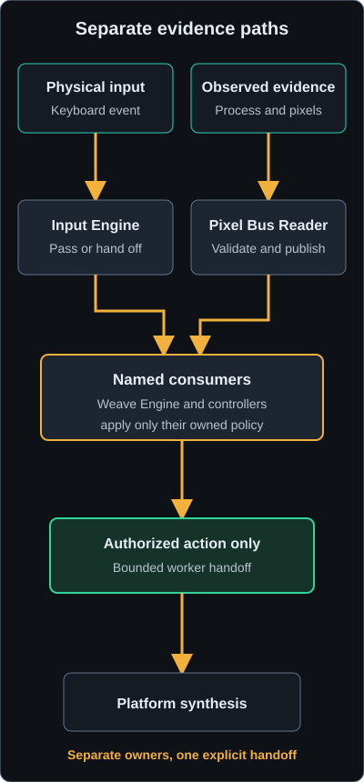

# Architecture and Ownership

ESO Weave is one Rust process composed of cooperating subsystems. The interface
owns presentation and configuration. Engines own correctness-bearing logic behind
test seams. Platform modules contain operating-system calls.

## Subsystem ownership

| Subsystem | Owns | Does not own |
| --- | --- | --- |
| Input Engine | Focus-scoped physical-event decisions, bindings, held-key bookkeeping, suspension, authorization epochs, shared synthesis gates, non-blocking handoff | Timed sequences and controller state |
| Game Observer | Installation candidates, process and launcher presence, focus, freshness, surface, and normalized Game Context | Pixel decoding and feature decisions |
| Weave Engine | Skill configuration, current timing, Global Cooldown, action sequences, and observable combat data | Physical hook callback and autonomous feature timers |
| Fishing Controller | Requested fishing state, detector events, deadlines, stop reasons, and Interact output | Pixel capture and hook decisions |
| Auto Potion Controller | Requested state, ordered eligibility rule, last attempt, and Quickslot output | Resource decoding and potion selection |
| Pixel Bus Reader | Layout negotiation, one-frame sampling, decoding, change detection, freshness, invalidation, and display description | User feature policy |
| Beacon Manager | AddOns discovery, ownership classification, embedded install files, managed in-place update and removal, block-size redeploy, and API-version upkeep | ESO runtime loading of the addon |
| Config and Session State | Separate user settings and derived runtime stores, notices, and serialization | Module-specific validation semantics |
| Logging | Global capture level, input suppression, bounded ring, and optional monthly file sink | UI presentation |
| Interface and App Model | Presentation, UI intent routing, persisted drafts, save scheduling, and view projection | Platform input and screen capture |
| Documentation Service | Immutable embedded-site lookup, bounded loopback GET and HEAD responses, browser handoff, and worker lifetime | Filesystem serving, application state, remote content, and mutation |
| Catalog Compiler and Runtime | Explicit normalized ingestion, provenance, coverage, semantic checksums, atomic publication, rollback evidence, and typed read-only queries | Startup generation, network discovery, user encounter storage, or UI-owned SQL |
| Catalog Candidate Pipeline | Maintainer-request validation, verified source acquisition, exact version tuples, compiler and icon-cache composition, thresholds, redacted reports, and immutable review candidates | Active selection, authenticated origin, releases, or source redistribution |
| Catalog Update Worker | Background Live status and candidate discovery, collector handshake, staged verification, immutable user-data installation, atomic Live selection, rollback, recovery, and redacted receipts | Silent download, automatic installation, PTS promotion, capture execution or upload, or modification of package data |
| Discovery Collector | Explicit bounded public-API enumeration, deterministic local SavedVariables records, restricted staging, and an independent managed addon lifecycle | PixelBeacon, combat capture, input generation, network transfer, direct SQLite publication, or distributable game art |
| Encounter Capture Addon | One explicitly armed Live or PTS encounter, numeric public-API observations, encounter-local actors, ordered elapsed time, bounded SavedVariables, and declared loss | Pixel Bus transport, personal names, desktop import, metric calculation, upload, input generation, or gameplay mutation |
| Encounter Import and Raw Store | Stable bounded SavedVariables reads, non-executing restricted parsing, terminal validation, canonical content identity, immutable user-owned SQLite records, explicit backup, listing, and deletion | Configuration, catalog mutation, metric projection, automatic discovery, upload, input generation, or gameplay mutation |
| Encounter Metrics | Read-only raw and catalog joins, algorithm-versioned descriptive metrics, explicit loss quality, deterministic receipts, and atomic rebuildable JSON projections | Raw or catalog mutation, history UI, recommendations, live parity claims, upload, telemetry, or gameplay authority |
| Encounter Recommendations | Pure `s090-v1` evidence gates, bounded provisional review prompts, complete per-item provenance, and deterministic fact-to-advice separation | Raw or catalog reads and mutation, persistence, network or model calls, telemetry, live parity claims, UI actions, or gameplay authority |

## Thread model

ESO Weave uses `std::thread`, `Arc<Mutex<...>>`, and `std::sync::mpsc`; it has no
async runtime.

| Thread | Receives | Owns or calls | Must not do |
| --- | --- | --- | --- |
| Main | UI events, queued application toggles, background API outcome | Interface, App Model, save scheduler, view state | Timed input sequences |
| Interception | Platform keyboard events | Focus refresh, `InputEngine::classify`, bounded handoff | Sleep, block, or synthesize |
| Weave worker | Actions from the bounded input channel | Application-toggle forwarding and `WeaveEngine::handle` through `RealSink` | Touch the interception callback |
| Pixel Bus worker | Clock deadlines, process probes, display and pixel samples | Game observations, safety pre-routing, controller routing, fishing ticks, Auto Potion ticks | Sample through another thread or treat stale data as current |
| API version check | Stored API cache, addon root, one bounded HTTP result | Monotonic API-version resolution and managed manifest update | Delay the first window or guess a numeric ESO API version |
| Documentation worker | Bounded loopback requests after Help > Documentation is chosen | Exact embedded asset lookup and read-only HTTP responses | Read request-derived filesystem paths or access application state |

Five ownership contracts are load-bearing:

1. The interception callback never sleeps or blocks.
2. Every timed sequence runs on a worker.
3. Application hotkeys and on-screen controls converge on the same interface
   intent path.
4. Pixel-bus and interface deadlines use one monotonic clock origin.
5. Network version checking runs once in the background and never blocks startup.
6. Closing focus, suspension, or menu authorization advances an epoch observed by
   queued and running weave work; a stale epoch cannot resume after recovery.
7. Every PixelBeacon writer rechecks managed ownership at its write boundary.

Platform and hardware boundaries are represented by traits so engine, controller,
and decoder behavior can be tested with deterministic mocks.

## Data flow

<figure class="docs-flow-diagram">

</figure>

### Ownership flow text equivalent

Physical input remains on the input path: a platform keyboard event reaches the
focus-scoped Input Engine decision, then either passes to ESO or enters the
bounded action queue. Observed game evidence remains on the observation path:
process, focus, and displayed pixels reach the Pixel Bus Reader, which validates
and publishes observations. Named engines and controllers consume only their
owned inputs. The Weave Engine and feature controllers may combine a handed-off
request with current positive evidence, but platform synthesis follows only
after that consumer authorizes a bounded action.

Physical input follows this text sequence:

`platform event -> Input Engine decision -> pass to ESO OR suppress -> bounded action queue -> weave worker -> platform synthesis`

Game observation follows a separate sequence:

`process and focus probe + displayed pixels -> Pixel Bus Reader -> close unsafe atomic gates -> lock engines and controllers -> route observations -> feature ticks -> view model`

Configuration follows:

`UI intent -> module validation and live application where implemented -> mark store dirty -> settle interval -> JSON write`

The stores are split deliberately. `config.json` contains user settings.
`state.json` contains suspend and fishing intent, API-version cache, and window
geometry. Auto Potion request is runtime-only.

Logging follows:

`structured event -> global level and input-suppression filter -> bounded in-memory ring -> optional monthly file sink`

The Live Log reads the ring after its dropdown has applied and persisted the
global captured level used by both the ring and optional file sink.

Documentation follows a separate read-only path:

`Help action -> one application-owned 127.0.0.1 listener -> exact embedded asset lookup -> default browser`

Catalog data follows another read-only application path:

`reviewed normalized JSON -> explicit catalog-compiler command -> verified catalog.sqlite -> package path -> typed read-only application queries`

Maintainer candidate generation precedes package publication:

`pinned request -> bounded verified sources -> normalize/import -> build/verify/diff -> local icon receipt -> immutable review candidate`

Candidate generation cannot update the package path. The user-initiated update
worker verifies an imported candidate again, publishes it immutably in user data,
opens it read-only, and only then atomically selects it. Invalid selections visibly
degrade to the packaged fallback.

User-local API discovery precedes that path when explicitly requested:

`explicit addon install -> explicit in-game capture -> SavedVariables save -> restricted importer -> reviewed normalized JSON`

Encounter observation and import follow a third addon path:

`explicit one-shot arm -> clean combat boundary -> bounded anonymous events -> declared loss and terminal boundary -> SavedVariables flush -> explicit stable read -> restricted parser -> terminal validation -> canonical hash -> immutable encounters.sqlite record`

The desktop importer consumes only terminal schema-v1 handoffs and requires the
caller to name both the file and its expected Live or PTS channel. It retains
unknown numeric IDs, accepts truthful partial captures, and rejects syntax,
schema, privacy, ordering, count, loss, channel, and identity conflicts before
publication. SQLite transactions make append and explicit deletion atomic; an
update-blocking trigger keeps raw records immutable. Consistent snapshot backup
is separate from derived metric projection.

Derived encounter calculation continues through an explicit local path:

`immutable raw record + verified compatible catalog -> s069-v1 metrics and loss quality -> canonical projection JSON`

The lowercase algorithm value in this sequence is a persisted runtime
identifier, not a work-slice reference.

The projection command identifies local-player contributions by recorded combat
source type rather than opaque actor allocation order. It requires an exact
channel and API match, keeps unknown positive IDs visible, and can rebuild a new
catalog receipt without rewriting raw data. The output is outside both SQLite
authorities and contains no wall-clock creation time, so equal inputs reproduce
equal bytes.

Selected encounter advice continues through one downstream display-only path:

`immutable in-memory S077 projection -> s090-v1 evidence gates -> bounded provisional report -> encounter-history presentation`

The recommendation domain reopens no catalog or raw store. The history worker
builds the report from the exact projection placed in the selected detail, so a
catalog replacement cannot mix versions. Observed metrics render first and remain
the independent fact authority. Recommendation output has no UI intent, action,
sink, callback, persistence, logging, network, telemetry, or automation consumer.

Optional icon transformation follows a separate user-local path:

`catalog virtual paths -> explicit user-owned directory -> bounded PNG/DDS decode -> immutable local manifest and objects`

The catalog never stores or associates user-local image bytes. The immutable
manifest is the explicit virtual-path-to-object authority, and every unavailable
source maps to the project placeholder. No icon path performs discovery,
download, archive extraction, upload, or application activation.

The collector is a separate addon and lifecycle boundary from PixelBeacon. It
does limited work per update tick, pauses in combat, and emits only a fixed
versioned table whose chunk payloads are deterministic JSON lines. The desktop
parser accepts that data grammar without a Lua runtime and stages through the
same strict catalog model used by reviewed source bundles.

ESO Weave Encounter is separate from both existing addons. It is dormant until
one explicit Live or PTS arm, captures only the next clean encounter, stores no
personal names, and disarms on every terminal path. Event and estimated-byte
budgets reserve room for loss and terminal records, so overflow cannot appear
complete. It never sends observations through Pixel Bus and cannot authorize or
generate gameplay actions.

The collector and encounter paths share one crate-private restricted table
parser with caller-specific roots, work limits, and empty-table interpretation.
This centralizes the no-execution grammar while each importer retains its own
typed schema and validation authority.

The compiler is a second binary in the existing Cargo package, not a `build.rs`
side effect or workspace. It builds a sibling candidate in one transaction,
validates and syncs it, preserves rollback evidence, then publishes atomically.
The application holds the opened version until a controlled reopen and degrades
to an empty typed catalog with a visible diagnostic on any verification failure.

Release-profile `build.rs` runs the pinned mdBook and link-check renderer, then
emits a sorted Rust manifest into Cargo's output directory. The executable
contains those bytes directly. Debug and test profiles use a small checked
fixture so ordinary Rust compilation does not require documentation tools. The
worker accepts only GET and HEAD, rejects ambiguous paths, never consults the
filesystem, and terminates with the interface owner.

## Ordering rules

Safety-closing Pixel Bus events update shared atomic gates before the worker waits
for controller locks. Safe recovery updates the owning engine or controller
before reopening interception. This asymmetric ordering prevents a recovered
physical key from being suppressed against stale worker state.

The input callback uses `try_send`, so overload never shifts work onto the hook
thread. The tradeoff is explicit: a full or disconnected queue drops the handed
off action after its physical event was suppressed and records a warning.

The App Model and Pixel Bus worker share one monotonic origin for fishing
deadlines. Wall-clock changes therefore cannot move an armed reel or recast
deadline. The App Model publishes complete scalar reader updates through a
standard-library channel. The worker's deadline wait wakes for an update, drains
rapid edits to the newest value, and applies one configuration boundary to both
decoding and cadence. Block geometry remains startup-owned because PixelBeacon
and screen capture must change together.

See [Action Authorization](../concepts/action-authorization.md) for the complete
gate comparison, [State Machines](state-machines.md) for transitions, and
[Test Strategy](test-strategy.md) for the evidence seams.
