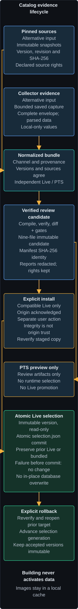

# Reviewed Catalog Candidate Pipeline

S073 provides a maintainer-only path from pinned source inputs to an immutable
review candidate. It composes the bounded collector importer, deterministic
catalog compiler, verifier, semantic diff, and local icon cache. It does not add
another source parser and cannot change the catalog used by the application.

## Evidence lifecycle and runtime selection

The catalog evidence lifecycle separates preparing review artifacts from the later user action
that changes the selected catalog. Read each branch together with the text below.

<figure class="docs-flow-diagram">

</figure>

### Catalog lifecycle text equivalent

1. **Alternative evidence inputs** enter the pipeline. Pinned source snapshots
   carry exact version, revision, hash and declared rights. Alternatively, bounded
   catalog collector evidence comes from a complete saved envelope. The
   [restricted importer](discovery-collector.md) parses data without executing
   Lua, checks identity, chunks and provenance, then normalizes the records.
   Pinned sources do not pass through the addon collector. Collector coverage
   remains limited to the declared account, character, unlock, locale, channel
   and API scope; review cannot broaden that coverage or its rights.
2. **Normalized bundle** validation requires channel, provenance, versions,
   sources and coverage to agree with the request. Live and PTS remain independent
   through acquisition, bundle, optional baseline, compiled database, manifest
   and directory identity. Optional immutable remote acquisition is bounded and
   hash-checked as described below; any stale-cache fallback must be explicitly
   allowed and recorded.
3. **Verified review candidate** preparation compiles the catalog, checks its
   schema, integrity and semantic checksum, compares a same-channel baseline,
   and enforces removal and redistribution thresholds. The exact nine-file
   review directory is immutable and identified by canonical manifest SHA-256.
   An existing matching candidate is verified and reused, not replaced.
   **Reports are redacted**, omitting captures, normalized contents, localized
   values, absolute paths and image bytes. The SQLite catalog can still contain
   user-collected values: **Collector values remain local-only** under their
   [source rights](../reference/catalog-sources-and-rights.md). Image objects
   stay in the separate user-local immutable cache; a review candidate does not
   turn them into release assets.
4. **Explicit install decision** is separate from building, discovering or
   verifying the candidate. The user acknowledges a trusted review or release
   origin and chooses installation. Hash integrity does not authenticate the
   download origin. The desktop accepts compatible supported Live candidates;
   **PTS review preview only** is a terminal branch with no runtime selection
   or automatic promotion into Live.
5. **Atomic Live selection** stages regular files, copies and re-verifies the
   candidate, publishes an immutable version and opens the database read-only
   before atomically replacing the small `selection.json` record. The prior
   target, which can be another verified Live version or the bundled catalog,
   is retained. Cancellation before selection or a failed validation preserves
   the previous selection. The selection commit itself is non-interruptible.
   Neither packaged catalog bytes nor an existing open database are replaced
   in place.
6. **Explicit rollback** re-verifies and reopens the previous Live or bundled
   target, then commits another selection generation. Accepted immutable versions
   remain available outside staging recovery. A receipt-storage failure is
   reported without undoing a successful selection; invalid saved selection
   visibly falls back to bundled data. The
   [user-initiated update workflow](catalog-updates.md) owns these selection,
   cancellation, recovery and rollback details.

Building a review candidate never activates it. Here, publishing a candidate
means installing its review directory, not selecting it for desktop use.

## Request and source gates

Every request fixes the mode, Live or PTS channel, game version, API version,
catalog version and schema, locales, tool version, sources, baseline, and removal
thresholds. Input paths are workspace-relative. Local files are opened through
bounded no-follow handles and cached by exact SHA-256 without replacement.
Normalized source snapshots must match the acquired channel, version, locale,
revision, hash, license scope, and redistribution decision. Collector snapshots
retain the fixed local-only rights assigned by the restricted importer.

Remote acquisition is optional. The request and command must both enable it.
Only HTTPS raw content from the approved repository host at an immutable
40-character commit revision is admitted. Redirects are denied, reads have a
timeout and byte limit, and content is cached only after its declared SHA-256
matches. Refresh failure is fatal unless the request explicitly allows a
verified stale cache;
`sources.json` records that choice. Cold and warm non-refresh retrieval both use
the stable `pinned-remote` provenance value, so cache temperature cannot change
candidate identity. New source objects remain staged until the complete
candidate verifies and installs. Icon generations are built in the same run
staging area, then copied into the user-local cache only after installation.
An allowed stale-cache fallback also appears as a stable warning in
`validation.json`.

Live and PTS remain independent. The request, every applicable source, normalized
bundle, optional baseline, compiled catalog, and manifest must agree on channel.
There is no automatic PTS promotion.

## Candidate contract

`pipeline-build` writes exactly these review files:

- `catalog.sqlite`;
- `manifest.json` and `checksums.json`;
- `sources.json`, `validation.json`, and `diff.json`;
- `build-report.json` and `verify-report.json`; and
- `icons.json`.

Reports contain stable source identities, hashes, counts, and results. They omit
local paths, normalized source content, captures, localized catalog values, and
icon bytes. The candidate ID is the SHA-256 of its canonical manifest. Existing
candidates are verified and reused, never replaced.

Coverage completeness downgrades are explicit regressions and consume the same
configured threshold as removed coverage rows. Any localized-text redistribution
change blocks publication.

`pipeline-verify` checks the exact file allowlist, canonical manifest, artifact
sizes and hashes, directory identity, catalog integrity, channel, and semantic
checksum. Removal thresholds and baseline channel checks run before publication.

## Automation boundary

The pinned `catalog-candidate` workflow runs manually or on a schedule with
read-only repository permission and a 30 minute matrix-job timeout. It builds
and verifies invented Live and PTS candidates and uploads them for review. It
contains no repository write, installation, promotion, or release step. Active
catalog selection, rollback, and end-user update behavior are provided by the
[user-initiated catalog update workflow](catalog-updates.md). Candidate integrity
does not authenticate its download origin, so installation keeps a separate
trusted-source acknowledgement.
