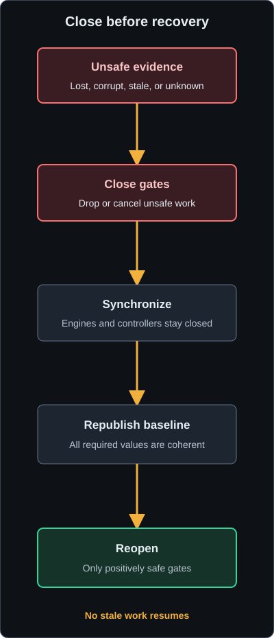

# State Machines

This developer reference summarizes correctness-bearing states, transitions,
Unknown policies, and evidence anchors. Feature pages own user setup and status
instructions. The [Action Authorization](../concepts/action-authorization.md)
truth table owns the comparison between input-producing paths.

## Runtime and Game Context

`ProcessObservation::runtime` reduces game and launcher presence in this order:

| Game evidence | Launcher evidence | Runtime |
| --- | --- | --- |
| Present | Any | Active |
| Unknown | Any | Unknown |
| Absent | Present | Launcher Open |
| Absent | Unknown | Unknown |
| Absent | Absent | Inactive |

`GameObservations::context` then evaluates:

`runtime -> focus -> heartbeat freshness -> surface -> Game Context`

Only Active, Focused, Fresh, and an observed `MenuSurface::None` produce
Gameplay. A named surface produces that surface. Missing freshness or surface
produces Signal Unavailable. Unknown runtime or focus remains Unknown.

Evidence: `src/game/mod.rs` symbols `ProcessObservation::runtime`,
`GameObservations::context`, `GameState::update_processes`, and
`GameState::signal_lost`; tests `runtime_reduction_honors_game_precedence_over_launcher`,
`gameplay_requires_every_authoritative_axis`, and
`leaving_active_clears_focus_freshness_and_surface` in `tests/game_state.rs`.

## Player safety states

| State machine | Safe value | Unsafe or unavailable values | Entry and recovery |
| --- | --- | --- | --- |
| Life State | Alive | Dead, Recovering (ghost, world activation, or no load), Unknown | Death starts an episode; player-alive and path events establish recovery, and only a later coherent baseline can publish Alive |
| World State | Active | Transitioning, Unknown | Player deactivation enters Transitioning; player activation refreshes every player payload before publishing Active |
| Travel | Inactive | Pending, Unknown | Recall-cooldown growth or jump preparation enters Pending; movement, jump failure, loading, or a 15 second watchdog clears the attempt |
| Roll Dodge | Inactive | Active, Unknown | Player ability 28549 gain enters Active and fade leaves it; a 1500 ms watchdog bounds rejected or missing fades |
| Movement | On Foot, Mounted, or Unknown for non-potion paths | Explicit Sprinting blocks Auto Potion only | Moving plus trying to move and action-slot evidence establishes keyboard on-foot sprint; 200 ms debounce and 1500 ms stale-positive expiry bound it |

**Version-sensitive**: the ESO event names, action-slot predicates, roll ability
identifier, and travel inference are current addon observations. The stable
product contract is that only positive safe evidence authorizes the consumers
that require it.

Evidence: addon functions and event registrations in
`addon/PixelBeacon/PixelBeacon.lua`; embedded-source contract tests
`addon_life_state_uses_authoritative_queries_events_and_rebaseline`,
`addon_world_state_uses_authoritative_events_and_a_complete_activation_baseline`,
`addon_roll_dodge_uses_filtered_events_bounded_recovery_and_lifecycle_invalidation`,
`addon_travel_detector_is_bounded_lifecycle_scoped_and_event_complete`, and
`addon_sprint_detector_is_bounded_keyboard_only_and_event_driven` in
`tests/beacon.rs`.

## Safety recovery order

<figure class="docs-flow-diagram">

</figure>

### Safety recovery text equivalent

Unsafe or unavailable evidence closes shared gates first. Work that no longer
has authority is dropped or cancelled, and output already held by a sink may
only be released. Consumers synchronize while authorization remains closed, so
an engine or controller cannot observe a partially recovered state. The reader
then republishes every required observation from one coherent generation. A
complete positive baseline reopens the gates that are safe, while missing or
unknown values keep their consumers closed. Cancelled work is never replayed.

## Weave decision flow

The Weave Engine is request-driven rather than a long-lived visible state
machine:

1. Require the queued request's authorization epoch to remain current. Focus
   loss, suspension, or menu-gate closure advances the epoch.
2. Resolve the queued action to one active skill slot.
3. Require Life State Alive.
4. Require Roll Dodge Inactive.
5. Require World State Active.
6. Require Travel Inactive.
7. Select the front or back timing profile from the active Weapon Bar. Unknown
   uses the front profile.
8. Drop a request inside the selected Global Cooldown.
9. Generate the selected Light Attack, Heavy Attack, Bash Attack, or Block
   Casting step sequence.
10. During the sequence, recheck the authorization epoch and shared life,
    roll-dodge, world, and travel gates before Down operations and during waits.
    After cancellation, release output already held by the sink.
11. Record the Global Cooldown origin only if the sequence emitted a Down event.

Requests blocked before or during a sequence are never replayed.

An open-to-closed Life transition advances a diagnostic death epoch. The reader
records a sample generation and, at death recovery, republishes every current
action-driving observation before it routes Life Alive. This makes reopening a
fresh authorization boundary rather than reuse of pre-death controller state.

Evidence: `WeaveEngine::handle`, `RealSink::emit`, `RealSink::wait`, and
`sequence_for_adapted` in `src/weave`; tests
`queued_weave_requires_safe_world_and_inactive_travel_without_replay`,
`s060_queued_weave_epoch_is_invalid_after_each_runtime_gate_closes`,
`s060_transient_suspend_closure_cancels_an_admitted_sequence`,
`s060_focus_closure_stops_new_presses_but_releases_held_output`, and
`real_sink_observes_roll_gate_closure_during_a_wait`, and
`a_gate_cancelled_sequence_does_not_consume_global_cooldown` in
`tests/weave_engine.rs`.

## Fishing Controller

Normal flow:

`Disabled -> Armed -> Waiting -> Reeling -> Recast -> Armed`

| Current state | Input | Next state and side effect |
| --- | --- | --- |
| Disabled with a permitted request | Enable | Armed; send one Interact Down and Up; arm cast-confirmation timeout |
| Armed or Recast | Fishing Started | Waiting; cancel the current deadline |
| Waiting or Armed | Bite Detected | Reeling; arm Reel Due |
| Reeling at Reel Due | Clock tick | Recast; send Interact; arm Recast Due |
| Recast at Recast Due | Clock tick | Remain Recast until confirmation; send Interact; arm cast-confirmation timeout |
| Waiting, Reeling, or Recast | Fishing Stopped | Armed; send a new cast and arm confirmation |
| Armed at cast timeout | Clock tick | Disabled with No Cast Detected; clear request |
| Any active state | User disables | Disabled; cancel deadline; emit nothing |
| Any active state | SignalLost | Disabled; cancel deadline; clear request; emit nothing |
| Any active state | Suspension begins | Disabled; cancel deadline; retain request; emit nothing |
| Disabled with retained request | Suspension ends | Remain Disabled; emit nothing until a fresh manual cast or off-on request |

A menu gate defers Reel Due and Recast Due without advancing state. Life, world,
or travel loss disables pending work, preserves the request, and requires fresh
safe evidence and a fresh manual cast observation rather than replay. Runtime or
focus loss also disables without input and preserves the request, with recovery
handled by `set_game_environment`.

Evidence: `FishingController::set_enabled`, `on_event`, `tick`,
`set_game_environment`, and `block_for_safety` in `src/fishing/mod.rs`; tests
`cast_reel_recast_cycle`, `non_alive_cancels_pending_fishing_without_replay_and_keeps_request`,
`focus_loss_pauses_and_refocus_rearms_requested_fishing`, and
`s060_suspension_refuses_initial_cast_and_preserves_request`,
`s060_suspension_cancels_pending_reel_without_replay`,
`s060_suspension_cancels_recast_and_timeout_paths`, and
`signal_loss_while_focus_paused_applies_the_existing_reset_policy` in
`tests/fishing.rs`.

## Auto Potion Controller

The controller retains an operator request separately from its effective state.
Its first terminal result is evaluated in this order:

| Order | Condition | Effective result when it fails |
| --- | --- | --- |
| 1 | Requested | Off |
| 2 | Game active | Dormant: Game Inactive |
| 3 | ESO focused | Dormant: Unfocused |
| 4 | Fresh heartbeat | Blocked: Beacon Unavailable |
| 5 | Not suspended | Blocked: Suspended |
| 6 | Game Context Gameplay | Blocked: Game Context |
| 7 | Life State Alive | Blocked: specific player state |
| 8 | World State Active | Blocked: World Unavailable |
| 9 | Travel Inactive | Blocked: Travel Pending |
| 10 | Not explicitly Sprinting | Blocked: Sprinting |
| 11 | At least one enabled, readable resource watch | Blocked: No Watched Resource or Resources Unavailable |
| 12 | Quickslot explicitly contains a usable potion | Blocked: Quickslot Unavailable, No Potion, or Potion Unavailable |
| 13 | Quickslot cooldown Ready | Blocked: Potion Cooldown |
| 14 | Retry interval elapsed | Blocked: Retry Interval |
| 15 | One watched resource at or below its threshold | Triggered; otherwise Ready |

Implementation detail: step 11 computes an optional low-resource cause before
steps 12 through 14. Fresh resources with no low cause do not return Ready until
the quickslot, cooldown, and retry checks pass. Triggered emits exactly one
quickslot Down and Up and records the attempt timestamp.

SignalLost clears gameplay observations and blocks the controller without
clearing the request. A fresh heartbeat alone does not invent safe values. Every
required positive observation must return before Ready or Triggered is possible.

Evidence: `evaluate`, `low_resource`, `AutoPotionController::tick`,
`on_signal_lost`, and `on_heartbeat` in `src/potion/mod.rs`; tests
`s043_effective_state_distinguishes_ready_triggered_and_every_runtime_family`,
`s043_quickslot_states_expose_their_specific_blocker`,
`s043_signal_loss_preserves_the_request_and_heartbeat_recovers`, and
`the_retry_interval_bounds_the_rate_independently_of_the_cooldown` in
`tests/potion.rs`.

## Pixel Bus lifecycle

Text sequence:

1. Capture the current header cells.
2. Validate magic, version, column complements, physical block size, and complete
   occupied extent.
3. Prepare one frame for the validated layout and decode payload from that same
   frame.
4. Emit changed aggregate observations.
5. Close safety gates before acquiring controller locks.
6. Synchronize engine and controller state, then open any positively safe gate.
7. On recognized header corruption, invalidate payload immediately.
8. On missing B0 beyond 2000 ms, emit SignalLost and clear cached payload state.
9. After recovery or reset, republish unchanged values so consumers receive a
   complete baseline.

The exact header and B0 through B28 wire values remain canonical in
[Pixel Bus Protocol](../reference/pixel-bus-protocol.md).

Evidence: `PixelBusReader::sample_and_observe_with_surface`, `lose_signal`,
`invalidate_safety_observations`, and `route_reader_safety_gate`; tests
`invalid_recognized_header_suppresses_payload_sampling`,
`heartbeat_then_signal_loss_then_recovery`, and
`safety_invalidation_fails_closed_and_republishes_unchanged_values` in
`tests/pixelbus.rs`.
