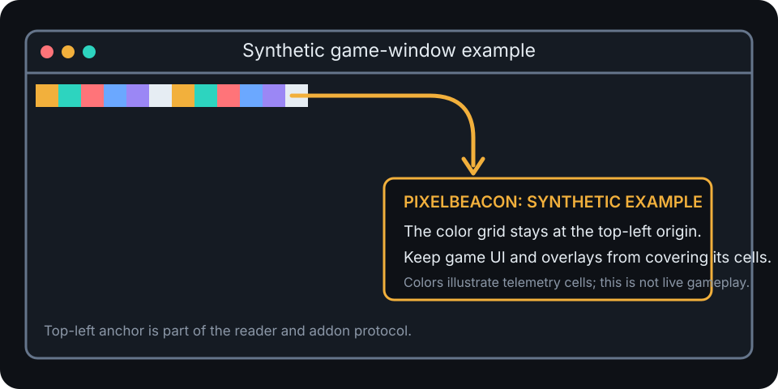
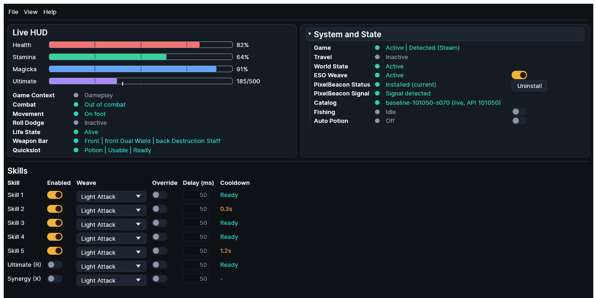
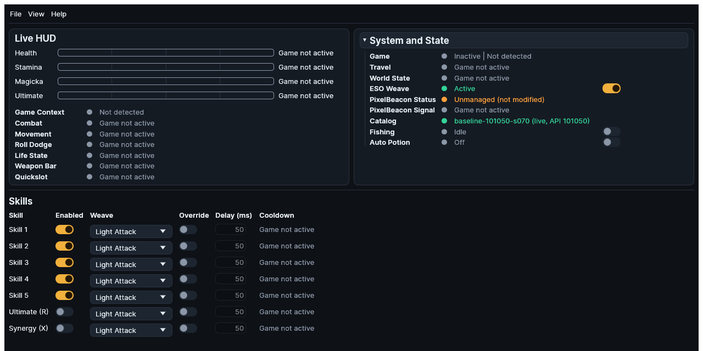

# PixelBeacon

PixelBeacon Status covers install addon, update addon, and unmanaged addon
states. API Version may appear as `APIVersion`, outdated addon, or ESO client
version in diagnostic discussions.

ESO exposes its Lua API to addons but provides no direct real-time subscription
for an external desktop application. PixelBeacon is the minimal bridge used by
ESO Weave. It renders solid-color telemetry blocks and has no settings, libraries,
saved variables, or interface beyond those blocks.

PixelBeacon is embedded in the ESO Weave binary and managed from System and
State. The overlay must remain visible at the top-left of the ESO client because
anything drawn over it can make the signal unavailable.

The addon is also described as the pixel addon, telemetry overlay, color blocks,
screen telemetry, or beacon. These terms refer to PixelBeacon and its Pixel Bus,
not to game memory or packet inspection.

At the default block size, protocol version 5 occupies 512 by 16 physical pixels:
three layout-header cells and twenty-nine payload cells. PixelBeacon calculates
how many complete blocks fit the current client width. Lowering Block Size in
Settings reduces the footprint. A changed size takes effect after the addon is
redeployed, `/reloadui` is run, and ESO Weave restarts.

The overlay cannot be moved. Its origin is part of the shared protocol; changing
only one side would create an undetectable geometry disagreement.

<figure class="docs-screenshot docs-screenshot--illustration">

<figcaption>Synthetic example, not live gameplay: PixelBeacon begins at the game client top-left origin, and other interface elements must not cover its cells.</figcaption>
</figure>

The colored cells in the illustration are explanatory only. The actual payload
varies with current telemetry, but its origin remains fixed and every cell must
stay unobscured.

## AddOns directory discovery

On Windows, ESO Weave resolves the Documents known folder through the shell API,
then locates `Elder Scrolls Online\<environment>\AddOns`. On Linux, it reads Steam
library metadata, finds app id `306130`, and resolves the path in the Proton
prefix. The `live` environment is the default and `pts` can be selected. A manual
override is also available.

In **Settings > PixelBeacon and Bus**, select **Live** or **PTS**. Use an
**AddOns Folder Override** only when discovery cannot find the existing
environment directory. The override must name the `AddOns` directory itself;
ESO Weave refuses to create a missing root.

Discovery never writes outside the resolved AddOns directory.

## Installation and update

Install writes embedded files only beneath `AddOns/PixelBeacon/` and renders the
manifest with the resolved ESO API version. Installing over a managed older copy
is an update. If the AddOns directory does not exist, installation refuses rather
than creating it.

The on-disk manifest is classified as:

| State | Meaning |
| --- | --- |
| Not Installed | The PixelBeacon target does not exist |
| Unmanaged | An existing target cannot be proven to be managed, including a missing, unreadable, invalid, or unmarked manifest |
| Installed (current) | The marker and embedded version match |
| Installed (outdated) | The marker exists but versions differ |

<figure class="docs-screenshot">

<figcaption>Deterministic healthy baseline: the game and world are active, the managed addon is current, and PixelBeacon Signal is detected.</figcaption>
</figure>

The interface shows **Unmanaged (not modified)** when the target exists but
ownership cannot be proven. It exposes no Install, Update, or Uninstall action
for that state. Move or remove only that exact `PixelBeacon` target manually
before asking ESO Weave to install a managed copy.

Removal deletes the PixelBeacon directory only when the manifest contains
`## X-ESO-Weave-Managed: true`. An unmanaged or unreadable directory is never
deleted. Managed-marker checks also protect automatic API and block-size edits.
Install, Update, API refresh, and block-size redeploy recheck ownership at the
write boundary and refuse an unproven target without modifying it. Updating an
outdated managed copy replaces its embedded files in place; it does not delete
the directory first. Lua is prepared before the manifest commit marker. A failed
fresh install removes the directory it just created, while a failed managed
update restores the previous embedded bytes on a best-effort basis and reports
the original error.

<figure class="docs-screenshot">

<figcaption>Deterministic unmanaged state: ownership cannot be proven, so ESO Weave offers no install, update, or removal action for that target.</figcaption>
</figure>

When ESO is running during an install, update, or removal, use `/reloadui` or
relog before expecting the change in game.

## API version upkeep

The manifest carries the addon version, one or more ESO API versions, and the
managed marker. At startup, ESO Weave uses the greater of its stored last-known
API version and a compiled default. A valid manifest therefore requires neither
network access nor prior state.

For a managed installation with an older primary API token, ESO Weave rewrites
only the `## APIVersion` line, retains greater tokens, and drops lesser ones. A
background startup check reads the official `esoui/esoui` live client version as
a bump-detection signal. It never guesses an undisclosed numeric API version,
never downgrades the manifest, and does not block startup on network failure.

**Version-sensitive:** ESO API and client versions can change independently of
an ESO Weave release. The network observation is only a bump signal; compiled
and last-known values preserve offline startup.

## Fishing signal and quickslot diagnostics

Fishing state is polled from ESO's interaction state every 100 ms. Bait
consumption while a cast is active is the sole bite signal. PixelBeacon does not
infer a bite from the standing interact prompt or a timer.

Run `/pbquickslot` in ESO for one bounded snapshot of quickslot facts. Run
`/pbquickslot watch` to report only changed snapshots, and run it again to stop.
The diagnostic intentionally omits localized item names and descriptions.
Quickslot classification first shipped in PixelBeacon version 13.

The commands are diagnostic tools, not setup requirements. Watch mode reports
only changed snapshots, and the same command stops it. If the heartbeat is not
healthy, first use [PixelBeacon signal troubleshooting](../getting-started/troubleshooting.md#pixelbeacon-signal-is-missing-or-lost).

## Overlay and compatibility recovery

Block Size choices are 2, 4, 8, 16, or 32 physical pixels, with 16 as the
default. After changing it, reload or relog ESO and restart ESO Weave. Color
Tolerance and both sampling intervals apply live through a wakeable reader
update. Rapid edits coalesce to the newest complete value. Changing tolerance
closes cached menu, life, world, roll-dodge, and travel evidence before a fresh
sample can authorize generated input. Running Block Size and the internal
heartbeat timeout never enter that live update path.

Older layouts remain bounded to the fields they draw. Missing newer fields become
unavailable and are never guessed.

See [Pixel Bus Protocol](../reference/pixel-bus-protocol.md) for the wire contract.
