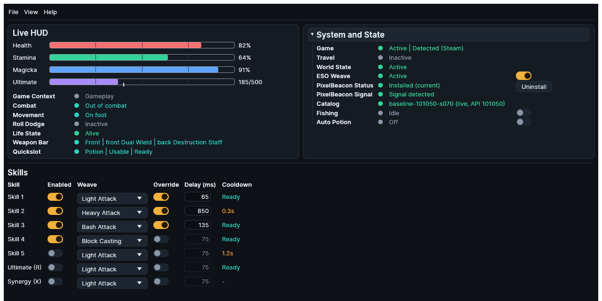

# Weaving

Players may also call these controls a bash weave, interrupt, or block bash; the
Global Cooldown is commonly shortened to GCD or cooldown window; and Latency
Adaptation may be described as ping adjustment, latency scaling, or k factor.

While the ESO window is focused, ESO Weave can intercept a configured skill key
and submit a basic attack and skill sequence in its place. An inactive skill slot
passes its key through unchanged. Press `F1` to suspend or resume automation.
Suspension prevents new weave interception and invalidates queued or running
work. Focus loss and menu-gate closure do the same. Recovery never replays the
discarded request.

Weaving requires fresh evidence that the player is alive, the world is active,
travel is inactive, and roll dodge is inactive. If roll-dodge evidence is Active
or unavailable, the physical skill key passes through instead of being swallowed.
If a roll begins after a sequence starts, the remaining generated work is
discarded and any held mouse button is released.

## Configure one slot

1. Find the slot in **Skills**. Skill 1 through Skill 5, Ultimate, and Synergy
   each have one row.
2. Turn **Enabled** on. When it is off, the physical key passes through.
3. Choose **Light Attack**, **Heavy Attack**, **Bash Attack**, or **Block
   Casting** in **Weave**.
4. Leave **Override** off to inherit the active weapon bar's timing. Turn it on
   to edit the delay used by that row's current weave type.
5. Confirm **Delay (ms)** shows the intended effective value. The field is
   read-only while the override is off.
6. Focus ESO, enter normal gameplay, and press the bound key once.

<figure class="docs-screenshot">

<figcaption>Deterministic configuration example: each Skills row shows whether it is enabled, its weave type, override state, effective delay, and observed cooldown.</figcaption>
</figure>

This image is a configuration fixture, not a live automation session. The text
above remains the authority for safely focusing ESO and testing one key.

The **Cooldown** column is observation-only. **Ready** means zero reported
cooldown, a duration is the remaining rounded telemetry, and a dash means no
usable signal. Synergy always shows a dash because ESO exposes no cooldown for
that contextual prompt. Cooldown telemetry does not authorize or block current
weave execution.

## Skill slots

| Slot | Default key | Default type | Active by default |
| --- | --- | --- | --- |
| Skill 1 through Skill 5 | `1` through `5` | Light Attack | Yes |
| Ultimate | `R` | Light Attack | No |
| Synergy | `X` | Light Attack | No |

Every binding can be changed. Conflicting assignments are rejected.

Open **Settings > Keybindings** to select a key for each of the ten actions.
The application keeps the previous assignment if the selection conflicts. The
default action hotkeys are `F1` for suspension, `F2` for Fishing, and `F3` for
Auto Potion. They remain reachable while suspended. F1 changes suspension and
F3 does not bypass Auto Potion's suspension check. F2 can retain a Fishing
request while suspended, but it sends no cast until the operator performs a
fresh manual cast or turns Fishing off and on after resuming.

## Weave types

"Primary" means the left mouse button, and "secondary" means the right mouse
button.

| Type | Generated sequence |
| --- | --- |
| Light Attack | Primary click, wait `d_weave`, send the skill key |
| Heavy Attack | Primary down, wait `d_heavy`, send the skill key, primary up |
| Bash Attack | Primary click, wait `d_weave`, send the skill key, wait `d_bash`, secondary down, primary click, secondary up |
| Block Casting | Secondary down, send the skill key, wait `d_weave`, secondary up |

## Timing

| Parameter | Default | Purpose |
| --- | --- | --- |
| `global_cooldown` | 500 ms | Minimum interval between submitted weave sequences |
| `d_weave` | 50 ms | Gap between a basic attack and skill key |
| `d_heavy` | 1000 ms | Heavy attack hold before the skill key |
| `d_bash` | 125 ms | Gap before the bash part of Bash Attack |

A request inside the configured global cooldown is dropped while its physical key
remains suppressed. Each slot can override the parameters used by its weave type;
a blank override inherits the global value.

ESO Weave always keeps separate base timing profiles for the primary and backup
weapon bars and selects the profile for the active bar. If the active bar is
unknown, it uses the primary profile. Weapon-aware timing then selects the
`d_heavy` preset for the active bar's weapon class; when that class is unknown,
it retains the selected profile's configured heavy attack value. See
[Weave Delay Defaults](../reference/weave-delay-defaults.md).

Optional latency adaptation computes:

```text
effective_delay = base_delay + round(k * latency_ms)
```

`k` defaults to 0.25. The adjustment applies to `d_weave` and `d_bash`, is
clamped between the base and base plus 300 ms, and does not change `d_heavy` or
`global_cooldown`. Without current latency telemetry, base values remain in use.

For example, a 50 ms base delay, 100 ms latency, and `k = 0.25` produce a 75 ms
effective delay. Latency adaptation adds a bounded allowance to Light Attack and
Bash delays; it does not shorten them, and the scaled allowance is capped at
300 ms.

## Weapon bars and timing

ESO calls the two normal hotbars primary and backup; the interface also calls
them front bar and back bar. A bar swap selects the already configured profile
for that active Weapon Bar. With Auto Timing from Weapon off, each normal bar has
its own Light Attack, Heavy Attack, and Bash delays. With it on, the detected
weapon class replaces only the active bar's Heavy Attack delay with the preset.

Example: the front bar can retain a 640 ms Dual Wield heavy preset while the back
bar uses a 1380 ms Bow preset. If the active bar or weapon class is Unknown, the
configured front or selected-bar value remains the fallback described above.

**Version-sensitive:** Heavy-attack presets are adjustable community estimates,
not ESO constants. See [Weave Delay Defaults](../reference/weave-delay-defaults.md).

## Authorization and cancellation

The normal decision sequence is:

```text
physical bound key -> focused-game interception -> queue
queue -> current authorization epoch + active slot + life + world + travel + roll + cooldown checks
authorized request -> timed generated sequence
focus/suspension/menu epoch or shared life/world/travel/roll gate closes -> discard remaining work, release held output, never replay
```

Game inactivity, lost focus, native menus or chat entry, and suspension prevent
new physical handoff. At queue handling, unavailable life/world/travel/roll
evidence and active Roll Dodge keep work from starting. A request inside the
configured Global Cooldown is dropped. Dropped work requires a new physical
press after recovery.

A queued request carries the authorization epoch established at physical
handoff. Focus loss, suspension, or menu-gate closure invalidates that epoch.
The worker and sink check it before output and during waits, alongside life,
roll-dodge, world, and travel. A cancellation still releases any output already
held by the sink and does not revive when the gate reopens.

## Troubleshooting

If the physical key passes through, first check Enabled, focus, suspension, Game
Context, Life State, World State, Travel, and Roll Dodge. If it is suppressed but
no sequence appears, check the Global Cooldown and Live Log for a queue or worker
drop. See [A skill passes through or a weave is dropped](../getting-started/troubleshooting.md#a-skill-passes-through-or-a-weave-is-dropped).
