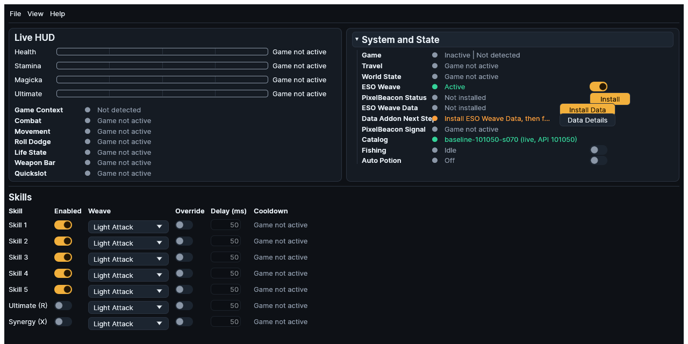
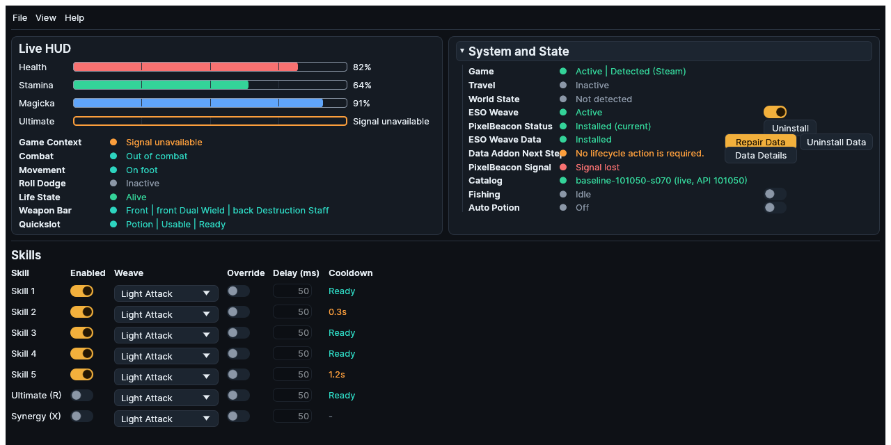

# First Launch

This walkthrough establishes a safe, observable baseline before any automation
is enabled. Keep ESO Weave visible beside ESO while completing the checks.

## 1. Confirm the desktop application

Launch ESO Weave from its installed shortcut or package. The window contains a
Live HUD, System and State, Skills, and an optional Live Log. **ESO Weave** should
show **Active** unless you intentionally suspended it.

<figure class="docs-screenshot">

<figcaption>Deterministic first-launch state: ESO is inactive, ESO Weave is active, and each absent managed addon has its own Install action.</figcaption>
</figure>

Open **Settings** from the File menu and confirm the theme and platform-specific
options are usable. Changes are saved automatically. All Fishing controls and
the Pixel Bus tolerance and sampling intervals apply live. Only Pixel Bus Block
Size remains staged for an ESO reload
or relog plus an ESO Weave restart; see
[Settings application timing](../reference/settings.md#application-timing).

## 2. Confirm ESO discovery

Start the ESO launcher and game. In **System and State**, the **Game** row combines
runtime and installation evidence. A normal installed game progresses from
**Launcher open** to **Active** and names one provider: ESO Store, Steam, Epic
Games, or Steam Proton.

If the row says **Not detected**, **Unknown**, or **Multiple installs detected**,
do not enable automation. Follow [Game discovery and runtime](troubleshooting.md#game-discovery-and-runtime).

## 3. Install PixelBeacon

PixelBeacon is the bundled addon that displays the color-block telemetry overlay.
In **System and State**, choose **Install** or **Update** beside **PixelBeacon
Status**. If ESO is already running, enter `/reloadui` in ESO or relog.

At ESO's character selection, enable the PixelBeacon addon if the game has not
enabled it automatically. The small block overlay must remain visible at the
top-left of the game client. Do not cover that area with another window or
overlay.

If an existing PixelBeacon target was installed or edited outside ESO Weave,
System and State shows **Unmanaged (not modified)** and offers no lifecycle
buttons. Move or remove only that exact target manually before using **Install**.
ESO Weave does not overwrite an unproven target.

<figure class="docs-screenshot">

<figcaption>Deterministic unmanaged state: ownership cannot be proven, so ESO Weave offers no install, update, or removal action for that target.</figcaption>
</figure>

## 4. Install ESO Weave Data when needed

**ESO Weave Data** is the separate managed package for catalog and encounter
data. Choose **Install Data** beside **ESO Weave Data**. Use **Update Data** for
managed drift, **Repair Data** for an atomic reinstall, or **Uninstall Data**
only after its data-specific confirmation. An unmanaged `EsoWeaveData` target
offers no mutation.

After a lifecycle change, obey **Data Addon Reload: Required** by running
`/reloadui` or relogging. Choose **Data Details** to inspect dedicated evidence
rows for enabled, loaded, runtime, catalog, and encounter facts. **Unconfirmed** is
expected when no supported current-session source exists. Verify enablement in
ESO's Add-Ons menu; do not treat installed files or a running ESO process as
load proof. **Data Addon Next Step** names the safe remediation for the current
lifecycle state.

## 5. Verify fresh telemetry

Focus the ESO game window and enter the world. Wait for loading to finish. A
healthy baseline has:

| Field | Expected observation |
| --- | --- |
| Game | **Active** with the detected provider |
| World State | **Active** |
| PixelBeacon Status | **Installed (current)** |
| ESO Weave Data | **Installed** when its data workflows are needed |
| Data Addon Ownership and Compatibility | **Managed** and **Current**; the following current-session fact rows may remain **Unconfirmed** |
| PixelBeacon Signal | **Signal detected** |
| Game Context | **Gameplay** when no native menu or chat field is open |
| Life State | **Alive** |
| Travel | **Inactive** |

Health, Stamina, Magicka, and Ultimate should become numeric when their current
protocol fields are available. A zero resource is a valid numeric reading;
**Signal unavailable**, **Not detected**, and **Unknown** are not zero.

<figure class="docs-screenshot">

<figcaption>Deterministic healthy baseline: the game and world are active, both managed addons are current, and PixelBeacon Signal is detected while data-addon session facts remain separate.</figcaption>
</figure>
<figure class="docs-screenshot">

<figcaption>Deterministic lost-signal state: the addon remains installed, but current telemetry is unavailable until visibility returns.</figcaption>
</figure>

**Not installed** means the managed addon files are absent. **Signal lost** means
the addon is installed but the reader no longer sees a valid current frame.
**Signal detected** is the healthy state. These distinctions remain explicit in
the text even when the images are unavailable.

Open and close an ESO menu to confirm **Game Context** changes away from and back
to **Gameplay**. This is an observation test, not an invitation to automate.

## 6. Configure one feature

Start with only one feature:

- [Configure one weaving slot](../features/weaving.md#configure-one-slot).
- [Prepare and start Fishing](../features/fishing.md#before-starting).
- [Configure Auto Potion](../features/auto-potion.md#configure-auto-potion).

Use the [Status Reference](../reference/status-reference.md) for exact meanings.
If the expected baseline does not appear, continue to
[Troubleshooting](troubleshooting.md) before enabling input generation.
