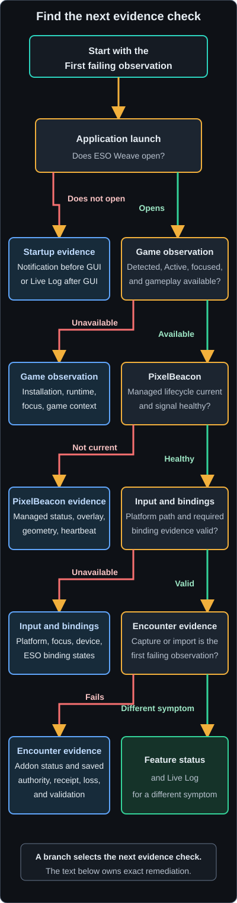

# Troubleshooting

Signal Lost may be described as a missing beacon, heartbeat timeout, or hidden
overlay. Start with the shared diagnostic flow below for any of those reports.

Start with the first failing observation, then follow the matching branch. Do not
disable focus checks, signal validation, suspension, or managed-addon guards to
make automation run.

For the optional authenticated extension service, including a stopped listener,
port collision, stale discovery, bearer rejection, protocol mismatch, database
limits, or client disconnect, use [Local API and MCP
troubleshooting](../reference/local-api-and-mcp.md#troubleshooting).

## Shared diagnostic flow

<figure class="docs-flow-diagram">



</figure>

### Shared diagnostic flow text equivalent

```text
Does ESO Weave open?
  No -> inspect Startup failure evidence before or after GUI initialization.
  Yes -> is ESO detected and Active?
    No -> fix installation or runtime discovery.
    Yes -> is the ESO window focused and Game Context Gameplay?
      No -> focus ESO, close menus, or wait for fresh lifecycle evidence.
      Yes -> is PixelBeacon Installed (current)?
        No -> fix addon discovery or lifecycle state.
        Yes -> is PixelBeacon Signal detected?
          No -> check addon enablement, reload, overlay visibility, and geometry.
          Yes -> is native binding evidence valid for the requested action?
            No -> repair the binding in ESO, then restore fresh evidence.
            Yes -> is encounter capture or import the first failing observation?
              Yes -> inspect addon status, saved authority, receipt, loss, and validation.
              No -> inspect the feature-specific status and Live Log.
```

The indented text is the complete decision tree. Each matching failure branch
stops before feature-specific diagnosis because later observations depend on
the earlier one.

## Game discovery and runtime

| Symptom | Meaning | Next action |
| --- | --- | --- |
| **Not detected** | No validated ESO installation or active game was found | Confirm ESO is installed for the current user and launch it normally |
| **Multiple installs detected** | More than one authoritative installation root conflicts | Close ESO Weave, identify the intended installation, and use the AddOns folder override only for PixelBeacon while provider ambiguity remains visible |
| **Unknown** | The operating-system observation did not authorize a conclusion | Retry after the launcher and game settle; inspect the Live Log if it persists |
| **Launcher open** | The launcher is present but the game client is not active | Start the game client |
| **Inactive** | The launcher and game client are absent | Start ESO |

Game exit clears game-derived observations and held-key state. Returning to the
game requires fresh focus, heartbeat, surface, life, world, travel, and roll
evidence. Dropped work is not replayed.

## Linux input or focus does not work

1. Confirm the current user has either `input` group membership or the packaged
   `/dev/uinput` udev rule described in [Installation](installation.md#linux).
2. If group membership changed, sign out and back in.
3. Confirm ESO runs under X11 or XWayland. Pure Wayland cannot provide the active
   X window and capture evidence required by the current application.
4. Confirm the physical keyboard exposes the expected keys and no other program
   has exclusively grabbed it.
5. Inspect the Live Log for an explicit pass-through emission error.

Do not use recursive permission changes or world-writable device modes.

## PixelBeacon Status is not current

| Visible state | Next action |
| --- | --- |
| **Not installed** | Choose **Install**, then `/reloadui` or relog if ESO is running |
| **Installed (outdated)** | Choose **Update** to replace the managed copy in place; then reload ESO |
| **Unmanaged (not modified)** | No lifecycle action is offered; move or remove only that exact target manually, then install a managed copy |
| **AddOns folder not found** | In Settings, select Live or PTS correctly, or enter the existing environment's `AddOns` directory as the override |

An existing PixelBeacon target whose ownership cannot be proven is shown as
**Unmanaged (not modified)**. Install, Update, Uninstall, API refresh, and
block-size redeploy refuse it without changing its contents. Resolve only that
exact target manually; do not disable the ownership guard.

## PixelBeacon Signal is missing or lost

1. Confirm PixelBeacon is enabled in ESO's addon list.
2. Run `/reloadui` or relog after install, update, or removal.
3. Keep the top-left color-block overlay visible and unobstructed.
4. If Block Size changed, redeploy the managed addon, reload ESO, and restart ESO
   Weave so both sides use the same physical geometry.
5. Wait until loading ends and **World State** returns to **Active**.
6. Use [PixelBeacon quickslot diagnostics](../features/pixelbeacon.md#fishing-signal-and-quickslot-diagnostics)
   only after the shared signal is healthy.

Missing, invalid, stale, or corrupt telemetry becomes unavailable and does not
authorize automated input.

The Live HUD may continue showing the last coherent values after a loss. Check
the **HUD Freshness** row: **Stale** names the cause and age. These values are
display-only and do not keep weaving, Fishing, or Auto Potion authorized. Fresh
observations replace them immediately; the configured **Stale Retention
(seconds)** interval then expires to the ordinary unavailable view. Set it to 0
under Appearance when immediate clearing is preferred.

## Native binding evidence is unavailable

PixelBeacon discovers bindings without changing ESO controls. Weaving, Fishing,
and Auto Potion consume their current action subset without a desktop fallback.
The evidence distinguishes these states for each native ESO action:

| State | Meaning | Safe next action |
| --- | --- | --- |
| Unavailable | PixelBeacon is old, the signal is stale or malformed, or ESO has not loaded binding data | Update PixelBeacon, reload ESO, and restore the shared signal first |
| Unbound | ESO has no keyboard or mouse assignment for the action | Bind the action in ESO's Controls menu |
| Conflicting | More than one distinct native assignment exists | Leave one intended keyboard or mouse chord in ESO |
| Unsupported | The only assignment is gamepad, combined, hold, unknown, or otherwise outside the portable registry | Choose an ordinary keyboard key or supported mouse control in ESO |
| Valid | One supported primary and normalized modifier set was decoded | The corresponding weave, Fishing, or Auto Potion action is usable now |

Do not install a custom binding addon or edit `Bindings.xml` to repair evidence.
PixelBeacon uses only ESO's read-only runtime binding APIs and deliberately has no
binding mutation or persistence path.

If valid combat evidence still passes through, confirm the skill row is enabled
and required Attack or Block evidence is also valid. Release extra physical
modifiers that are absent from a target chord. ESO Weave refuses to synthesize a
release for a modifier you are holding.

If Fishing or Auto Potion reports a binding unavailable state, inspect the
read-only detected row in Settings, repair the action in ESO, and reload the UI.
Do not add the obsolete gameplay key back to `config.json` because it is ignored.

## ESO Weave Data is missing, outdated, unmanaged, or awaiting reload

- **Not installed**: choose **Install Data**, then obey any reload guidance.
- Compatibility **Update available**: choose **Update Data** or **Repair Data**;
  both stage and verify replacement before commit.
- Ownership **Unmanaged**: move or remove only the exact `EsoWeaveData` target
  manually. No lifecycle action is offered.
- **AddOns folder not found**: select the correct Live or PTS environment or
  configure its existing `AddOns` directory.
- Reload **Required**: run `/reloadui` or relog before relying on the change.
- Lifecycle operation failed: keep the prior package, check AddOns permissions,
  and retry the named operation. Do not delete first.

Enabled, loaded, runtime, catalog, and encounter are separate evidence facts.
**Unconfirmed** does not mean disabled. Verify ESO Weave Data in ESO's Add-Ons
menu and use `/ewcollect status` or `/ewencounter status` for the in-game module.
A running ESO process does not confirm addon loading or collection, and
SavedVariables on disk may reflect only an earlier flush.

## Encounter capture is waiting, interrupted, or failed

Run `/ewencounter status` inside ESO. The desktop can show only a validated
last-saved snapshot and cannot toggle capture or acknowledge current addon
state.

- **Stopped**: choose `single` or `continuous`, select `live` or `pts`, then use
  `/ewencounter toggle` inside ESO.
- **Waiting**: the selected mode is enabled and detailed capture handlers are
  dormant until combat starts. Toggle again to disable it.
- **Capturing**: the current encounter is recording. Toggling off finalizes it
  as a user-stopped partial record.
- **Interrupted**: reload or relog created an explicit gap. Single stops;
  continuous resumes only from valid durably saved authority and retains the
  interruption fact.
- **Failed**: callback, clock, recovered-state, marker, or storage pressure made
  continued capture unsafe. Retained evidence remains in place and the failed
  request does not retry automatically. Flush and import it before following
  the controlled clear and restart guidance.

A malformed same-version controller is never normalized by guessing. The addon
preserves it unchanged, keeps it inactive, and reports `state-invalid` through
`/ewencounter status`; use `clear confirm` only when you intentionally accept
discarding that unimportable state.

Single mode enabled during combat truthfully marks the unseen prefix and is
partial even when the next combat exit is observed. Continuous encounters share
one session identity but have separate contiguous ordinals, raw sequences, and
replay outcomes. A missing ordinal, changed prior member, malformed spool, or
identity collision rejects the complete desktop import batch without changing
existing history.

No old encounter is automatically removed when the spool reaches its record,
marker, or 32 MiB estimated-data limit. The controller preserves terminal and
failure evidence and stops. Run `/reloadui`, relog, or exit ESO to flush data,
then use **Import Saved Capture** in Encounter History. An ESO or operating-system
crash before a flush can lose unflushed control and encounter state; the product
does not invent a recovery marker for facts that never reached disk.

## Discovery collector capture or import fails

The catalog module is separate from PixelBeacon but shares the managed ESO Weave
Data package with encounter capture. Use the first-class System and State row for
package lifecycle. Maintainers may also run `collector-status` against the exact
Live or PTS `AddOns` directory. An `unmanaged` result is intentionally not
repaired or removed automatically.

In ESO, `/ewcollect status` reports the current capture state. Combat pauses a
run and requires `/ewcollect resume`. After completion, run `/reloadui`, log
out, or exit so ESO writes SavedVariables. Import the matching Live or PTS file;
channel, checksum, chunk, status, size, or schema errors are fail-closed and do
not overwrite the previous staged JSON. Do not edit the capture to bypass an
error. Preserve it for diagnosis and begin a fresh explicit run.

## A local ability icon uses the placeholder

S072 provides a library cache boundary but does not activate icon selection in
the application. For direct library use, confirm that the explicitly selected
source root mirrors the complete catalog virtual path and contains a PNG or DDS
file. `Missing` and `Unsupported` identify absence or file type. `Failed`
includes unsafe paths, links or reparse points, permissions, corruption,
dimension or byte limits, and cache integrity failures.

Do not move game image bytes into the repository or a release to repair a local
lookup. Keep them in the user-owned source and application-data cache. Remove or
replace only the exact failed local cache generation after preserving it for
diagnosis; another verified immutable generation remains usable.

## A catalog review candidate fails

Candidate generation is a maintainer operation and does not affect the catalog
used by the application. Read `validation.json`, `sources.json`, and the command
error before retrying. Fix the pinned request or source rather than changing a
hash to bypass verification. A failed source refresh uses cached bytes only when
the request explicitly permits stale fallback, and the resulting source report
labels that choice. Existing immutable candidates remain unchanged.

## A user catalog update or rollback fails

Open **File > Catalog Update...** and read the named failing stage. A malformed,
linked, incomplete, wrong-channel, unsupported-schema, older, checksum-invalid,
or policy-invalid candidate is intentionally unavailable for Live installation.
Replace the complete hash directory in `catalog/import/live` from the trusted
review source, then choose **Refresh candidates**. Do not edit manifests or
checksums to bypass verification.

Cancellation before selection preserves the preceding target. During the short
Selecting catalog stage, allow the atomic operation to finish. On restart, the
worker removes only abandoned `.update-*` staging and never accepted versions.
If a user selection is invalid, the status visibly identifies the bundled
fallback. A receipt warning means the selection itself succeeded but redacted
receipt storage failed, commonly because the application-data volume is full.

For a collector-assisted build, manage ESO Weave Data from System and State,
then choose **Begin capture wait** before the ESO save
boundary. Then run `/reloadui`, log out, or exit and choose **Build from flushed
capture**. Unchanged, unstable, incomplete, PTS, or coverage-reducing captures
remain unaccepted. Module-local clear guidance never removes the shared package,
shared SavedVariables, or PixelBeacon.

## A skill passes through or a weave is dropped

Check the Skills row first. It must be enabled, bound to the physical key, and
outside the configured Global Cooldown. Then confirm ESO is active and focused,
ESO Weave is not suspended, Game Context is **Gameplay**, Life State is **Alive**,
World State is **Active**, Travel is **Inactive**, and Roll Dodge is **Inactive**.

A blocked physical skill passes through where the input gate can decide safely.
A request dropped after queueing is not replayed. Focus loss, suspension, or
menu-gate closure invalidates the authorization epoch for queued and running
work. Any output already held is released, but no new generated press follows
the closure.

## Fishing returns to Idle

Use the exact suffix:

- **no cast detected**: select bait, face the fishing-hole prompt, and start with
  `F2` rather than casting manually.
- **signal lost**: restore the PixelBeacon heartbeat before starting again.
- **game not active** or **game unfocused**: return to an active, focused ESO
  window. With the other safety gates clear, the retained request automatically
  attempts a fresh cast.
- **player unavailable**, **world unavailable**, or **travel pending**: wait for
  Alive, Active, and Inactive evidence, then make a fresh start as described on
  the [Fishing page](../features/fishing.md#status-meanings).

## Auto Potion is Dormant or Blocked

The Auto Potion line names the first current blocker. Use the
[Auto Potion state table](../features/auto-potion.md#status-and-recovery) in order.
The request remains on through ordinary dormant and blocked states and across a
normal application restart. After restart, wait for fresh current evidence;
remembered enablement does not make a missing or stale gate permissive.

## Configuration was rejected

Invalid `config.json` content falls back to safe defaults and the rejected file
is preserved with an `.invalid` suffix. Do not repeatedly edit or delete files
while ESO Weave is running. Close the application, preserve the rejected file for
diagnosis, then change only the exact invalid field or allow a fresh default file
to be written. Session-state load failures use safe defaults but do not have the
same `.invalid` preservation guarantee.

## Use the Live Log

Open **View > Live Log**. Select INFO for ordinary lifecycle diagnosis, DEBUG for
a bounded reproduction, or TRACE only when resource sampling detail is needed.
The dropdown changes and persists the global captured level for both the Live Log
ring and optional file logging.

Enable **Write Log to File** before reproducing a problem that must survive the
current session. See [Logging](../reference/logging.md) for paths and privacy.

## Startup failure

After logging initializes, a panic is written to the application log. A very
early panic may occur before that best-effort initialization. Before the GUI
event loop starts, the application surfaces the failure to the user: Windows shows a native
**ESO Weave failed to start** dialog, while Linux writes the same notice to
standard error. After the GUI starts, later panics use the initialized log only so an unexpected
dialog cannot interrupt play.

Record the exact dialog or terminal text, package and version, operating system,
and whether a monthly log was created. Re-verify the package checksum, then report
the evidence without including private paths or unrelated log data.
